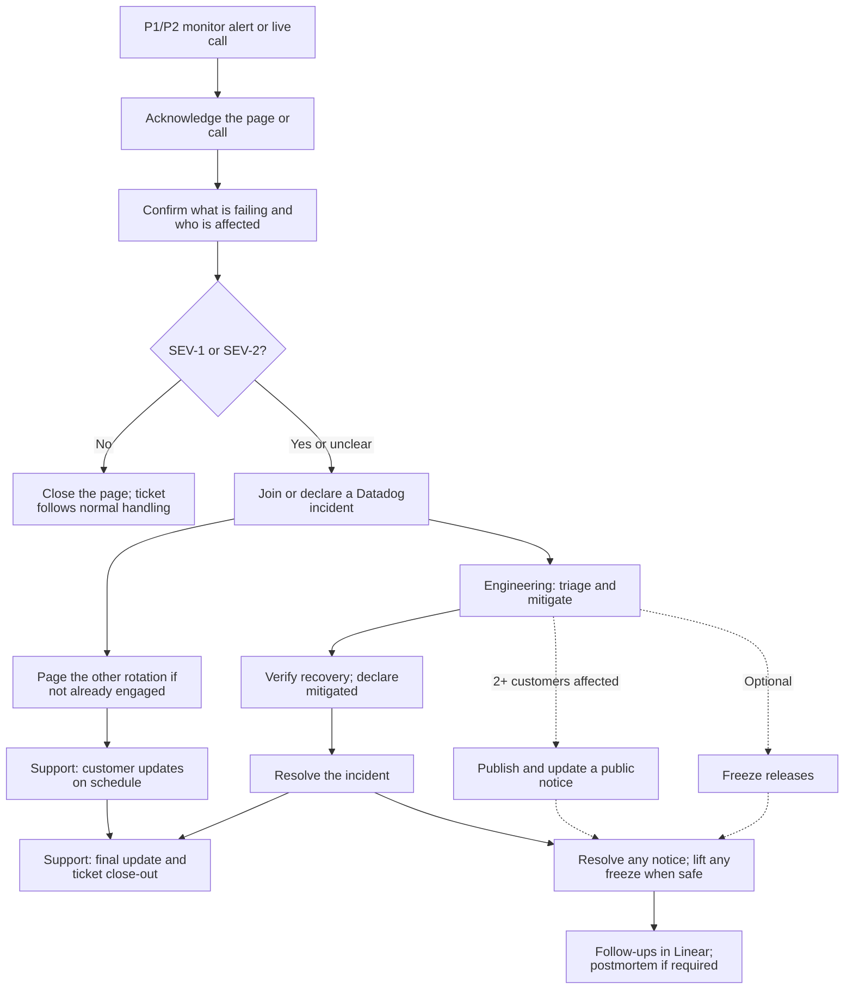

# On-Call Playbook

For the Engineering and Support on-call rotations.

## Start here

| When                       | Guide                                                      |
| -------------------------- | ---------------------------------------------------------- |
| Before your shift          | [Readiness checklist](./readiness-checklist.md)            |
| Understand severity        | [Priority and Severity](./severity.md)                     |
| How Paging works           | [Paging](./paging.md)                          |
| You have been paged        | [First 15 minutes](./first-15-minutes.md)                  |
| The incident is ongoing    | [During an incident](./during-incident.md)                 |
| The incident is resolved   | [After an incident](./after-incident.md)                   |
| Writing to the customer    | [Customer update templates](./template-customer-update.md) |
| Posting a public notice    | [Publish a status page notice](./publish-status-page.md)   |
| Wording a public notice    | [Public status page templates](./template-status-page.md)  |

## Flow overview

Engage the Support on-caller for every SEV-1/2 incident. Until Support acknowledges, the incident commander owns communication.

