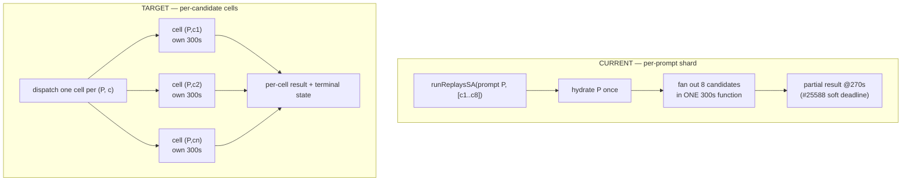
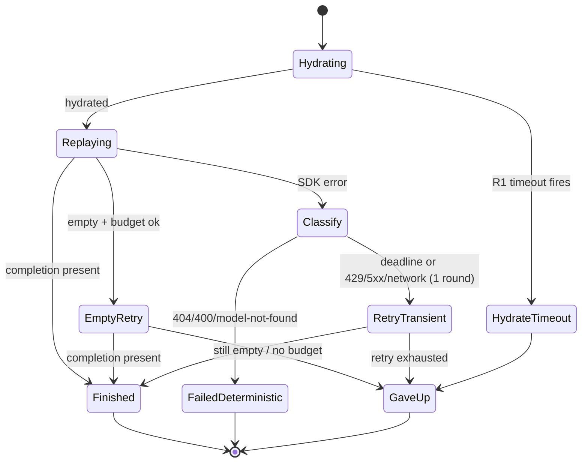

# refactor: Candidate-grain sharding for reliable tournament replays

## Summary

Re-grain quality-tournament replays from **per-prompt shards** (one
`runReplaysSA` call = one prompt × all candidates, sharing a single Vercel
300s function) to a **hydrate-once / fan-out-per-candidate** model where each
`(prompt, candidate)` cell runs in its own server-action call with its own
300s budget. Candidate count stops consuming the fixed, unmovable 300s
ceiling. Supporting guards — hydration timeout, transient-vs-deterministic
retry classification, per-candidate trust accounting, a client backstop, and
durable per-cell results — are folded in. The work is phased so the cheap,
independent guards land before the structural re-grain.

Driven by **observed instability failures** in the tool today (not speculative
hardening), on a client-side admin tool whose near-term purpose is validating
whether replaying captured prompts against candidate models saves money.

---

## Problem Frame

The tool shards replay work per prompt. Each shard hydrates the prompt once,
then fans out to all candidates inside one Vercel function capped at
`maxDuration = 300`s (`projects/web/app/[locale]/(user)/(dashboard)/labs/quality-tournament/page.tsx:30`).
We are at the Vercel Pro ceiling — **300s is fixed and cannot be raised**
without a plan change (see origin:
`docs/brainstorms/2026-06-22-tournament-replay-hardening-requirements.md`).

Three failure modes within that fixed wall:

1. **Breakage.** A prompt with many candidates and/or a slow reasoning model
   exceeds 300s. PR #25588 softened the 504 into a partial result at a 270s
   soft deadline, but the root cause — N candidates sharing one 300s budget —
   remains.
2. **Trust.** A "completed" run can hide empty completions, deadline-cancelled
   candidates, and silently-skipped stacked passes, so the cost numbers can't
   be fully trusted.
3. **Unguarded hydration.** `loadHydratedPrompts` calls `fetchUserTransactions`
   and `fetchPrivatePromptLog` before any `chatSend`. `fetchInternalJsonApi`
   has **no timeout** (`packages/frontend/utils/fetch-internal-api.ts:41,68,145`),
   so hydration can hang the shard before the request timeout is in play.

**Core lever:** per-candidate execution gives each attempt its own 300s, so
candidate count no longer eats the ceiling. This is the only lever available
with the ceiling fixed.

---

## Requirements Traceability

Carried from the origin requirements doc:

- **R1 — Hydration timeout.** Bound the stage-1 hydrate IO. → U1
- **R2 — Targeted retry classification.** Retry deadline + transient (429/5xx/
  network); deterministic (404/400) stays failed and visible. Capped at one
  round. → U2, U6
- **R3 — Trust accounting.** Explicit per-candidate terminal state surfaced in
  the run summary. → U3, U7
- **R4 — Client backstop.** Wall-clock catch for a cell whose function returns
  no body. → U6
- **Re-architecture (hydrate-once / fan-out).** The primary build. → U4, U5, U6
- **R5 — Durable per-cell results.** Results persist as cells complete. →
  U6 (carried via existing shard cache; full incremental persistence deferred —
  see Scope Boundaries)
- **R6 — Cost comparison.** **Already built and rendered** (`recommendations.ts`,
  `wizard/RecommendationsTab.tsx`, `wizard/SourceRecCard.tsx`). Demoted from a
  build to a **verification** item: confirm dropped candidates don't corrupt
  savings. → U7

---

## Key Technical Decisions

**KTD1 — Hydrated-payload transport: re-fetch by key, not pass-the-payload.**
Each candidate cell re-runs `loadHydratedPrompts` for its single
`generationId` rather than receiving the full hydrated `messages` + `media`
across the server-action boundary. Rationale: passing hydrated payloads
(potentially large message arrays + base64 media) as server-action input
risks serialization-size limits and bloats the request. A single-generation
hydrate is cheap once R1's timeout bounds it, and `fetchUserTransactions`
already accepts a `generationIds` array of length 1. The "hydrate once per
prompt" goal is preserved at the *prompt* level within a cell that handles all
of one prompt's candidates; see U4/U5 for the exact cell boundary.

> **Note:** This is the primary risk fork (see Risks). If single-generation
> hydration proves too slow under the per-cell multiplier, the fallback is a
> hydration-cache-by-key step (hydrate once, cells read the cached result).
> Recorded as an open question, not resolved blindly.

**KTD2 — Cell grain = one prompt × one candidate.** The retryable unit is a
single `(generationId, modelSlug)` pair. This makes #25588's soft-deadline and
"retry-the-failed" machinery largely unnecessary on the sharded path (a cell
has nothing else in its 300s budget to protect) and makes retry = re-dispatch
one cell.

**KTD3 — Leave the single-call `runTournament` path on #25588's shape.** Only
the wizard/sharded path (`runReplaysSA` via `BaseRunPhaseEvents`) re-grains.
`runTournament` (replays + judging in one function) keeps its shared budget and
soft deadline, because the instability is in the sharded path and re-graining
both doubles the blast radius. (Resolves origin open question 1.)

**KTD4 — Error classification reuses existing `statusCode` extraction.**
`describeSdkError` (`openrouter-sdk-client.ts:45-46`) already pulls `statusCode`
from SDK errors. The new `classifyReplayFailure` is a pure function mirroring
`decideEmptyRetry` / `describeReplayFailure` — takes the error + deadline flag,
returns a discriminated `ReplayFailureClass`.

**KTD5 — Retry is capped at one round.** A genuinely-slow-forever candidate
exhausts its budget, gets one retry in a fresh budget, and if it fails again
stays failed. Mirrors `EMPTY_RETRY_ATTEMPTS = 1`.

---

## High-Level Technical Design

### Current vs. target sharding grain

### Per-cell lifecycle and terminal states

> Directional guidance for review; prose and unit definitions are authoritative.

---

## Implementation Units

Phased: **Phase A** (U1–U3) ships independent guards on today's per-prompt
shards — immediate breakage/trust wins, no re-grain. **Phase B** (U4–U6)
re-grains to per-candidate cells. **Phase C** (U7) verifies trust + cost.

### U1. Bound hydration IO with an explicit timeout

**Goal:** `loadHydratedPrompts` cannot hang the run before `chatSend` starts.

**Requirements:** R1

**Dependencies:** none

**Files:**
- `projects/web/app/[locale]/(user)/(dashboard)/labs/quality-tournament/hydrate-prompts.ts`
- `packages/frontend/utils/fetch-internal-api.ts` (add optional timeout signal)
- `projects/web/app/[locale]/(user)/(dashboard)/labs/quality-tournament/hydrate-prompts.test.ts` (new)

**Approach:** Thread an `AbortSignal.timeout(...)` into the internal fetch for
both `fetchUserTransactions` and `fetchPrivatePromptLog`. Prefer adding an
optional `signal` (or `timeoutMs`) param to `fetchInternalJsonApi` so the
timeout is reusable and the body is cancelled on the abort path (per
`.claude/rules/fetch-body-cancellation.md`). A hydration timeout surfaces as a
`warnings` entry, not a thrown error — the run continues with the prompts that
hydrated (mirrors the existing warnings pattern in `tournament-runner.ts`).

**Patterns to follow:** `buildReplayRequestSignal` (`replay-budget.ts`) for
signal construction; existing `warnings.push(...)` flow in
`hydrate-prompts.ts`.

**Test scenarios:**
- Happy path: hydration within the timeout returns the hydrated prompt
  unchanged.
- Error path: a hydration call that exceeds the timeout aborts, pushes a
  warning naming the generation, and is excluded from the returned prompts
  (does not throw, does not fail the batch).
- Edge: timeout fires on one generation in a batch — the others still hydrate
  and return.
- Fetch-body cancellation: on the abort path, the response body is cancelled.

**Verification:** A deliberately stalled internal fetch no longer blocks the
run; the affected generation appears as a warning and the run proceeds.

---

### U2. `classifyReplayFailure` pure function

**Goal:** A single source of truth that maps a failed replay into retryable
vs. terminal.

**Requirements:** R2

**Dependencies:** none

**Files:**
- `projects/web/app/[locale]/(user)/(dashboard)/labs/quality-tournament/replay-execution.ts`
- `projects/web/app/[locale]/(user)/(dashboard)/labs/quality-tournament/replay-execution.test.ts`

**Approach:** Add a pure `classifyReplayFailure({ error, didExceedDeadline })`
returning a discriminated `ReplayFailureClass` (`as const` + `ValueOf`):
`DeadlineCancelled`, `Transient` (429, 5xx, network/abort-not-deadline),
`Deterministic` (404, 400, model-not-found). Reuse `statusCode` extraction
logic from `describeSdkError` — extract a shared `extractStatusCode(error)`
helper rather than duplicating the property guard. Mirrors `decideEmptyRetry`'s
shape exactly.

**Patterns to follow:** `decideEmptyRetry`, `describeReplayFailure`
(`replay-execution.ts`); enum-as-const + `ValueOf` per type-safety rules.

**Test scenarios:**
- `didExceedDeadline: true` → `DeadlineCancelled` regardless of statusCode.
- `statusCode: 429` → `Transient`.
- `statusCode: 503` → `Transient`.
- network/abort error (no statusCode, deadline not fired) → `Transient`.
- `statusCode: 404` ("No endpoints found") → `Deterministic`.
- `statusCode: 400` → `Deterministic`.
- Non-object / unknown error → `Deterministic` (conservative: don't retry the
  unclassifiable).

**Verification:** Unit tests pass; classifier is exported and consumed nowhere
yet (wired in U6).

---

### U3. Per-candidate terminal-state model

**Goal:** Every candidate row carries an explicit terminal state, replacing
the current "errorMessage or not" implicit model.

**Requirements:** R3

**Dependencies:** U2 (failure classes inform terminal states)

**Files:**
- `projects/web/app/[locale]/(user)/(dashboard)/labs/quality-tournament/types.ts`
- `projects/web/app/[locale]/(user)/(dashboard)/labs/quality-tournament/replay-execution.ts`
- `projects/web/app/[locale]/(user)/(dashboard)/labs/quality-tournament/replay-execution.test.ts`

**Approach:** Add a `terminalState` field to `CompletionRow` (or a derivation
helper `deriveTerminalState(row)`) with values `Finished`,
`FailedDeterministic`, `RecoveredOnRetry`, `GaveUp`, `SkippedLowBudget`. Prefer
a pure derivation helper over a stored field if the row already carries enough
signal (`errorMessage`, `completion`, attempt count), to avoid a migration of
existing persisted rows. Decide stored-vs-derived in U3 based on what the
summary (U7) needs.

**Patterns to follow:** `EmptyRetryDecision` discriminated union; existing
`CompletionRow` shape (`types.ts:378`).

**Test scenarios:**
- A row with a completion → `Finished`.
- A row with a 404 errorMessage → `FailedDeterministic`.
- A row that succeeded after one retry → `RecoveredOnRetry`.
- A row empty after retry exhausted → `GaveUp`.
- A row skipped for low budget → `SkippedLowBudget`.
- Covers the trust requirement: every row maps to exactly one state (no row is
  stateless).

**Verification:** Unit tests cover all five states; helper/field is exported
for U7.

---

### U4. Extract candidate-cell execution boundary

**Goal:** Factor the per-candidate replay into a callable unit so it can be
dispatched independently, without yet changing the dispatch grain.

**Requirements:** Re-architecture

**Dependencies:** U1

**Files:**
- `projects/web/app/[locale]/(user)/(dashboard)/labs/quality-tournament/tournament-runner.ts`
- `projects/web/app/[locale]/(user)/(dashboard)/labs/quality-tournament/actions.ts`
- `projects/web/app/[locale]/(user)/(dashboard)/labs/quality-tournament/types.ts`

**Approach:** Define the cell input/output shape: a cell takes a single
`generationId` + a single `candidateModelSlug` (+ `sessionId`), hydrates that
one generation (KTD1), runs `runReplay`, returns one `CompletionRow` plus its
terminal state. Refactor `runReplaysOnly` so the per-candidate work is a
function the new path can call, keeping the existing per-prompt path working
(no behavior change yet). This is a characterization-preserving refactor.

**Execution note:** Add characterization coverage for `runReplaysOnly`'s
current output shape before refactoring, so the extraction is provably
behavior-preserving.

**Patterns to follow:** existing `runReplay` call site in `tournament-runner.ts:142-160`;
`RunReplaysInput` shape.

**Test scenarios:**
- Characterization: existing per-prompt `runReplaysOnly` returns identical
  `ReplayResults` shape before/after the extraction (same prompts, same
  candidate rows, same warnings).
- The extracted cell function, given one generation + one candidate, returns a
  single `CompletionRow` with a terminal state.
- Edge: a generation that fails to hydrate yields a cell result with a warning,
  not a throw.

**Verification:** Existing tournament tests still pass; new cell function is
unit-tested and unused in production paths until U5.

---

### U5. Client dispatch at candidate grain

**Goal:** The wizard dispatches one server-action call per `(prompt,
candidate)` cell instead of one per prompt.

**Requirements:** Re-architecture, R5 (shard cache keyed per cell)

**Dependencies:** U4

**Files:**
- `projects/web/app/[locale]/(user)/(dashboard)/labs/quality-tournament/wizard/BaseRunPhaseEvents.ts`
- `projects/web/app/[locale]/(user)/(dashboard)/labs/quality-tournament/actions.ts`
- `projects/web/app/[locale]/(user)/(dashboard)/labs/quality-tournament/wizard/BaseRunPhaseEvents.test.ts` (or existing `.dom.test`/event test)

**Approach:** Change `runReplayPhase` to build a cell list (`generationId ×
candidateModelSlug`) and dispatch via the wizard's `mapWithConcurrency` at the
cell grain. Re-key the completed-cache from `replayShardsByGenerationId` to a
per-cell key (`${generationId}::${modelSlug}`) so skip-completed / retry-missing
resumes at cell granularity. Update `advanceBy` progress to increment per cell
(not per prompt × candidateCount). `collectReplayOutcome` re-assembles
per-prompt `PromptRecord`s from completed cells. Keep `REPLAY_REQUEST_CONCURRENCY`
but note the effective fan-out multiplies (see Risks).

**Patterns to follow:** existing `pendingGenerationIds` filter + cache pattern
(`BaseRunPhaseEvents.ts:108-131`); `collectReplayOutcome` assembly
(`:134-185`); wizard `map-with-concurrency.ts` order preservation.

**Test scenarios:**
- Happy path: a 2-prompt × 3-candidate run dispatches 6 cells; result assembles
  into 2 `PromptRecord`s each with 3 candidate rows + baseline.
- Resume: a run where 4 of 6 cells completed re-dispatches only the 2 missing
  cells (not whole prompts).
- Progress: `advanceBy` reaches 100% across cells; a failed cell still advances.
- Edge: all cells of one prompt fail — that prompt still appears in the outcome
  with failed rows (not dropped).
- Order: assembled candidate rows preserve candidate order regardless of cell
  completion order.

**Verification:** A run completes with the same leaderboard shape as the
per-prompt path; resume re-runs only missing cells.

---

### U6. Wire classification, retry, and backstop into the cell path

**Goal:** Each cell self-heals transient/deadline failures once, leaves
deterministic failures visible, and the client catches a no-body cell.

**Requirements:** R2, R4, R5

**Dependencies:** U2, U3, U5

**Files:**
- `projects/web/app/[locale]/(user)/(dashboard)/labs/quality-tournament/replay-execution.ts`
- `projects/web/app/[locale]/(user)/(dashboard)/labs/quality-tournament/wizard/BaseRunPhaseEvents.ts`
- `projects/web/app/[locale]/(user)/(dashboard)/labs/quality-tournament/replay-execution.test.ts`

**Approach:** In the cell path, on failure call `classifyReplayFailure`; if
`DeadlineCancelled` or `Transient` and retry budget remains (one round),
re-dispatch the cell in a fresh budget; `Deterministic` stays failed with its
SDK message. Client backstop (R4): wrap each cell server-action call in a
wall-clock guard (above the per-cell budget) so a cell that returns no body at
all is marked `GaveUp` rather than hanging the run. Log skipped/again-failed
cells with `wLog` (snake_case, include `session_id`, `model_slug`,
`generation_id`, `failure_class`, `remaining_ms`).

**Patterns to follow:** `decideEmptyRetry` budget-gating; `describeReplayFailure`
deadline relabel; `wLog` conventions; client backstop mirrors the existing
abort-signal handling in `BaseRunPhaseEvents`.

**Test scenarios:**
- A `Transient` cell failure retries once and succeeds → `RecoveredOnRetry`.
- A `Transient` cell that fails twice → `GaveUp`.
- A `Deterministic` (404) cell does **not** retry → `FailedDeterministic`,
  message preserved.
- A `DeadlineCancelled` cell retries once in a fresh budget.
- Retry cap: a cell never retries more than once.
- Backstop: a cell whose call resolves with no usable body is marked `GaveUp`,
  run continues.
- Logging: a skipped/again-failed cell emits a `wLog` with the expected fields.

**Verification:** A run with one deliberately-slow and one deterministically-
broken candidate completes: slow one recovers or gives up, broken one stays
failed and visible, run does not 504.

---

### U7. Trust + cost verification in the run summary

**Goal:** The run summary reports a definite terminal state per candidate, and
the existing cost-comparison view is confirmed correct under partial runs.

**Requirements:** R3, R6

**Dependencies:** U3, U5, U6

**Files:**
- `projects/web/app/[locale]/(user)/(dashboard)/labs/quality-tournament/wizard/BaseRunPhaseEvents.ts` (summary assembly)
- `projects/web/app/[locale]/(user)/(dashboard)/labs/quality-tournament/replay-failure-summary.ts`
- `projects/web/app/[locale]/(user)/(dashboard)/labs/quality-tournament/recommendations.test.ts` (verification)
- relevant summary/results view test (`wizard/RunResultsView` / `RecommendationsTab.dom.test.tsx`)

**Approach:** Extend the run/failure summary so each candidate's terminal state
is surfaced (counts by state, and per-prompt detail). For cost (R6): this is
**verification, not new build** — `recommendations.ts` already computes
`sourceAvgCostUsd` vs `recommendedAvgCostUsd` and returns `Infinity` mean when
not every prompt has a successful replay (so partial coverage suppresses a
recommendation rather than inflating savings). Add/confirm a test that a run
with `GaveUp`/`FailedDeterministic` candidates does not produce a misleading
saving.

**Patterns to follow:** `summarizeReplayFailures` (`replay-failure-summary.ts`);
existing `recommendations.ts` cost rollup (`:244,266,276`).

**Test scenarios:**
- Summary reports per-state counts matching the cells' terminal states.
- A run with a `GaveUp` candidate does not produce a cost recommendation for
  that source (mean cost guards on full coverage).
- A fully-successful run still produces the existing cost comparison unchanged
  (no regression in `RecommendationsTab`).
- Covers R3: no candidate is reported without a terminal state.

**Verification:** Summary shows trustworthy state counts; cost view confirmed
to suppress (not corrupt) savings under partial coverage.

---

## Scope Boundaries

### In scope
- Re-grain the wizard/sharded replay path to per-candidate cells (U4–U6).
- Hydration timeout (U1), retry classification (U2, U6), terminal-state trust
  accounting (U3, U7), client backstop (U6).
- Verify the existing cost-comparison view under partial runs (U7).

### Deferred to Follow-Up Work
- **Full incremental per-cell persistence (R5, beyond the in-memory shard
  cache).** Persisting each cell to Postgres/IndexedDB as it completes (vs. the
  current end-of-run `persistEvalRunSA`) is a larger persistence change; the
  cell cache already preserves finished work within a session. Split out.
- **Re-graining the single-call `runTournament` path** (KTD3) — left on
  #25588's shape for now.

### Out of scope (origin non-goals)
- Temporal / async / job-queue re-home — explicitly out, even as phase 2.
- Public / 100s-of-prompts / many-concurrent-users scale — the synchronous
  model does not carry it; a separate future decision.
- Raising `maxDuration` — confirmed impossible at the Vercel Pro cap.
- Cancellation work.
- Changing #25588's soft-deadline mechanism on the single-call path.

---

## Risks & Dependencies

- **Hydrated-payload transport (primary risk, KTD1).** Re-fetch-by-key
  multiplies hydration IO by the per-candidate fan-out. Mitigation: U1's
  timeout bounds each hydrate; if measured cost is too high, fall back to a
  hydration-cache-by-key step. **Open question — validate hydration cost early
  in Phase B.**
- **Invocation-count multiplier.** Per-candidate dispatch multiplies
  server-action calls (prompts × candidates). `REPLAY_REQUEST_CONCURRENCY = 4`
  still bounds in-flight calls, but total volume rises. Confirm acceptable at
  admin run sizes; watch for rate-limit pressure.
- **Resume-cache key migration.** Re-keying the completed cache from
  per-generation to per-cell (U5) must not let a stale per-generation entry
  from an in-flight run leak in. Covered by U5 resume tests.
- **Dependency:** U6 depends on U2+U3+U5; U7 depends on U3+U5+U6. Phase A
  (U1–U3) is independent and shippable first.

---

## System-Wide Impact

- **Users affected:** admins using the quality-tournament lab. No public-API
  surface, no inference-path code (`projects/web`, not `cfw-api`/`router`).
- **No DB schema change** in the in-scope units (incremental persistence is
  deferred).
- **Observability:** new `wLog` events for retry/skip/backstop with
  `session_id` correlation; terminal-state counts feed the run summary.

---

## Open Questions

1. **Hydration cost under per-cell fan-out** (KTD1) — re-fetch-by-key vs.
   hydration-cache-by-key. Resolve with a measurement early in Phase B; the
   plan assumes re-fetch-by-key and records the cache fallback.
2. **`terminalState` stored vs. derived** (U3) — decide based on whether U7's
   summary needs more than the row already carries; prefer derived to avoid a
   persisted-row migration.

---

## Sources & Research

- Origin requirements: `docs/brainstorms/2026-06-22-tournament-replay-hardening-requirements.md`
- PR #25588 (ECO-1114) — soft per-shard deadline; established the
  pure-function + budget patterns (`replay-budget.ts`, `replay-execution.ts`)
  this plan mirrors.
- Repo research confirmed: hydration is per-prompt and precedes the candidate
  loop (`tournament-runner.ts:93-160`); `fetchInternalJsonApi` has no timeout
  (`packages/frontend/utils/fetch-internal-api.ts:41,68,145`);
  `mapWithConcurrency` preserves input order; cost comparison already exists
  and is rendered (`recommendations.ts`, `wizard/RecommendationsTab.tsx`).
- Conventions: Result monads, `wLog` structured logging, enum-as-const +
  `ValueOf`, fetch-body cancellation, `bun:test` colocated tests.
