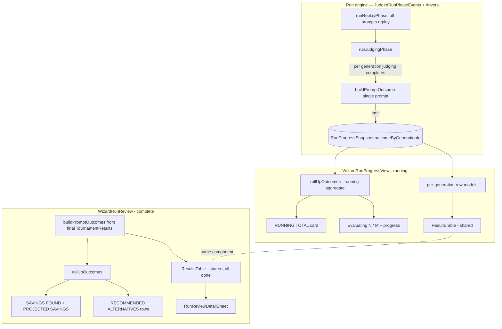

# feat: Run & review — live resolving running state + done-state polish

## Summary

Align the quality-tournament wizard's **Run & review** step to the
current `prompt-cost-eval` prototype across its three surfaces. Today the
running state is a debug-style dashboard (phase mini-cards + a per-model
spinner grid); the target is a **RUNNING TOTAL** card plus a per-prompt
table whose rows resolve incrementally to `baseline → cheaper alternative
→ savings` as each prompt finishes. The running and done views share one
row shape and one data source, so the layout doesn't jump when the run
completes.

The prototype source is the authority for structure and copy. It lives in
`OpenRouterTeam/openrouter-design-sandbox` at
`app/(proto-prompt-cost-eval)/prototype/t2cdpf/prompt-cost-eval/`
(`_client.tsx`, `data.ts`). All file paths below are in the
`openrouter-web` monorepo.

---

## Problem Frame

The deployed Run & review step was ported from an earlier prototype
revision (ECO-1592). The prototype has since evolved, and three surfaces
drifted:

1. **Running state (biggest gap).** `WizardRunProgressView` shows an
   aggregate progress dashboard (`PhaseMiniCard`s for Replaying / Judging
   / Computing, plus `ReplayProgressGrid` — one spinner cell per
   candidate per prompt). It reads like instrumentation, not a result.
   The target shows a RUNNING TOTAL savings card and a per-prompt table
   that resolves each row to its winning cheaper alternative + savings as
   that prompt finishes.

2. **Done state.** `WizardRunReview` renders `RunSummaryStrip` +
   `RecommendationsTab` (a "Switch to save" / "keep current" grouping of
   per-**source-model** `SourceRecCard`s) + a `RunReviewResultRow` table
   with `Status · Type · Prompt · Baseline · Cheaper alternative ·
   Savings`. The target is a `SAVINGS FOUND` banner, a `PROJECTED SAVINGS
   IF YOU SWITCH` card, a `RECOMMENDED ALTERNATIVES (N)` list grouped by
   **(baseline → winner) pair**, and a `Per-prompt results` table that
   shares the running row shape.

3. **Detail sheet.** `RunReviewDetailSheet` already matches the prototype
   closely (verdict header, prompt, judge-conclusion callout, stacked
   output cards with baseline / ✓ recommended / ✓ comparable / lost-quality
   badges, per-output cost + savings, italic verdict). This is a
   verification + minor-polish pass, not a rebuild.

**Core behavioral requirement:** per-prompt outcomes (winning cheaper
alternative + savings) must resolve **during** the run, not only at the
end. Today `TournamentResults` — the input to outcome computation — is
assembled only after the replay barrier and the judge barrier both drain.

---

## Requirements

- **R1.** Running state shows a RUNNING TOTAL card (cumulative savings $,
  blended % cheaper, "re-running these prompts" caption) that accumulates
  as prompts resolve.
- **R2.** Running state shows `Evaluating…` + `N / M evaluated` + a
  progress bar, where N = prompts with a resolved outcome.
- **R3.** Running and done states share one per-prompt table + row
  component with columns `[status] · [modality] · Prompt · Baseline ·
  Cheaper alternative · Savings · [chevron]`; rows render `done`
  (winner + savings, or "none held quality"), `running` ("evaluating…"),
  or `queued`.
- **R4.** Each row resolves to its real per-prompt winner + savings the
  moment that prompt's judging completes (incremental, not all-at-once).
- **R5.** Done state shows the `SAVINGS FOUND` / `No savings found` banner
  ("A cheaper model held quality on N of M prompts." + confidence line)
  and the `PROJECTED SAVINGS IF YOU SWITCH` card.
- **R6.** Done state shows `RECOMMENDED ALTERNATIVES (N)` rows grouped by
  (baseline → winner): modality pill, `baseline → cheaper`, "Held quality
  on K prompts · X% judge confidence", saved $ + % cheaper.
- **R7.** Detail sheet matches the prototype (header, prompt, judge
  callout, stacked output cards, badges, cost, verdict) and its content
  area scrolls.
- **R8.** Results are persisted only on run completion (unchanged); the
  resolving table is the in-memory "intermediate results survive" behavior
  — **no** mid-run writes to IndexedDB or Postgres.
- **R9.** All three judge modes still work: pairwise + council resolve
  outcomes live; human runs keep replay-only progress and hand off to
  `HumanJudgingView` (no live winner/savings during the run).

---

## Scope Boundaries

### In scope

- The running-state rewrite, done-state reshape, detail-sheet
  verification, and the data/engine changes needed to resolve per-prompt
  outcomes incrementally.
- Retiring `ReplayProgressGrid` from the running view (and the file, if it
  has no other consumer).

### Deferred to Follow-Up Work

- **Full replay→judge per-prompt pipeline.** The user noted interest in
  "separating replay + judges" per prompt (see KTD-1). This plan resolves
  outcomes incrementally during the judge phase **without** restructuring
  the two-phase concurrency model, which delivers the same visible
  incremental behavior at far lower risk. A true per-prompt pipeline
  (overlapping replay and judge, bounded per-prompt concurrency) is a
  larger engine change with cost-ordering and concurrency-profile
  implications; defer unless the two-phase resolution proves
  insufficient.
- **Mid-run persistence / reload survival.** Out of scope per the
  visual-only choice (R8).

### Out of scope

- Select-prompts and Configure steps (separate surfaces).
- The Postgres-first opened-run results view (`ServerRunResultsView`)
  and past-evals home — they read persisted summaries and are unaffected
  by the live-run resolution change. Only confirm they still render the
  done-state components correctly if shared.

---

## Key Technical Decisions

### KTD-1. Resolve outcomes incrementally during the judge phase, keeping the two-phase engine

The run engine (`JudgedRunPhaseEvents.orchestrate`) runs two barriers:
`runReplayPhase()` (all prompts) → `runJudgingPhase()` (all comparisons)
→ `buildResult()`. `buildPromptOutcome()` needs a prompt's `PromptRecord`
+ its judgments.

**Decision:** hook per-prompt outcome computation into the point where a
generation's judging completes. The drivers already track per-generation
judge completion via `JudgeProgressTracker` (it returns `passed`/`failed`
when a generation's last judge task lands). At that moment we have that
prompt's `PromptRecord` (from replay) and its judgments, so we build its
`PromptOutcome` and emit it into the snapshot.

**Why not the full per-prompt pipeline:** restructuring `orchestrate()`
so each prompt independently replays-then-judges changes the concurrency
profile (separate replay/judge pools today), request ordering, and the
cost-comparison assumptions baked into the driver tests. The visible
behavior (rows resolving steadily) is achieved either way. Two-phase
resolution is the lower-risk path that satisfies R1–R4; the pipeline is
deferred (see Scope Boundaries). Rationale grounded in the existing
`TournamentRunPhaseEvents` / `CouncilRunPhaseEvents` structure.

**Trade-off:** during the replay phase, rows show `running`/`queued` and
none resolve until judging starts. Because judging begins immediately
after replays and resolves per-generation, this closely matches the
prototype's steady cadence.

### KTD-2. One per-prompt outcome source feeds running total, running rows, done banner, done recs, and done rows

Both the running and done aggregates derive from the same
`PromptOutcome[]`. Export a single-prompt builder and an outcome rollup
(mirroring the prototype's `rollUp()`), so the RUNNING TOTAL card and the
done-state `SAVINGS FOUND` banner / `RECOMMENDED ALTERNATIVES` use one
code path. This is what keeps running and done numerically consistent and
the layout stable across the transition (R3).

### KTD-3. Done-state recommended alternatives group by (baseline → winner) pair, not per-source-model

The prototype's `RECOMMENDED ALTERNATIVES` rows are per (baseline,
winner) pair (5 of 6 prompts → 5 rows, each "Held quality on 1 prompt").
Production's `buildEvalSummary` produces one rec per **source model**.
The done view will derive its banner counts, projected savings, and
recommended-alternatives rows from the per-prompt outcome rollup
(KTD-2), not from `buildEvalSummary`. `RecommendationsTab` /
`SourceRecCard` / `buildEvalSummary` are no longer used by this view
(verify no other consumer before deleting; otherwise leave in place).

### KTD-4. `outcomeByGenerationId` carried on the snapshot, sparse like the existing status maps

Add `outcomeByGenerationId?: Record<string, PromptOutcome>` to
`RunProgressSnapshot`, mirroring the existing optional, sparse
`replayByGenerationId` / `judgeByGenerationId` pattern (a missing id is
unresolved). The view derives row state from: outcome present → `done`;
else replay/judge in flight for that id → `running`; else → `queued`. The
running total is `rollUpOutcomes(Object.values(outcomeByGenerationId))`,
computed in the view.

---

## High-Level Technical Design

Data flow from run engine to the two shared surfaces:

Persistence is unchanged: `useWizardRun.onComplete` fires once at
`status === 'complete'` and writes IndexedDB + Postgres. Outcomes
resolving mid-run never trigger a write (R8).

---

## Implementation Units

### U1. Export single-prompt outcome builder + add `rollUpOutcomes`

**Goal:** provide the shared per-prompt outcome data layer feeding running
total, running rows, done banner, done recs, and done rows (KTD-2).

**Requirements:** R1, R5, R6.

**Dependencies:** none.

**Files:**
- `projects/web/app/[locale]/(user)/(dashboard)/labs/quality-tournament/wizard/redesign/run-review-outcomes.ts`
- `projects/web/app/[locale]/(user)/(dashboard)/labs/quality-tournament/wizard/redesign/run-review-outcomes.test.ts`

**Approach:**
- Export the existing private `buildPromptOutcome` (or a thin
  `buildPromptOutcomeFor({ prompt, candidateSlugs, judgments })`) so the
  engine can build one prompt's outcome from its `PromptRecord` + the
  judgments accumulated so far.
- Add `rollUpOutcomes(outcomes: PromptOutcome[]): OutcomeRollup` mirroring
  the prototype `rollUp()` in `data.ts`: `promptCount`, `switchCount`
  (outcomes with a recommended winner), `totalSavedUsd`, `savedPct`
  (totalSaved / total baseline cost over resolved outcomes), `avgConfidence`,
  and `recs` grouped by `(baselineModelSlug → recommendedModelSlug)` with
  per-group `promptCount`, `savedUsd`, `pctSaved`, `confidence`, `modality`.
- Reuse existing `RecKind`, `confidenceLabel` from `recommendations.ts`.

**Patterns to follow:** prototype `rollUp()` / `Rec` in
`data.ts`; existing `buildPromptOutcomes` ordering + cost guards.

**Test scenarios:**
- `rollUpOutcomes` over mixed outcomes: counts switch vs keep correctly;
  `totalSavedUsd` = sum of per-prompt `savedUsd`; `savedPct` = totalSaved /
  total baseline.
- Recs grouped by (baseline, winner) pair; two prompts with the same
  baseline→winner collapse into one rec with `promptCount = 2` and summed
  savings; recs sorted by descending savings.
- Empty outcomes → zeroed rollup, `recs: []`.
- Single-prompt builder returns the same `PromptOutcome` as
  `buildPromptOutcomes` for the equivalent single-prompt `TournamentResults`
  (parity check against existing behavior).
- `avgConfidence` averages per-prompt judge confidence; null confidences
  excluded or treated as 0 consistently with existing rollup.

### U2. Add `outcomeByGenerationId` to the run snapshot + row-state helper

**Goal:** carry resolved per-prompt outcomes on the snapshot and provide a
helper that maps a generation id to its row state (KTD-4).

**Requirements:** R2, R3, R4.

**Dependencies:** U1.

**Files:**
- `projects/web/app/[locale]/(user)/(dashboard)/labs/quality-tournament/wizard/run-phases.ts`
- `projects/web/app/[locale]/(user)/(dashboard)/labs/quality-tournament/wizard/run-phases.test.ts`

**Approach:**
- Add `outcomeByGenerationId?: Record<string, PromptOutcome>` to
  `RunProgressSnapshot` (optional + sparse, mirroring
  `replayByGenerationId`). Seed `{}` in `makeInitialSnapshot`.
- Add `resultRowState(generationId, snapshot): 'done' | 'running' |
  'queued'`: `done` if an outcome exists; else `running` if that id's
  replay or judge status is `running`; else `queued`.
- Import `PromptOutcome` from `redesign/run-review-outcomes` (client-side;
  acceptable cross-folder import within the wizard).

**Patterns to follow:** existing `replayByGenerationId` /
`judgeByGenerationId` optional-sparse fields + `runPhaseState`.

**Test scenarios:**
- `resultRowState` returns `done` when an outcome is present regardless of
  status maps.
- Returns `running` when no outcome but replay or judge status is
  `running`; `queued` otherwise (missing id).
- `makeInitialSnapshot` seeds `outcomeByGenerationId: {}`.

### U3. Engine: build + emit per-prompt outcomes as judging completes

**Goal:** resolve and emit each prompt's `PromptOutcome` the moment its
judging finishes, for pairwise + council; human mode stays replay-only
(KTD-1, R4, R9).

**Dependencies:** U1, U2.

**Files:**
- `projects/web/app/[locale]/(user)/(dashboard)/labs/quality-tournament/wizard/BaseRunPhaseEvents.ts`
- `projects/web/app/[locale]/(user)/(dashboard)/labs/quality-tournament/wizard/JudgedRunPhaseEvents.ts`
- `projects/web/app/[locale]/(user)/(dashboard)/labs/quality-tournament/wizard/TournamentRunPhaseEvents.ts`
- `projects/web/app/[locale]/(user)/(dashboard)/labs/quality-tournament/wizard/CouncilRunPhaseEvents.ts`
- `projects/web/app/[locale]/(user)/(dashboard)/labs/quality-tournament/wizard/TournamentRunPhaseEvents.test.ts`
- `projects/web/app/[locale]/(user)/(dashboard)/labs/quality-tournament/wizard/CouncilRunPhaseEvents.test.ts`

**Approach:**
- Add a protected `emitOutcome(generationId, outcome)` on
  `BaseRunPhaseEvents` that merges into `snapshot.outcomeByGenerationId`
  (same emit/debounce path as `setJudgeStatus`).
- In each driver's judging worker, accumulate per-generation judgments as
  tasks complete. When `JudgeProgressTracker.complete(...)` reports a
  generation is fully judged (`passed`/`failed`), build that prompt's
  outcome via the U1 builder (using its `PromptRecord` from the replay
  phase + that generation's judgments / council promptResults) and call
  `emitOutcome`.
  - Pairwise: accumulate `PairwisePairJudgment[]` per generationId.
  - Council: derive that prompt's judgments via the existing
    `deriveCouncilJudgments` over its `CouncilPromptResult`(s).
- Goes through the existing `EMIT_DEBOUNCE_MS` batching; phase
  transitions/completion stay on `emitImmediate`.
- Human mode (`HumanRunPhaseEvents`) is unchanged — no judge phase, no
  outcome emission.
- Final `buildResult()` is unchanged; the complete snapshot already
  carries every resolved outcome.

**Execution note:** add a failing driver test asserting incremental
emission first (characterization of the new contract), then wire the
emission.

**Test scenarios:**
- Pairwise driver: subscribing to snapshots, `outcomeByGenerationId`
  gains one entry per generation as its judging completes (before
  `status: complete`); the final set matches `buildPromptOutcomes(result)`.
- Council driver: same incremental emission; council outcomes derived
  correctly per prompt.
- A generation whose judge tasks all fail still emits an outcome (status
  `Keep`, no winner) rather than being omitted.
- Stopped/retried run does not emit outcomes after `stop()`.
- Human driver emits **no** `outcomeByGenerationId` entries.
- `buildResult` output unchanged (existing assertions still pass).

### U4. Shared `ResultsTable` + rework `RunReviewResultRow` to the 3-state row

**Goal:** one table + row component, used by both running and done views,
matching the prototype `ResultsTable` / `ResultRow` (R3).

**Dependencies:** U1.

**Files:**
- `projects/web/app/[locale]/(user)/(dashboard)/labs/quality-tournament/wizard/redesign/ResultsTable.tsx` (new)
- `projects/web/app/[locale]/(user)/(dashboard)/labs/quality-tournament/wizard/redesign/RunReviewResultRow.tsx`
- `projects/web/app/[locale]/(user)/(dashboard)/labs/quality-tournament/wizard/redesign/RunReviewResultRow.dom.test.tsx` (new)

**Approach:**
- Rewrite `RunReviewResultRow` to take a `state: 'done' | 'running' |
  'queued'` plus the `PromptOutcome` (present when `done`) and an optional
  prompt label/modality for non-done rows. Match the prototype `ResultRow`:
  leading status cell (queued dot → spinner → check), modality pill,
  truncated prompt, then — only when `done` — baseline cell, cheaper-
  alternative cell (green winner chip with ✓, or "none held quality"),
  savings (`$X` green, or `—`), chevron. Non-done rows show
  `evaluating…` / `queued` in place of the verdict columns.
- New `ResultsTable` renders the shared header (`Prompt · Baseline ·
  Cheaper alternative · Savings`, blank leading status+modality cells) and
  maps rows. Props: ordered row models + `onOpen` (no-op while running).
- Replace the old `RUN_REVIEW_GRID` 6-column layout (`Status`/`Type` text
  columns) with the prototype's flex layout.
- Keep `ph-no-capture` on prompt text + outputs.
- Add `aria-label`/`title` for row status per `.claude/rules`
  accessibility guidance.

**Patterns to follow:** prototype `ResultsTable` + `ResultRow` +
`ModelCell` in sandbox `_client.tsx`; existing `ModelAuthorIcon` /
`useModelShortName` / `ModalityPill` / `formatPrice`.

**Test scenarios:**
- `done` switch row: renders baseline, winning cheaper-alternative chip
  with ✓, and savings `$X`; row click invokes `onOpen`.
- `done` keep row: renders "none held quality" and `—` savings; still
  clickable.
- `running` row: shows spinner + `evaluating…`, no verdict columns, not
  clickable.
- `queued` row: shows queued dot + `queued`, not clickable.
- Header renders the four labelled columns once.

### U5. Rewrite the running view (`WizardRunProgressView`)

**Goal:** RUNNING TOTAL card + `Evaluating… N/M evaluated` + progress bar +
shared resolving `ResultsTable` (R1, R2, R3, R9). Retire the phase
mini-cards + `ReplayProgressGrid` from this view.

**Dependencies:** U2, U4.

**Files:**
- `projects/web/app/[locale]/(user)/(dashboard)/labs/quality-tournament/wizard/redesign/WizardRunProgressView.tsx`
- `projects/web/app/[locale]/(user)/(dashboard)/labs/quality-tournament/wizard/redesign/WizardRunProgressView.stories.tsx`
- `projects/web/app/[locale]/(user)/(dashboard)/labs/quality-tournament/wizard/redesign/ReplayProgressGrid.tsx` (remove usage; delete file if no other consumer)

**Approach:**
- Header: `⟳ RUNNING EVALUATION` eyebrow + `Judging N prompts with
  <judge>…` (use `useModelShortName(judgeModelSlug)`; fall back to a
  judge-agnostic headline for human mode). Keep the existing
  `EvaluationFailedView` error branch and `KeepTabOpenBanner`.
- RUNNING TOTAL card (right): `rollUpOutcomes(resolved)` → big savings $,
  `X% cheaper · re-running these prompts`. Show muted zero-state until the
  first switch resolves.
- `Evaluating…` + `N / M evaluated` (N = resolved outcome count) +
  `Progress` bar (reuse the monotonic-pct guard, but base completion on
  resolved-outcome fraction for LLM-judge modes).
- Build ordered row models from `generationIds` → outcome (if resolved)
  else `resultRowState`; render via shared `ResultsTable` (rows not
  clickable while running).
- Human mode: no judge headline / RUNNING TOTAL winner data; rows show
  replay status (`done` once replayed, but no winner/savings). Keep the
  hand-off to `HumanJudgingView` unchanged (the wizard switches views on
  completion).
- Remove `PhaseMiniCard` / `ReplayProgressGrid` from this view. Drop
  `replayByGenerationId`-grid props no longer needed; keep what row-state
  derivation needs.

**Patterns to follow:** prototype `RunStep` + `TallyBanner` RUNNING TOTAL
sub-card; existing `RunSummaryStrip` usage on completion (keep or move per
the done view); `useBeforeUnloadWarning`, `useMonotonicPct`.

**Test scenarios:**
- Story: running state with a partial resolved set (some done, one
  running, rest queued) renders RUNNING TOTAL, `N/M evaluated`, and the
  mixed-state table.
- Story: human-mode running (replay-only, no winner columns populated).
- Story: error state unchanged.
- (dom, if added) `N/M evaluated` reflects resolved-outcome count;
  RUNNING TOTAL hidden/zeroed until a switch resolves.

### U6. Reshape the done view (`WizardRunReview`)

**Goal:** `SAVINGS FOUND` banner + `PROJECTED SAVINGS IF YOU SWITCH` card +
`RECOMMENDED ALTERNATIVES (N)` rows + shared `Per-prompt results` table
(R5, R6, R3), all from the per-prompt outcome rollup (KTD-2, KTD-3).

**Dependencies:** U1, U4.

**Files:**
- `projects/web/app/[locale]/(user)/(dashboard)/labs/quality-tournament/wizard/redesign/WizardRunReview.tsx`
- `projects/web/app/[locale]/(user)/(dashboard)/labs/quality-tournament/wizard/redesign/WizardRunReview.dom.test.tsx`
- `projects/web/app/[locale]/(user)/(dashboard)/labs/quality-tournament/wizard/redesign/RunReviewTallyBanner.tsx` (new)
- `projects/web/app/[locale]/(user)/(dashboard)/labs/quality-tournament/wizard/redesign/RunReviewRecommendations.tsx` (new)

**Approach:**
- Compute `outcomes = buildPromptOutcomes(results)` and `rollup =
  rollUpOutcomes(outcomes)` (replaces `buildEvalSummary` for this view).
- `RunReviewTallyBanner`: port the prototype `TallyBanner` — `SAVINGS
  FOUND` / `No savings found` eyebrow, "A cheaper model held quality on N
  of M prompts." headline, confidence line (`confidenceLabel` +
  `X% avg judge confidence`), and the `PROJECTED SAVINGS IF YOU SWITCH`
  sub-card (`$total` + `X% cheaper · re-running these prompts`). Use Radix
  green/amber per `.claude/rules/frontend.md` (not raw emerald — map to
  `green-*`/`amber-*` tokens used elsewhere in this dir, e.g.
  `RecommendationsTab`).
- `RunReviewRecommendations`: port the prototype `Verdict` + `RecCard` —
  `RECOMMENDED ALTERNATIVES (N)` heading + one card per rollup rec
  (modality pill, `baseline → cheaper`, "Held quality on K prompts ·
  X% judge confidence", saved $ + % cheaper). Keep-only run shows the
  "Keep your current models" amber card.
- Replace the `RecommendationsTab` block with the two new components.
  Replace the old `RunReviewResultRow` table markup with the shared
  `ResultsTable` (all rows `done`).
- Preserve: `saveError` banner, `results.warnings` list, the
  `onReopenHumanJudging` re-open button, the detail-sheet wiring +
  PostHog events + prev/next navigation.
- Verify `RecommendationsTab` / `SourceRecCard` / `buildEvalSummary` have
  no other consumer before deleting (grep `ServerRunResultsView`,
  `BreakdownTab`, stories). If shared, leave them and only stop using them
  here.

**Patterns to follow:** prototype `ResultsStep` / `TallyBanner` /
`Verdict` / `RecCard`; existing `RunSummaryStrip`, `verdictSourceFromResults`.

**Test scenarios:**
- Switch-heavy results: banner reads "held quality on N of M", shows
  projected savings $ and %; `RECOMMENDED ALTERNATIVES (K)` lists one card
  per (baseline→winner) pair.
- No-savings results: `No savings found` banner + "Keep your current
  models" card; table still lists all prompts with `—` savings.
- Per-prompt table row click opens the detail sheet for that outcome.
- `saveError` banner renders when set; `warnings` list renders.
- Human re-open button shows only when `onReopenHumanJudging` provided.

### U7. Verify + polish the detail sheet (`RunReviewDetailSheet`)

**Goal:** confirm parity with the prototype and a scrollable content area
(R7). Expected to be small.

**Dependencies:** U1 (no shape change expected).

**Files:**
- `projects/web/app/[locale]/(user)/(dashboard)/labs/quality-tournament/wizard/redesign/RunReviewDetailSheet.tsx`
- `projects/web/app/[locale]/(user)/(dashboard)/labs/quality-tournament/wizard/redesign/RunReviewOutputCard.tsx`
- `projects/web/app/[locale]/(user)/(dashboard)/labs/quality-tournament/wizard/redesign/RunReviewDetailSheet.dom.test.tsx` (new, if absent)

**Approach:**
- Diff against prototype `ResultPanel` / `OutputCard`: header `Switch to
  <model>` / `Keep <model>`; subtitle `Comparable quality at X% lower cost
  · judged by <judge> · Y% confidence`; `PROMPT` block; `<judge>'s
  judgment` callout; `GENERATED OUTPUTS` heading (production currently
  "Generated outputs" — align casing if the prototype uses uppercase
  eyebrow); stacked `RunReviewOutputCard`s with baseline / ✓ recommended /
  ✓ comparable / lost-quality badges, per-output cost + `−%`, italic
  verdict line.
- `DetailSheet` already scrolls its content (`overflow-y-auto`); confirm no
  nested scroll trap from the output cards (prototype collapses long
  outputs inline rather than inner-scrolling — match if production inner-
  scrolls).
- Align Radix color tokens (green/amber/rose) with the rest of the dir.

**Test scenarios:**
- Switch outcome: header "Switch to <winner>", subtitle includes "%
  lower cost" + judge + confidence; recommended output card ringed +
  `recommended` badge.
- Keep outcome: header "Keep <baseline>", subtitle "No cheaper model held
  quality".
- Output cards render baseline badge, comparable/lost badges, cost, and
  italic verdict when rationale present.
- Content area is the scroll container (assert the scrollable wrapper
  exists; behavior-level, not a CSS-class contract).

### U8. Persistence-timing verification, analytics, and cleanup

**Goal:** confirm results persist only on completion (R8), wire any new
interactive analytics, and remove dead code.

**Dependencies:** U3, U5, U6.

**Files:**
- `projects/web/app/[locale]/(user)/(dashboard)/labs/quality-tournament/wizard/redesign/QualityTournamentWizard.tsx`
- `projects/web/app/[locale]/(user)/(dashboard)/labs/quality-tournament/wizard/use-wizard-run.ts` (verify only)
- `packages/enums/posthog.ts` (only if a new event is needed)

**Approach:**
- Verify `onComplete` (IndexedDB `evalRunStorage.save` + Postgres
  `persistEvalRunSA`) fires exactly once at `status: 'complete'` and that
  mid-run `outcomeByGenerationId` emissions never reach a persistence
  path. The `didCompleteRef` single-fire guard + final
  `emitImmediate({ status: 'complete' })` remain the sole trigger.
- Reuse existing PostHog events (`QualityTournamentRunReviewPromptOpened`,
  etc.); add a new enum entry only if a genuinely new interaction appears
  (prefer none — scope discipline).
- Delete `ReplayProgressGrid.tsx` + its `.dom.test.tsx` if U5 left it with
  no consumer; remove now-unused exports (`RUN_REVIEW_GRID`,
  `PhaseMiniCard` helpers) flagged by `knip`.

**Test expectation:** none beyond verification — covered by U3 (no early
emit) and existing wizard tests. Run `bun run knip` to confirm no dead
exports remain.

---

## Risks & Mitigations

- **Prototype is auth-gated; source pulled from the sandbox repo.** The
  authoritative reference is `openrouter-design-sandbox`
  `app/(proto-prompt-cost-eval)/prototype/t2cdpf/prompt-cost-eval/`
  (`_client.tsx`, `data.ts`) + the three screenshots. The sandbox uses raw
  Tailwind `emerald/amber/rose`; production must map to Radix tokens per
  `.claude/rules/frontend.md` — do not copy raw shades. Verify visually
  via Storybook (`WizardRunProgressView.stories.tsx`,
  `RecommendationsTab.stories.tsx` patterns) during `ce-work`.
- **Council/pairwise judgment accumulation per generation (U3).** Getting
  per-generation completion detection wrong could emit a half-judged
  outcome. Mitigation: gate emission on `JudgeProgressTracker`'s
  `passed`/`failed` (all tasks for the generation done), and assert in
  driver tests that the incremental set equals
  `buildPromptOutcomes(result)`.
- **Concurrency/debounce interaction (U3).** Outcome emits ride the
  `EMIT_DEBOUNCE_MS` batch; ensure the final snapshot flush includes the
  last outcome before `complete`. Covered by U3's "final set matches"
  test.
- **Deleting shared components (U6/U8).** `RecommendationsTab` /
  `SourceRecCard` / `ReplayProgressGrid` may have other consumers. Grep
  before deleting; only stop using them here if shared.

---

## Verification

- `bun run typecheck` + `bun run lint` clean.
- `bun run test` for the changed package (driver tests, `run-phases`,
  `run-review-outcomes`, dom tests).
- `bun run knip` shows no new dead exports.
- Storybook visual check of running, done, and detail-sheet stories
  against the three screenshots + sandbox source.
- Manual: run an eval end-to-end (pairwise + council + human) and confirm
  rows resolve live, RUNNING TOTAL accumulates, done banner/recs/table
  render, detail sheet matches, and a mid-run reload loses progress (no
  partial persistence) while completion persists once.

## Sources & Research

- Linear ECO-1608; parent ECO-1592 (the earlier port).
- Prototype source (authoritative): `OpenRouterTeam/openrouter-design-sandbox`
  `app/(proto-prompt-cost-eval)/prototype/t2cdpf/prompt-cost-eval/_client.tsx`
  + `data.ts` (`RunStep`, `ResultsStep`, `ResultsTable`, `ResultRow`,
  `TallyBanner`, `Verdict`, `RecCard`, `ResultPanel`, `OutputCard`,
  `rollUp`).
- Three target screenshots attached to ECO-1608 (running, done, detail).
- Persistence path: `QualityTournamentWizard.onComplete` → `evalRunStorage`
  + `persistEvalRunSA`; `use-wizard-run` single-fire completion.
