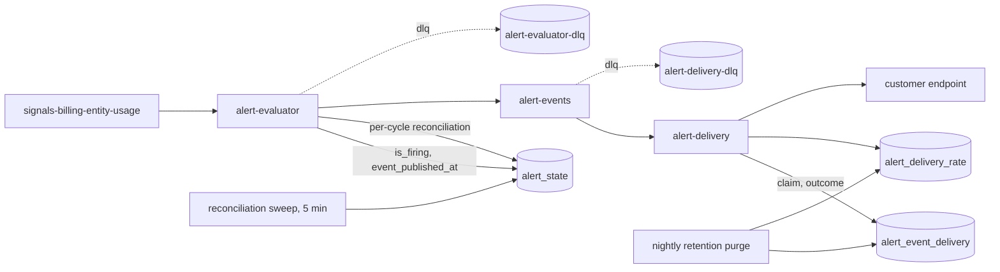

# Alert Platform Recovery Runbook

On-call procedure for getting the alert platform out of a known stuck state.
Each state below gives you the symptom, the diagnosis query, the recovery
action, and the verification that recovery worked. You should not need to read
the schema to use this document.

This runbook describes the platform as it behaves on `main`. Decision history
lives in Git and Linear, not here.

- **Services:** `services/alert-evaluator` (evaluate, publish, sweep),
  `services/alert-delivery` (consume, deliver, ledger)
- **Tables:** `alert_state`, `alert_event_delivery`, `alert_delivery_rate`,
  `alert_delivery_endpoint`, `alert_policy_settings`
- **Queues:** `signals-billing-entity-usage` → evaluator → `alert-events` →
  delivery, with `alert-evaluator-dlq` and `alert-delivery-dlq`
- **Design docs:** `services/alert-delivery/DESIGN.md`,
  `services/alert-evaluator/README.md`
- **Monitors:** `configs/terraform-monitors/monitoring/alert_platform*.tf` and
  the `alert_delivery/`, `alert_evaluator/` and `alert_producer_model_dep/`
  module directories beside them. `alert_platform_observability/` holds the
  dashboards rather than monitors

No alert-platform monitor is silenced. Every one of them evaluates and shows
state in Datadog. Whether a state change reaches a human is a separate
question, and the answer is per monitor. A monitor notifies only if it
interpolates one of the two targets defined in `alert_platform_targets.tf` and
that target is non-empty. The `severity:p3` monitors interpolate neither
target, so they never notify whatever those values are, and the two
subscription-backlog monitors leave paging to the
`[Alert Platform] Input subscription stalled` composite they feed. Read the
target the monitor actually interpolates rather than assuming its severity tag
routes it.

So silence from a monitor is not evidence of health. Open Datadog and read the
monitor state rather than waiting for a page. The
[Notifications Observability dashboard](https://us5.datadoghq.com/dashboard/sxj-tms-6iw/notifications-observability)
is the fastest way to see the platform's live state at once.

Each state below names the monitors that lead into it. That is a minority of
the platform's monitors, because most of them report a failure with no wedged
state to recover, so a monitor absent from this runbook is not undocumented.
Its own message says what it means, and the Terraform file above it states the
question it answers. Monitor messages do not link back here.

**Symptom index**

- Alert did not arrive or is late: start with **Stuck, or just quiet?**, then
  use State 6 for a ledger row or State 7 for rate-ceiling pacing.
- Email is failing broadly: start with **Stuck, or just quiet?**, then use
  State 4.
- A queue or backlog is not draining: use **Stuck, or just quiet?**, then
  State 5.
- A DLQ monitor fires: use State 5.
- A row will not clear or stop firing: start with **Stuck, or just quiet?**,
  then use State 1 or State 2.
- An endpoint is disabled: use State 3.
- A customer received duplicates or too many alerts: start with **Stuck, or
  just quiet?**, then use State 1, State 6, or State 7.

## Before you touch anything

**Access and approval.** Everything in the Diagnose steps is a read and needs
only production database read access or Datadog. Everything in the Recover
steps is a production mutation:

| Action | Access needed | Approval |
| --- | --- | --- |
| Read-only diagnosis queries | Prod Postgres read, Datadog | None |
| Customer-side settings re-save | The customer, or an operator acting on their behalf | Customer consent |
| Pub/Sub seek, purge, or DLQ pull | GCP `openrouter-core` Pub/Sub admin | Second engineer |
| Flipping a kill switch | Terraform apply on `services/alert-*/infra` | Second engineer, and it is a deploy |
| Direct `UPDATE` or `DELETE` on an alert table | Prod Postgres write | Second engineer reviewing the exact statement, including its `WHERE` |

**Prefer the supported lever.** Every state below has an ordered recovery
list. Take the first option that applies. A direct database edit is always the
last entry and is labelled as such, because these tables are written
concurrently by two always-on workers and an unscoped statement will corrupt
live state rather than repair it.

**Rules that hold for every recovery.**

- Never edit files under `postgres/seeds/`.
- Never write `internal_note` on the provider `endpoints` table. It is not a
  column on `alert_delivery_endpoint`, so nothing in this runbook should write it.
- Application writes go through `dbWrite`. A direct `psql` session is the
  fallback path only, and only against the primary.
- Every direct edit needs a `WHERE` that cannot over-scope. Key on `id` where
  you can, and on `(entity_id, alert_key)` or
  `(dedup_key, endpoint_id, channel)` where you cannot.
- Run the Diagnose query, keep its output, run the edit, then run the same
  query again. That before/after pair is your evidence.
- Never paste `endpoint_url`, `endpoint_url_encrypted`, `signing_secret`,
  `recipient_key`, or `entity_id` into a ticket, a Slack channel, or a
  screenshot. Several diagnosis queries select `entity_id` because it scopes
  the repair, so keep that output in your private session notes and redact the
  `entity_id` values before sharing the before/after evidence anywhere. For the
  other listed columns, select them only where a query below asks for them.

**Getting a prod session.** Follow `postgres/README.md`. There is no
alert-specific repair CLI and no Mission Control surface for these tables.

**Operational ownership.** The alert platform owner runs standing operational
actions: migrations, grant replays, monitor notification-target changes, and
Terraform applies for the kill switches. Escalate to the owner rather than
self-serving those actions. The current owner is Qi Shao (`qi.shao`).

> **Maintenance note.** Update the owner named above whenever operational
> ownership of the alert platform changes hands.

## Stuck, or just quiet?

Start here. Doing nothing is the default because both workers have automatic
repair loops.

For an `alert_state` row, read only these columns first:

```sql
SELECT id, entity_id, alert_key, is_firing, event_published_at,
       clear_pending_since, last_triggered_at
FROM alert_state
WHERE entity_id = :entity_id
  AND alert_key = :alert_key;
```

There are two repair branches:

1. `is_firing = true` and `event_published_at IS NULL` is an unpublished fire
   edge. The sweep owns it. The in-process sweep runs every
   `SWEEP_INTERVAL_MS` (300000 ms by default), and wedge healing only touches
   rows older than `RECONCILE_WEDGED_FIRING_MIN_AGE_SECONDS` (900 seconds by
   default). Leave the row alone. The next eligible sweep resets it.
2. `is_firing = true` and `event_published_at IS NOT NULL`, but the condition
   no longer holds, is a published firing row absent from the current
   evaluation. Per-cycle reconciliation in the evaluator orchestrator owns it.
   Leave the row alone. The next successful evaluation cycle resolves it or
   advances its normal falling-edge debounce.

Manual intervention is warranted only when the owning loop has demonstrably
seen the row and failed to heal it, or when the loop itself is down. For wedge
healing, that means a current
`alert-evaluator.reconciliation-sweep-summary` is present, the row is older
than the 900-second floor, and it remains unpublished. For published rows,
check the cycle's reconciliation logs and the evaluator's health before
editing. Do not reset a row merely because it is old.

Other quiet states are not stuck states:

- A recent `alert-delivery:rate-ceiling-nack` with no ledger row means the
  alert is paced by Pub/Sub backoff. It is not lost.
- A nacked message waiting for redelivery is expected at-least-once behavior.
  Lease expiry or broker backoff will redeliver it.
- `DELIVERY_CONSUMER_ENABLED=false` gates real delivery and acknowledges the
  event. This drops real events, so it is an incident, not a queue pause.
- Delivery reads are pinned to the primary database. Zero-weight replicas are
  only last-resort fallbacks, so `exhausted database instances` means the
  message was nacked and is waiting for Pub/Sub redelivery. The queue is
  waiting, not stuck.
- A nack is not a loss. A message can be nacked as `processing-failed`,
  redelivered, and delivered successfully. Confirm the ledger outcome before
  replaying or hand-delivering anything.

Low-balance notifications are not served by this platform. They are sent by
the legacy transactional-email path. An `alert_state` or
`alert_event_delivery` search for low balance finds nothing, and that absence
is not a stuck state.

## How the pieces fit

The evaluator keeps one `alert_state` row per `(entity_id, alert_key)`. Firing
is edge-triggered: the row flips `is_firing = true` once on crossing, the
evaluator publishes one `alert-events` message, and `event_published_at` is
written back to confirm the publish landed.

Delivery claims one `alert_event_delivery` ledger row per
`(dedup_key, endpoint_id, channel)` before it posts to the endpoint. The ledger
is what makes redelivery idempotent, so almost every delivery-side stuck state
is a ledger row that will not let the next attempt claim it.

The evaluator's five-minute sweep evaluates every entity with an alert-policy
settings row in batches of 50 even without usage traffic, then heals older
unconfirmed firing rows. Each evaluation cycle also reconciles
confirmed-published firing rows whose alert key was not produced, applying the
normal resolve or falling-edge debounce transition. That path skips unconfirmed
rows, entities in the cycle's failed set, and an entity whose policy is
disabled. A nightly retention purge runs separately in `cfw-internal`.



## State 1: Wedged `alert_state` from a partial group confirm

**Symptom.** The `[Alert Evaluator] Alert-group confirmation partial` monitor
fires on `alert-evaluator.alert-group-confirm-partial`, emitted by the
confirmation helper in `packages/db/alert-state`. A customer reports
alerts that stopped after the first one in a group. Some rows of one collapse
group carry `event_published_at`, and the rest do not.

The monitor also matches `alert-evaluator.alert-group-confirm-stale`. That
variant means every requested key was confirmed but some keys in the group no
longer matched the firing or delivery predicates. It is a warning, does not
count as a failed cycle, and needs no recovery. Read the triggering log line
first: this state applies only to the `partial` signal.

**Why it happens.** Group firing writes the winner and the suppressed rows in
one transaction, then one `UPDATE` stamps `event_published_at` across the whole
claimed key list. Confirmation checks the post-update rows and returns a
distinct `partial` outcome when some requested keys remain unconfirmed. The
orchestrator counts that outcome as a failed cycle and logs
`alert-evaluator.alert-event-confirm-failed`, while any rows already stamped
remain stamped. The unconfirmed rows are still `is_firing = true`, so they will
not fire again until the reconciliation sweep rolls them back.

**Diagnose.**

```sql
SELECT
  entity_id,
  collapse_key,
  count(*) AS firing_rows,
  count(*) FILTER (WHERE event_published_at IS NOT NULL) AS confirmed_rows,
  count(*) FILTER (WHERE event_published_at IS NULL) AS unconfirmed_rows,
  array_agg(DISTINCT last_delivery_id) AS delivery_ids_present,
  min(last_triggered_at) AS oldest_trigger
FROM alert_state
WHERE is_firing = true
  AND collapse_key IS NOT NULL
  AND (
    last_triggered_at IS NULL
    OR last_triggered_at < now() - interval '15 minutes'
  )
GROUP BY entity_id, collapse_key
HAVING count(*) FILTER (WHERE event_published_at IS NULL) > 0;
```

The fifteen-minute floor matters: below it you are looking at groups the sweep
has not yet had a chance to heal, and you will chase normal in-flight state.
`collapse_key` is not account-scoped, so use `entity_id` with it when identifying
or repairing a group. A null `oldest_trigger` means every row in the group has
no trigger timestamp, which the sweep treats as eligible rather than hiding it.

The group can contain different delivery identifiers because an already-firing,
unconfirmed row keeps its existing identifier while a new row takes the current
one. It can also be entirely unconfirmed. For either case, drill down before
editing:

```sql
SELECT alert_key, event_published_at, last_delivery_id, last_triggered_at
FROM alert_state
WHERE entity_id = :entity_id
  AND collapse_key = :collapse_key
  AND is_firing = true
ORDER BY last_delivery_id NULLS FIRST, alert_key;
```

Repair one `last_delivery_id` at a time. Keep the repair predicate scoped to
that identifier, including the null-safe comparison shown below. Do not widen it
to the whole collapse group.

**Recover.**

1. **Wait for the automatic heal. This is the default and usually the whole
   answer.** The evaluator's reconciliation sweep runs every
   five minutes (`SWEEP_INTERVAL_MS`, default 300000), evaluates every entity
   with an alert-policy settings row in batches of 50, and then rolls back every
   row matching `is_firing = true AND event_published_at IS NULL` whose
   `last_triggered_at` is null or older than
   `RECONCILE_WEDGED_FIRING_MIN_AGE_SECONDS` (default 900), and that is also
   older than the elapsed time of the current sweep. The second guard prevents
   a row fired after this sweep began from being rolled back by the same sweep,
   even if the sweep runs long. It resets `is_firing`, `last_triggered_at`,
   `last_delivery_id`, and `clear_pending_since`, so a still-breaching entity
   simply re-fires on the next cycle. The sweep heals after it evaluates,
   precisely so a breaching row is not rolled back and re-fired inside one
   sweep. Give it two sweeps, about ten minutes past the age floor, before
   doing anything else.
2. **Check the sweep is actually running.** If the rows persist, look for
   `alert-evaluator.reconciliation-sweep-summary` in Datadog and first check
   the per-stage logs: `alert-evaluator.reconciliation-sweep-entity-eval-failed`,
   `alert-evaluator.reconciliation-sweep-wedged-state-heal-failed`, and
   `alert-evaluator.reconciliation-sweep-gc-failed`. Worklist or batch-level
   failures appear as `alert-evaluator.reconciliation-sweep-worklist-failed`
   or `alert-evaluator.reconciliation-sweep-evaluate-failed`. If those do not
   identify the cause, check the `[Alert Evaluator] Reconciliation sweep
   failed` monitor and inspect the inner errors of its
   `alert-evaluator.reconciliation-sweep-failed` `AggregateError`. Entitlement
   reads, alert-state work, and batch evaluation can fail independently, and
   none has a dedicated monitor on the sweep path. A sweep that is not
   running is the real incident, and it is a service problem, not a data
   problem. There is no manual sweep trigger: the sweep is an in-process
   interval on the singleton instance, deliberately not a Cloud Scheduler job or
   an HTTP endpoint. Restarting the evaluator runs a sweep immediately at
   startup.
3. **Last resort, direct edit.** Only if the sweep is confirmed running and the
   rows are confirmed older than the age floor, which means the sweep has seen
   them and not healed them. Reproduce the sweep's own repair, scoped to one
   group:

   ```sql
   -- Last resort. Same repair the sweep performs, scoped to one wedged group.
   UPDATE alert_state
   SET is_firing = false,
       last_triggered_at = NULL,
       last_delivery_id = NULL,
       clear_pending_since = NULL
   WHERE entity_id = :entity_id
     AND collapse_key = :collapse_key
     -- Null-safe because the diagnosis can return a NULL last_delivery_id.
     AND last_delivery_id IS NOT DISTINCT FROM :last_delivery_id
     AND is_firing = true
     AND event_published_at IS NULL
     AND (
      last_triggered_at IS NULL
      OR last_triggered_at < now() - interval '900 seconds'
    );
   ```

   **Risk.** Rolling back a row whose condition is still breaching causes it to
   re-fire and re-notify the customer on the next cycle. That is the intended
   behaviour, but it means a duplicate notification. Never widen this statement
   past one `last_delivery_id`.

**Verify.** Re-run the Diagnose query and confirm the group is gone from the
result. Then confirm the rows either disappeared or came back cleanly:

```sql
SELECT alert_key, is_firing, event_published_at, last_triggered_at
FROM alert_state
WHERE entity_id = :entity_id
  AND collapse_key = :collapse_key
ORDER BY alert_key;
```

Healthy is either every row `is_firing = false`, or every row `is_firing = true`
with a non-null `event_published_at` and a fresh `last_triggered_at`.

## State 2: Stale falling-edge debounce

**Symptom.** A row is still `is_firing = true` with a `clear_pending_since`
timestamp much older than the policy's debounce window. The customer says the
condition cleared long ago and they never got the resolution. Check
`[Alert Evaluator] Reconciliation sweep failed` and
`[Alert Evaluator] Settings read failed` if the sweep is not progressing.

**Why it happens.** A clear edge arms `clear_pending_since` rather than
resolving immediately, and the commit is driven by a later clear observation.
There is no independent timer in the database. A configured entity is evaluated
by the five-minute sweep even without usage traffic, so a stale arm should clear
within a sweep or two. `budget-limit` has a debounce window of five minutes.
Other policies may resolve without that debounce.

**Diagnose.**

```sql
SELECT id, alert_key, is_firing, clear_pending_since, last_triggered_at
FROM alert_state
WHERE clear_pending_since IS NOT NULL
  AND clear_pending_since < now() - interval '1 hour'
ORDER BY clear_pending_since;
```

Anything under an hour is normal debounce in progress against a five-minute
window plus evaluation cadence.

**Recover.**

1. **Wait for the sweep to evaluate the entity.** A configured entity is on the
   sweep worklist even without usage traffic, so expect the next clear commit
   or breach cancellation within one or two sweeps. Check
   `alert-evaluator.reconciliation-sweep-summary` and the settings-read and
   entitlement monitors if it does not clear. If the sweep-failed monitor
   fires, read the `AggregateError` inner error fields before changing rows.
2. **Note what already heals.** A new fire, a group fire, a
   hold, a breach, and a rollback reset `clear_pending_since`. The five-minute
   reconciliation sweep only heals unconfirmed firing rows where
   `event_published_at IS NULL`. The per-cycle reconciliation handles a
   confirmed-published row absent from the current evaluation by applying the
   normal clear or debounce transition. A configured entity is evaluated by the
   five-minute sweep, so expect this path to clear the arm within a sweep or
   two. It does not heal an alert-state row whose entity has no settings row, an
   entity that remains in the cycle's failed set, or an entity whose policy is
   disabled. Disabling a policy leaves its settings row in the
   worklist, so that last case is evaluated but skipped.
3. **Last resort, direct edit.** For rows confirmed abandoned:

   ```sql
   -- Last resort. Disarm one stale falling-edge debounce.
   UPDATE alert_state
   SET clear_pending_since = NULL
   WHERE id = :alert_state_id
     AND clear_pending_since IS NOT NULL
     AND clear_pending_since < now() - interval '1 hour';
   ```

   **Risk.** Disarming alone does not resolve the alert. The row stays
   `is_firing = true` and will need a real clear edge or a later supported state
   transition to stop firing. Clearing an arm that was legitimately mid-window
   restarts the debounce, which delays a resolution by one window at worst.

**Verify.**

```sql
SELECT id, alert_key, is_firing, clear_pending_since
FROM alert_state
WHERE id = :alert_state_id;
```

`clear_pending_since` is null. Then watch one evaluation cycle and confirm the
row either clears or re-arms with a fresh timestamp.

## State 3: Endpoint stuck auto-disabled

**Symptom.** The `[Alert Delivery] Endpoint automatically disabled` monitor
fired on `alert-delivery:endpoint-auto-disabled`. The customer has fixed their
receiver but gets nothing, and the endpoint shows as disabled in notification
settings.

**Why it happens.** The configured threshold count of consecutive terminal
failures (`DELIVERY_TERMINAL_FAILURE_DISABLE_THRESHOLD`, 10 by default) is only
one part of the predicate. The first terminal failure in the current streak
must also be at least the configured spread period
(`DELIVERY_TERMINAL_FAILURE_SPREAD_DAYS`, 1 day by default) in the past,
with no successful delivery in between; failures do not need to be evenly
distributed. Only `terminal_4xx`, `http_error`, `ssrf_blocked`, and
`redirect_blocked` escalate to endpoint auto-disable. `fan_out_capped` is
terminal in the ledger but does not escalate. A successful delivery resets
the streak, and the success path only matches rows with `deleted_at IS NULL`,
so a disabled endpoint cannot recover by itself.

**Diagnose.** Select only these columns. Do not select the URL columns or the
signing secret.

```sql
SELECT id, type, consecutive_terminal_failures, first_terminal_failure_at,
       last_terminal_failure_at, deleted_at, disabled_reason
FROM alert_delivery_endpoint
WHERE entity_id = :entity_id
  AND deleted_at IS NOT NULL
  AND disabled_reason IS NOT NULL
ORDER BY deleted_at DESC;
```

**Recover.**

1. **Preferred, and this is the whole answer: re-save the endpoint in the
   notification settings UI.** Re-enable puts the disabled URL back into the
   form, and saving syncs endpoints by inserting a **fresh active row**. It does
   not clear `deleted_at` on the old row and does not reset its counters. The
   old row stays soft-deleted as history, and the new row starts with a zeroed
   failure count. The UI only offers Re-enable when the URL field is empty or
   already matches the disabled URL, so clear the field first if it is
   offering nothing.
2. **Confirm the receiver is actually fixed first.** Re-enabling an endpoint
   that still returns terminal errors must again reach the configured
   consecutive-failure threshold, and the first failure in that streak must
   also be at least the configured spread period old with no successful
   delivery in between. It will not disable again immediately: a still-broken
   endpoint remains active until that spread period elapses, then disables only
   if the threshold has also been reached. Ask for a successful test event
   before re-saving.
3. **Do not edit `deleted_at` directly.** There is no supported path that
   revives an auto-disabled row. The active-row uniqueness index
   (`alert_delivery_endpoint_entity_fingerprint_idx`, partial on
   `deleted_at IS NULL`, keyed on
   `(entity_id, type, endpoint_url_fingerprint)`) means that if the same
   entity has since re-added the same URL with the same endpoint type, the
   `UPDATE` fails with a unique violation. If they have not, the revival
   silently succeeds and puts a row the platform considers permanently
   disabled back into delivery, bypassing the sync path that would give it a
   clean failure count. Use the UI path.

**Verify.** Run this separate active-row query:

```sql
SELECT id, type, consecutive_terminal_failures, first_terminal_failure_at,
       last_terminal_failure_at, deleted_at, disabled_reason
FROM alert_delivery_endpoint
WHERE entity_id = :entity_id
  AND deleted_at IS NULL
ORDER BY id DESC;
```

The healthy result has a new row with
`consecutive_terminal_failures = 0` and `disabled_reason IS NULL`. Then have the
customer send a test event and confirm a `delivered` ledger row, using the
State 6 query.

## State 3a: Retired-policy event suppressed at delivery

**Symptom.** A customer or operator is tracing an event for a policy that is
no longer served by the composed alert runtime, and the event has no delivery
or failure row. The delivery logs contain
`alert-delivery:skipped-retired-policy`, or the event outcome contains
`suppression_reason = 'retired_policy'`.

**Why it happens.** Delivery independently checks
`RETIRED_ALERT_POLICY_KEYS` before reading routing or endpoints. The current
retired set contains `credits-low`, which remains on the legacy notification
path. This guard is defense in depth for an event published before the
evaluator filter existed or by another producer. It suppresses the event,
acknowledges it without retry, and records an outcome with
`skipped_count = 1` and `unevidenced_skipped_count = 1`, with zero delivered
and failed counts. This is an intentional suppression, not a lost alert.

**Diagnose.**

```sql
SELECT id, dedup_key, channel, status, failure_reason, created_at, updated_at
FROM alert_event_delivery
WHERE entity_id = :entity_id
  AND dedup_key = :dedup_key
ORDER BY created_at;
```

Also inspect the delivery logs and event-outcome record for the exact policy
key and `suppression_reason = 'retired_policy'`. The guard runs before routing
and endpoint reads, so the absence of an `alert_event_delivery` row is
expected for this state.

**Recover.**

1. **Do not replay or reset anything.** The message was acknowledged with
   `shouldRetry = false`; delivery will not send it on another attempt.
2. **Use the owning path.** For `credits-low`, investigate the legacy
   notification path if the customer expected a low-balance notice. For any
   other retired key, confirm the producer and policy migration rather than
   treating delivery suppression as a queue failure.

**Verify.** Confirm the event has a delivery outcome with
`suppression_reason = 'retired_policy'`, `skipped_count = 1`,
`unevidenced_skipped_count = 1`, and zero delivered and failed counts. No
delivery ledger row is the healthy result for this intentional suppression.

## State 4: Email delivery failing through Resend

**Symptom.** `[Alert Delivery] Resend provider failures` fires, or many email
deliveries fail while webhook and Slack deliveries remain healthy.

**Why it happens.** Email is a delivery channel backed by Resend. Its ledger
row has `endpoint_id IS NULL`. Email adds the failure reasons
`provider_error`, `email_terminal_4xx`,
`no_recipients`, and `recipients_unresolved`.

On a terminal endpoint-disable transition, and only when the notification gate
is enabled, the worker sends an account-integrity email to the canonical
account owner contact. That send ignores account notification preferences,
because suppressing it could leave an account with its only alerting channel
disabled and no warning. The claim is recorded before the send, so a consumed
claim means that transition will not be emailed again, even if the bounded send
later fails. This is separate from the delivery ledger row and should not be
diagnosed as a delayed retry.

The key trap is a missing or empty `RESEND_API_KEY`. Terraform injects that
variable from Secret Manager secret `ALERT_DELIVERY_RESEND_API_KEY`. When it is
missing, every email send returns retryable `provider_error`. This is a
provider or configuration problem, not a customer endpoint problem. It does
not auto-disable anything. Messages nack and redeliver, so fixing the key lets
the backlog heal without replay. Only messages already in the DLQ need manual
attention.

**Diagnose.** The provider monitor is
`[Alert Delivery] Resend provider failures`, defined in
`configs/terraform-monitors/monitoring/alert_delivery/alert_delivery_provider_error.tf`.
Its query looks for `service:alert-delivery`, the
`alert-delivery:failed` log, and
`failure_reason:provider_error`.

```sql
SELECT id, dedup_key, endpoint_id, channel, status, attempts,
       is_terminal_failure, failure_reason, last_error, updated_at
FROM alert_event_delivery
WHERE entity_id = :entity_id
  AND channel = 'email'
  AND dedup_key = :dedup_key
ORDER BY updated_at DESC;
```

For a fleet-wide provider signal, use Datadog rather than selecting recipient
data:

```text
service:alert-delivery "alert-delivery:failed"
@data.jsonPayload.extra.failure_reason:provider_error
```

Provider errors across many entities point to Resend or the shared key. A
terminal reason isolated to one endpoint points to that customer's receiver.
Do not treat `email_terminal_4xx` as proof that the shared provider is down.

**Read a partial fan-out.** Email has one endpoint-less ledger row for the
tenant, event, and policy, but that row summarizes several recipient batches.
Use the outcome logs to understand the individual batches before deciding
whether the alert was delivered:

- Only `permit_timeout` means the current batch never started. A provider-wide
  retryable failure (`rate_limited`, `provider_error`, a retriable 5xx, or a
  transport failure) means the current batch was attempted and failed; only
  later batches are unattempted. Terminal batch failures continue to later
  batches.
- Compare `failed_recipient_count` with `unattempted_recipient_count`.
  Failed recipients were handed to the provider and failed; unattempted
  recipients were not reached and remain owed the alert on replay. The
  aggregate row stays retryable whenever any retryable failure or unattempted
  recipient remains, and is delivered only when no batch failed or remained
  unattempted.
- Records with `outcome_scope = 'batch'` carry each batch's diagnosis. The
  unscoped aggregate record is the delivery outcome used by the aggregate
  attempt and failure rates; batch records are deliberately excluded so one
  delivery is not counted once for every batch. Use the batch records to
  explain the partial failure, not to add another failure to the rate.

An accepted send can briefly have no `status = 'delivered'` row when the
provider accepted the batches but another worker won the guarded ledger
transition. Search for the identity-bearing `alert-delivery:delivered` log
with `provider_accepted = true` and `ledger_status = 'skipped'`, then follow
the same `(entity_id, dedup_key, policy_key, delivery_id, channel)` to the
other worker's ledger outcome. This is a recorded optimistic-concurrency
no-op, not evidence that the provider rejected the alert: do not reset the
row or send again.

**Recover.**

1. **Check the shared key path.** Confirm the Secret Manager secret and
   Terraform injection with the alert platform owner (see Operational
   ownership above). Do not print or paste the key.
2. **Wait after the key is fixed.** The source messages nack and redeliver.
   Existing email ledger rows remain retryable and claimable.
3. **Treat a DLQ message separately.** Nothing consumes the DLQ. Follow State 5
   and use a new fire edge after the cause is fixed.
4. **Do not edit endpoint state.** Provider errors do not represent a customer
   endpoint and never increment the endpoint terminal-failure counter.

**Verify.** Confirm the provider-error monitor recovers, then confirm a later
email ledger row is `delivered` with `channel = 'email'` and
`endpoint_id IS NULL`. Do not expect a webhook endpoint row for email.

## State 5: DLQ backlog on the evaluator or delivery queue

**Symptom.** `[Alert Evaluator] DLQ has undelivered messages` or
`[Alert Delivery] DLQ has undelivered messages` fires. Both monitor
`gcp.pubsub.subscription.num_undelivered_messages` on the respective DLQ
subscription and both alert at any depth above zero.

**Why it happens.** Two routes. Real delivery events have a
`DELIVERY_MAX_ATTEMPTS_PER_ENDPOINT` cap, defaulting to 8 and schema-capped at
`PUBSUB_MAX_DELIVERY_ATTEMPTS - 1` (19 with the delivery subscription's current
Pub/Sub limit of 20). The cap runs before the rate-ceiling check and explicitly
moves retry-exhausted messages to the DLQ. Test events use
`TEST_EVENT_MAX_ATTEMPTS = 2` and are exempt from this per-endpoint exhaustion
path. The delivery source subscription allows twenty attempts with 10 to 600
second backoff as a fallback for failures that occur before the worker records
exhaustion. The evaluator source subscription is separate and allows ten
attempts. That is the limit referenced by the lease-extension comment, not the
delivery retry budget. Direct dead-lettering publishes an unparseable message
or an internally invalid CloudEvents envelope, including a recognized policy
key that disagrees with a recognized context kind, straight to
`alert-delivery-dlq` and acks it. A structurally valid event carrying an enum
value this consumer does not recognize instead emits
`alert-delivery:unsupported-event` with the tenant and deduplication key, is
acknowledged and dropped without a ledger row or terminal failure, and never
reaches the DLQ. That is why enum widening still deploys consumer-first: a
skew-window alert is silently lost rather than parked for recovery.

The evaluator can hold a message while extending its lease. A held but
unprocessed message occupies a flow-control slot until the lease reaches
`PUBSUB_MAX_EXTENSION_MINUTES`, which defaults to 5 minutes, so an old lease
stalls backlog drain until it expires. The lease ceiling is set alongside
`PUBSUB_ACK_DEADLINE_SECONDS`, which defaults to 60 seconds. Both values are
evaluator settings. Delivery does not extend leases and relies on its
flow-control limit, and its subscription uses a fixed 600 second ack deadline
(`ALERT_DELIVERY_ACK_DEADLINE_SECONDS`, asserted by the queue-parity test), so
do not carry the evaluator's 60 seconds over to delivery. If the evaluator backlog is
not draining while the instance is healthy, wait for the extension ceiling
before restarting into another stall.

On the evaluator side, a throwing `ack()` or `nack()` is logged as
`alert-evaluator.message-settlement-failed` and the message is left for lease
expiry redelivery. Do nothing for that message. Check the
`[Alert Evaluator] Message settlement failed` monitor and let Pub/Sub retry.

| Queue | DLQ topic and subscription | Source subscription | Retention |
| --- | --- | --- | --- |
| Evaluator | `alert-evaluator-dlq` | `alert-evaluator-billing-entity-usage` | 7 days |
| Delivery | `alert-delivery-dlq` | `alert-delivery-alert-events-transactional`, `alert-delivery-alert-events-notice` | 7 days |

**Diagnose.** Read the depth without consuming by opening the existing
`[Alert Evaluator] DLQ has undelivered messages` or
`[Alert Delivery] DLQ has undelivered messages` monitor. Their metric queries
are:

```text
min(last_15m):sum:gcp.pubsub.subscription.num_undelivered_messages{subscription_id:alert-evaluator-dlq} > 0
max(last_5m):sum:gcp.pubsub.subscription.num_undelivered_messages{subscription_id:alert-delivery-dlq} > 0
```

For the raw series, use Cloud Console Metrics Explorer with the same GCP metric
`pubsub.googleapis.com/subscription/num_undelivered_messages`, filtered by the
DLQ subscription. Neither option consumes messages.

Then inspect content. Pulling without `--auto-ack` leaves the messages in place
once the ack deadline lapses:

```bash
gcloud pubsub subscriptions pull alert-delivery-dlq \
  --project=openrouter-core --limit=5 --format=json
```

Messages dead-lettered by delivery itself carry a `dead_letter_reason`
attribute of `poison-message`, `poison-envelope`, `retry-exhausted`,
`retry-exhausted-rate-ceiling`, or `privilege-denied`. Treat message payloads as
customer data.

### Privilege-denied notice shard

A notice shard with a privilege-denied recipient-resolution failure lands in the
delivery DLQ with `dead_letter_reason = 'privilege-denied'`. Restore the
missing Postgres grant, then republish the DLQ message onto the source topic.
Persisted recipient digests suppress recipients already delivered before the
failure, so the replay does not double-send them.

A `privilege-denied` reason means at least one ledger row is claimable, so
restore the missing grant and republish the message. Any rows exhausted for
other reasons in the same message short-circuit before the claim rather than
being retried, so the republish is safe and does not need a separate fire edge
for them.

**Recover.**

1. **Establish whether the customer was actually affected.** DLQ depth alone
   does not mean a missed notification. Combine the DLQ evidence with the
   ledger: a `delivered` row for that `dedup_key` means the customer got the
   alert on an earlier attempt. See State 6 for the query.
2. **Fix the cause before draining.** A poison-message or poison-envelope
   backlog means a producer or schema deploy has produced an unparseable or
   internally invalid message, and replaying into an unfixed consumer just
   refills the DLQ. A structurally valid event with an unsupported enum value
   is not in the DLQ; it was acknowledged and dropped.
3. **Do not look for automatic replay tooling.** No replay worker or consumer is
   attached to either DLQ subscription. A privilege-denied notice shard is the
   exception: after restoring the grant, use the single-message republish in
   step 5. For other dead-lettered alerts, recovery is the new fire edge in the
   next step, the single-message republish in step 5, the purge in step 6, or
   the seven-day retention drain.
4. **Use the supported recovery path for exhausted alerts.** Do not wait for
   normal redelivery after `retry-exhausted`: the worker has already
   acknowledged the source message after publishing it to the DLQ. The only
   recovery route for that alert is a new fire edge, which gets a new delivery
   identity and retry budget. For poison messages or envelopes, fix the
   producer or consumer cause before any republish.
   Unsupported enum events are not recoverable from the DLQ because they were
   acknowledged and dropped before dead-lettering; deploy the consumer first to
   avoid that skew-window loss.
5. **Last resort, republish one confirmed-safe message.** With Pub/Sub admin
   access and a second engineer present, republish a DLQ message onto the
   source topic only after confirming that the current consumer can parse its
   payload and envelope. This re-runs the normal delivery path only when the
   existing ledger row is not already marked `retry_exhausted`,
   `retry_exhausted_rate_ceiling`, or over the per-endpoint attempt cap. A
   `privilege-denied` message may be republished after the missing grant is
   restored; its non-terminal ledger rows remain claimable. Rows exhausted for
   other reasons in the same message short-circuit before the claim rather than
   being retried, so the republish is safe and does not need a separate fire
   edge for them. Do not republish messages that still reproduce a poison or
   schema failure.
6. **Purge only as a deliberate decision.** Seeking the DLQ subscription past
   its backlog discards those events permanently. Do it only when you have
   confirmed from the ledger that the affected customers were served, or that
   the events are obsolete. Record the decision. Note that the DLQ drains itself
   at seven days regardless.

**Verify.** Re-run the metric query and confirm the undelivered count is
falling. Check the corresponding subscription-age monitor for oldest unacked
age, and confirm the DLQ monitor recovers. For any republished event, confirm a
`delivered` ledger row using the State 6 query.

## State 6: Delivery ledger row stuck non-terminal

**Symptom.** A customer did not receive an alert. The ledger has a row for the
event that is not `delivered`, and redelivery attempts are not producing a new
attempt. Check `[Alert Delivery] Ledger write failures`,
`[Alert Delivery] Permit wait timeouts detected`, or
`[Alert Delivery] Decrypt errors detected` when the matching failure reason is
present.

The standing `[Alert Delivery] A delivery has been stalled for six hours` monitor catches rows that remain in the sweep's stalled class after the arrivals monitor recovers. Read the matching `cfw_internal_alert_delivery_stalled_delivery` log event to identify the entity, dedup key, and endpoint before following the diagnosis and recovery steps below.

**Why it happens.** Delivery claims a ledger row per
`(dedup_key, endpoint_id, channel)` before it attempts a send. The claim's
conflict clause decides whether the next attempt may take the row:

| Row state | Reclaimable | Meaning |
| --- | --- | --- |
| `status = 'delivered'` | Never | Correct. The customer already got it. |
| `status = 'failed'`, `is_terminal_failure = false`, `failure_reason = 'retry_exhausted'` or `'retry_exhausted_rate_ceiling'` | No | The raw claim predicate allows it, but the exhaustion guard refuses the row before that predicate, sends the message back to the delivery DLQ, and acknowledges the source message. Use a new fire edge rather than republishing it. |
| `status = 'failed'`, `is_terminal_failure = false` for other reasons | Yes, immediately | Normal retry path, if the source message still exists. |
| `status = 'failed'`, `is_terminal_failure = true` | Never | **This is the blocking state.** |
| `status = 'pending'`, `last_error IS NOT NULL` for a test event | Yes | The test-event claim exception reclaims a pending row with a recorded error immediately. |
| `status = 'pending'`, `updated_at` older than 90 seconds | Yes | Self-healing after a crashed attempt. |
| `status = 'pending'`, `updated_at` within 90 seconds | No | An attempt is genuinely in flight. |

So an ordinary `pending` row heals itself after 90 seconds and is not the thing
to chase. Only a test-event pending row with a recorded error bypasses that
window. For ordinary source redelivery, the row that truly blocks it is
`is_terminal_failure = true`.

Disposition governs whether the worker retries within the current message. It
does not decide whether the ledger row is reclaimable, and it is independent of
endpoint auto-disable escalation:

| `failure_reason` | Ledger terminal | Disposition | Escalates auto-disable |
| --- | --- | --- | --- |
| `terminal_4xx` | Yes | No retry | Yes |
| `http_error` | Yes | No retry | Yes |
| `ssrf_blocked` | Yes | No retry | Yes |
| `redirect_blocked` | Yes | No retry | Yes |
| `email_terminal_4xx` | Yes | No retry | No |
| `endpoint_redirected` | Yes | No retry | No |
| `no_recipients` | Yes | No retry | No |
| `recipients_unresolved` | Yes | No retry | No |
| `fan_out_capped` | Yes | No retry | No |
| `invalid_endpoint` | No | No retry | No |
| `invalid_payload` | No | No retry | No |
| `retry_exhausted` | No | No retry | No |
| `retry_exhausted_rate_ceiling` | No | No retry | No |
| `rate_limited`, `provider_error`, `rate_ceiling`, `permit_timeout`, `retriable_5xx`, `fetch_error`, `decrypt_error`, `sign_error`, `circuit_open` | No | Retry | No |

At the per-endpoint test-event retry cap (`TEST_EVENT_MAX_ATTEMPTS = 2`),
a normally non-terminal retryable failure is marked terminal. When no other
endpoint requests retry, the source message is acked; recover the capped
endpoint with a fresh test event.

`recipients_unresolved` is not customer-caused: recipient resolution found
candidates it could not use. It carries a `failure_cause` of
`no_eligible_workspace_admin`, `no_candidate_recipients`, or
`candidates_all_ineligible`, so read that field before deciding whether the
account or the platform owes the fix. `no_recipients` carries a `failure_cause`
of `no_configured_recipients` or `workspace_admin_requires_workspace`, and both
mean the account has nothing to deliver to.

`permit_timeout` is handled before the claim, so it writes no ledger row and
logs `alert-delivery:failed` with `ledger_status = 'skipped'`. `retry_exhausted`
and `retry_exhausted_rate_ceiling` look reclaimable by the raw claim predicate,
but the worker's exhaustion guard runs before that predicate, dead-letters the
message, and acknowledges it, so the source message has already left the
subscription.

Every ledger write that follows a claim carries an expected state with
`{status, attempts}`. The database update requires both values to match. A
stale worker cannot overwrite a newer owner, which is one more reason not to
hand-edit a row while delivery is active.

**Diagnose.** For one event:

```sql
SELECT id, dedup_key, endpoint_id, channel, status, attempts, is_terminal_failure,
       failure_reason, last_error, response_status, created_at, updated_at
FROM alert_event_delivery
WHERE entity_id = :entity_id
  AND dedup_key = :dedup_key
ORDER BY created_at;
```

For a fleet-wide sweep of genuinely stalled claims:

```sql
SELECT id, endpoint_id, channel, status, attempts, failure_reason, updated_at
FROM alert_event_delivery
WHERE status = 'pending'
  AND updated_at < now() - interval '15 minutes'
ORDER BY updated_at
LIMIT 100;
```

Fifteen minutes is well past the 90-second reclaim threshold, so anything here
is not being retried by traffic.

For the rows the stalled gauges and the six-hour stalled monitor count, scoped to the alerting channel:

```sql
SELECT id, entity_id, dedup_key, endpoint_id, channel, status, attempts,
       failure_reason, created_at, updated_at
FROM alert_event_delivery
WHERE status <> 'delivered'
  AND is_terminal_failure = false
  AND (failure_reason IS NULL
       OR failure_reason NOT IN ('retry_exhausted', 'retry_exhausted_rate_ceiling'))
  AND updated_at < now() - interval '30 minutes'
  AND channel = :channel
ORDER BY updated_at
LIMIT 20;
```

This reproduces the unresolved sweep's stalled predicate, so its rows are exactly the ones the stalled count and age gauges report. Use it when the sweep's `cfw_internal_alert_delivery_stalled_delivery` log, which names only the five oldest stalled rows across all channels, has no line for the channel that alerted.

**Recover.**

1. **Read `failure_reason` first and fix that.** A row with
   `is_terminal_failure = true` is usually telling the truth. `terminal_4xx`
   means the customer's receiver rejected the payload. `decrypt_error` or
   `sign_error` means a key problem on our side and is retried by disposition,
   and there are dedicated monitors for both. `rate_ceiling` is State 7. The
   common pre-claim denial writes no ledger row and claims no attempt. In the
   narrow race where that check admits the event but the atomic slot claim
   loses after the ledger claim, the row carries `rate_ceiling` as a retryable,
   non-terminal failure. A test-event denial also writes a `rate_ceiling` row,
   but does not retry it. For `retry_exhausted`, do not clear the apparently
   non-terminal row or wait for redelivery. The source message is already in
   the delivery DLQ, nothing consumes it, and there is no replay tooling. Use a new
   fire edge after the underlying cause is fixed. Clearing the ledger terminal
   flag without fixing the cause just produces another terminal failure.
2. **Prefer a fresh event over resurrecting an old one.** For an endpoint
   problem now fixed, a customer-triggered test event exercises the whole path
   and writes a clean ledger row. That is the supported way to prove recovery.
3. **Check the message still exists.** Resetting a ledger row only helps if
   something will redeliver the event. Source and DLQ retention are seven days,
   and `retry_exhausted` messages are already in the DLQ rather than awaiting
   source redelivery. Past that there is nothing to redeliver and the reset
   accomplishes nothing.
4. **Last resort, direct edit.** To let a redelivery reclaim one specific row:

   ```sql
   -- Last resort. Allow one terminal-failed ledger row to be reclaimed.
   UPDATE alert_event_delivery
   SET is_terminal_failure = false
   WHERE entity_id = :entity_id
     AND dedup_key = :dedup_key
     AND endpoint_id = :endpoint_id
     AND channel = :channel
     AND status = 'failed'
     AND is_terminal_failure = true;
   ```

   Email ledger rows have `endpoint_id IS NULL`, matching the claim's
   separate `(dedup_key, channel)` conflict target for that channel, so the
   statement above updates zero rows for email. Use this variant instead:

   ```sql
   -- Last resort, email variant. Email rows carry no endpoint id.
   UPDATE alert_event_delivery
   SET is_terminal_failure = false
   WHERE entity_id = :entity_id
     AND dedup_key = :dedup_key
     AND endpoint_id IS NULL
     AND channel = 'email'
     AND status = 'failed'
     AND is_terminal_failure = true;
   ```

   **Risk.** This re-opens the row to the retry path. If the underlying cause is
   unfixed it burns another delivery attempt and another endpoint
   terminal-failure count, moving it closer to auto-disable (State 3).
   Never clear the flag in bulk, and never touch a `delivered` row: doing so
   risks a duplicate notification for an alert the customer already received.

**Verify.** Re-run the per-event Diagnose query. Success is `status =
'delivered'` with an incremented `attempts`. In Datadog, the terminal event for
a successful redelivery is `alert-delivery.message-acknowledged` with reason
`delivered`. The preceding `alert-delivery.unexpected-processing-failure` or
`alert-delivery.message-rejected` lines are the nack that led to it, not a
failure to act on.

## State 6a: Endpoint-disable notification claim consumed

**Symptom.** An endpoint was auto-disabled and the owner says no email
arrived. If the notification gate is enabled, the disable transition has a
notification claim, but there is no second send on a later delivery attempt.

**Why it happens.** The owner notification claims its idempotency key before
sending. The key is the endpoint ID followed by the disable timestamp, and the
unique constraint allows only one claim for that transition. A consumed claim
means the owner email for that disable transition will not be sent again. It
does not mean the email is merely delayed: a send failure after the claim is
best-effort and does not consume the key again or retry through this ledger.
The `DELIVERY_ENDPOINT_DISABLED_NOTIFICATION_ENABLED` gate defaults to
`false`. When it is off in production, the worker returns
`not-notifiable` before claiming and writes no `notification_log` row. No
owner email is then expected, and that is not a stuck state.

**Diagnose.**

```sql
SELECT id, clerk_user_id, notification_type,
       notification_idempotency_key, created_at
FROM notification_log
WHERE clerk_user_id = :entity_id  -- entity_id from alert tables = clerk_user_id here
  AND notification_type = 'alert_endpoint_auto_disabled'
  AND notification_idempotency_key LIKE :endpoint_id || ':%'
ORDER BY created_at DESC;
```

Use the disabled endpoint row's `id` as `:endpoint_id`. Match the timestamp
suffix in `notification_idempotency_key` by eye against that row's
`deleted_at`. The query must be scoped to the account and endpoint prefix. Do
not search only by notification type because claims from other endpoint
transitions are unrelated.

**Recover.**

1. **Check the notification outcome logs.** `sent` confirms the send was
   accepted by the email sender; `send-failed` confirms the claim was consumed
   but the bounded send failed. Lookup, gate, or claim failures have their
   corresponding outcome and log stage.
2. **Do not delete or reset the claim.** The table has no delivery status to
   advance, and removing a row would violate the at-most-once contract and
   could create a duplicate owner email. If the customer needs notice after a
   consumed failed send, escalate for a deliberate new account-integrity
   communication rather than replaying the disable transition.
3. **Customer recovery remains settings-driven.** Have the customer fix the
   receiver and re-add or re-enable the endpoint through notification
   settings, as in State 3. Do not mutate the endpoint row or notification
   claim to force a resend.

**Verify.** Confirm the exact `notification_log` row remains present and
there is no second row for the same
`(clerk_user_id, notification_type, notification_idempotency_key)`. A
consumed claim with no email is a final at-most-once outcome, not an alert
delivery backlog.

## State 7: Rate-ceiling pacing and exhaustion

**Symptom.** An alert is late at one delivery endpoint, or a delivery message
has reached the delivery DLQ. Check
`[Alert Delivery] Sustained rate ceiling by tenant`
or `[Alert Delivery] DLQ has undelivered messages` as applicable. Do not treat
an ordinary `rate_ceiling` decision
as a dropped alert. In the common pre-claim path, the worker claims no attempt,
nacks the source message, and Pub/Sub redelivery paces the alert until the
window admits it or the broker's retry budget is exhausted. In the narrow race
where the pre-claim check admitted the event but the atomic slot claim lost
after the ledger claim, the attempt is counted and the ledger carries a
retryable, non-terminal `rate_ceiling` failure.

**Why it happens.** The counter is keyed by
`(entity_id, recipient_key, channel, window_bucket)` where the bucket is
`floor(epoch_seconds / window_seconds)`, and it is checked before the ledger
claim. For webhook and Slack, `recipient_key` is the alert delivery endpoint
identifier. Email uses the synthetic key `${entity_id}:email`, so do not look
for an email rate row by endpoint ID or recipient address. Defaults are 10 per
hour for email,
30 for Slack, and 60 for webhook. Only first attempts count: retries do not
consume quota, so the ceiling does not bound redelivery storms. A ceiling
denial is therefore retryable pacing through Pub/Sub, not terminal failure.

Terminal exhaustion is a separate outcome. When the broker attempt budget is
exhausted, the worker records `failure_reason =
'retry_exhausted_rate_ceiling'` where it can, publishes the raw message to the
delivery DLQ with `dead_letter_reason = 'retry-exhausted-rate-ceiling'`, and
acknowledges the source message. If the DLQ publish fails, it nacks instead.
This is the durable evidence of an alert that was actually lost. An ordinary
`rate_ceiling` decision is not.

**Diagnose.** This query surveys every recent rate row for the entity. When
you already know the endpoint, narrow it with
`AND recipient_key = :recipient_key`, using the alert delivery endpoint
identifier (or `${entity_id}:email` for email). The last-resort reset in
Recover binds `:recipient_key` too. It is customer-linked. Do not include it
in anything you share.

```sql
SELECT recipient_key, channel, window_bucket, window_seconds, sent_count,
       window_started_at
FROM alert_delivery_rate
WHERE entity_id = :entity_id
  AND window_started_at > now() - interval '6 hours'
ORDER BY window_started_at DESC;
```

**Recover.**

1. **First distinguish late from lost.** For a late alert, inspect the source
   subscription's delivery-attempt/redelivery state and the current rate row.
   A recent `rate_ceiling` pacing decision with no terminal ledger row means
   Pub/Sub is still expected to redeliver it. Do not replay or reset a counter
   while that message remains on the source subscription.
2. **Check the ledger and DLQ together.** For the event and endpoint, query
   `alert_event_delivery` for `status`, `attempts`, `failure_reason`, and
   `is_terminal_failure`. Then inspect the delivery DLQ and its message
   attributes. A durable `retry_exhausted_rate_ceiling` row plus a corresponding
   DLQ message is terminal exhaustion. It is not an ordinary pacing delay.
3. **Investigate the source volume.** Check for a flapping alert (States 1 and
   2), a burst of distinct alerts, or a redelivery storm. The counter saturates
   at its configured limit, so it tells you the window reached the ceiling but
   not how far the endpoint's volume would have exceeded it. Fixing the source
   is the recovery. Clearing the counter without it just lets the storm resume.
4. **Wait for the window to roll for ordinary pacing.** Windows are one hour.
   The next bucket starts a fresh counter with no intervention. Do not raise
   the ceiling during an incident: the signed-off values in
   `packages/alert-policies` are a code change and deploy, not an operational
   lever.
5. **Last resort, direct edit.** Only to unblock a customer where the volume
   cause is understood and fixed, and only for the current bucket:

   ```sql
   -- Last resort. Reset one endpoint's current rate window.
   UPDATE alert_delivery_rate
   SET sent_count = 0
   WHERE entity_id = :entity_id
     AND recipient_key = :recipient_key
     AND channel = :channel
     AND window_bucket = :window_bucket;
   ```

   **Risk.** This removes the only backstop against notification flooding for
   that endpoint for the rest of the window. If the cause is not fixed you are
   choosing to send the customer an unbounded number of alerts. Deleting rate
   rows rather than zeroing them has the same effect, since a missing row reads
   as zero. These rows are purged after seven days by the nightly job.

**Verify.** Re-run the rate-counter and ledger queries. For ordinary pacing,
confirm that the source message is still being redelivered and that a later
attempt produces a normal ledger outcome. For terminal exhaustion, confirm both
the durable `retry_exhausted_rate_ceiling` ledger row and the corresponding DLQ
message. Do not call the alert lost solely because it was late or because one
delivery attempt logged `rate_ceiling`.

## Emergency stop

Both services are singleton Cloud Run instances with `min_instance_count = 1`
and `max_instance_count = 1`, and both have an application-level kill switch.
Prefer the kill switch to scaling down: a gated service still acknowledges
messages in a controlled way, whereas a scaled-down service lets the
subscription backlog grow.

| Lever | Effect |
| --- | --- |
| `EVALUATION_ENABLED = "false"` on alert-evaluator | Skips every evaluation cycle and acks buffered signals instead of redelivering. Emits `alert-evaluator:evaluation-disabled-in-prod` once at boot and an `alert-evaluator:evaluation-disabled` heartbeat every 60 seconds. |
| `DELIVERY_CONSUMER_ENABLED = "false"` on alert-delivery | Real events are acked and dropped, which fires `[Alert Delivery] Real event dropped while consumer gated`. Nothing is queued or held, and the dropped alerts are not recoverable. Trusted test events still flow. |

Both values are environment variables on their Cloud Run service, set in
Terraform under `services/alert-*/infra/cloudrun.tf`. Each service reads its
variable once at process boot, so a flip takes effect only on a new revision:
the change is a Terraform apply and a deploy, **it needs human approval and
cannot be done from this runbook.** Gating delivery loses every real alert for
the duration rather than pausing them, so flip it as a decision to drop
notifications, not as a queue pause. There is no runtime kill switch and no
Statsig gate for either service.

## Nightly retention purge

Three `cfw-internal` cron tasks run at midnight UTC:
`purge-alert-event-deliveries`, `purge-alert-delivery-rates`, and
`purge-alert-endpoint-circuits`. Ledger rows are deleted at 30 days by age
alone with no status filter. `pending`, `failed`, and `delivered` rows all
disappear at 30 days. Rate rows are deleted at 7 days. Endpoint-circuit rows
are deleted after their one-day cooldown has been expired for one day, or when
their endpoint is soft-deleted; live probe leases are always retained. All
three run in batches of 500 with a cap of 20 batches per run. Source and DLQ
retention are 7 days, so nothing older than 30 days is still redeliverable.
Capture evidence before it ages out because delivery history beyond 30 days
cannot answer whether a customer received an alert.

None of the tasks is in the manual-trigger allowlist on the internal cron
trigger route, so **there is no supported way to run any purge on demand.** A
missed run is recovered by the next night's run.

Monitor these signals:

- `[Alert Delivery] Retention purge failed` on `db.purgeExpiredAlertEventDeliveries-failed`, `db.purgeExpiredAlertDeliveryRates-failed` or `db.purgeExpiredEndpointCircuits-failed`. Unbounded table growth if it persists.
- `[Alert Delivery] Stuck pending delivery rows` on
  `db.purgeExpiredAlertEventDeliveries-stuck-pending`. This is a worker-crash
  signal, not a volume metric: it means deliveries aged past 30 days with their
  outcome never recorded. Capture those rows before the purge deletes them.
- `[Alert Delivery] Retention purge backlog: <table>` when a batch cap is hit on two consecutive runs, which means the daily run cannot drain the backlog. The suffix is `: alert_event_delivery` or `: alert_delivery_rate`, so search Datadog with it included. `alert_endpoint_circuit` has no backlog monitor of its own: its batch-cap and failure log lines appear on the retention widgets of the Alert Platform Observability dashboard, and `[Alert Delivery] Oldest purgeable alert_endpoint_circuit age` covers a purge that stops draining eligible rows.

## Known gaps

Update this runbook when any of these change.

- **There is no dead-letter replay.** No replay worker, replay command, or
  consumer is attached to either DLQ subscription. State 5 recovers exhausted
  alerts through a new fire edge or, as a last resort, a single confirmed-safe
  message republish with Pub/Sub admin access and a second engineer present.
  Purging is a deliberate discard, and an untouched DLQ backlog expires at
  seven days.
- **There is no manual trigger for the reconciliation sweep.** It is an
  in-process five-minute interval. Restarting the evaluator is the only way to
  force one.
- **There is no manual trigger for any retention purge.** All three tasks exist
  but none is allowlisted on the internal cron trigger route.
- **There is no alert-specific production repair CLI and no Mission Control
  surface for these tables.** Direct edits go through `psql` per
  `postgres/README.md`.
- **Circuit-breaker state is process-local.** Repeated `retriable_5xx` or
  `fetch_error` outcomes can open an endpoint circuit and make delivery appear
  stuck until its cooldown probe succeeds, but the state is not persisted in
  Postgres and cannot be queried from the alert tables. The observable signal
  is the `alert-delivery:breaker-transition` log and the
  `[Alert Delivery] Endpoint repeatedly opening circuit` monitor. Individual
  open state and failure history are otherwise per worker instance.
- **Both kill switches require a Terraform apply and a new revision.**
  `EVALUATION_ENABLED` and `DELIVERY_CONSUMER_ENABLED` are Cloud Run
  environment variables read at process boot, so the fastest stop is a deploy.
  See Emergency stop.
