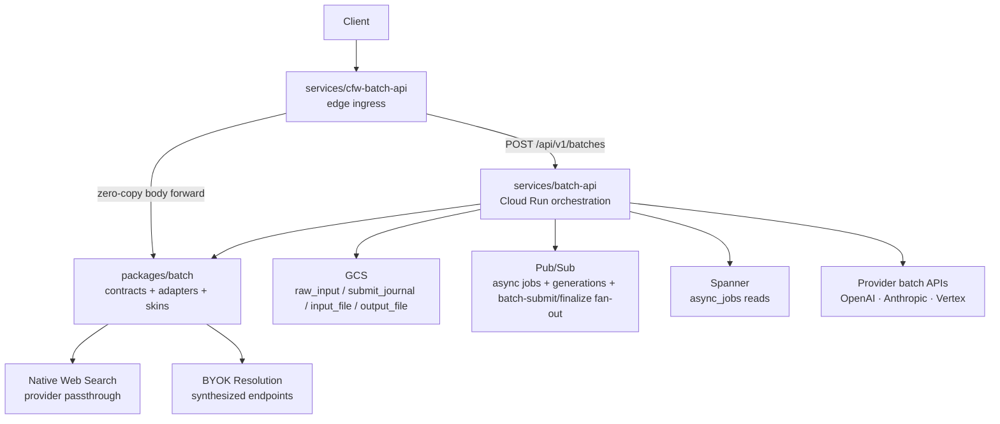

# Batch

Shared Batch API contracts for the Cloudflare ingress and Cloud Run executor.
This package owns the public route shell, request/response schemas, provider
adapter interface, provider adapters, and endpoint skins. It should stay
runtime-agnostic: no Cloudflare bindings, no Cloud Run clients, no Spanner, no
GCS clients. A skin layer normalizes each batch endpoint to the internal
completion shape so results stored as chat-completions output can be
re-rendered into other endpoint shapes (e.g. Anthropic Messages).

## Three Layers



| Layer | Owns | Must not own |
|------|------|---------------|
| `services/cfw-batch-api` | Edge auth, CORS, internal auth token minting, Cloud Run OIDC, zero-copy request/response forwarding | Batch parsing, provider calls, storage, Pub/Sub, Spanner |
| `packages/batch` | Stable schemas, route contracts, adapter interfaces, provider adapters, endpoint skins | Runtime credentials, Cloudflare bindings, Cloud Run infra, databases |
| `services/batch-api` | Submit accept + async validation worker, read/finalize orchestration, GCS URI/object store, Pub/Sub publishers, Spanner readers, sweep/finalize jobs | Public edge auth, package-internal schema forks |

## Stable Imports

Consumers should import these subpaths only:

| Subpath | Purpose |
|---------|---------|
| `@openrouter-monorepo/batch/app` | Runtime-agnostic Hono app factory used by `cfw-batch-api` |
| `@openrouter-monorepo/batch/routes/forward` | Forwarding constants and route variables shared with the ingress auth middleware |
| `@openrouter-monorepo/batch/schemas` | Public batch schemas, adapter I/O schemas, status mapping helpers |
| `@openrouter-monorepo/batch/routing/batch-endpoint-routing` | Runtime-agnostic Batch endpoint routing policy and configuration schema |
| `@openrouter-monorepo/batch/adapters` | `BatchAdapter`, `BatchObjectStore`, factory types |
| `@openrouter-monorepo/batch/adapters/openai` | OpenAI batch adapter entry point |
| `@openrouter-monorepo/batch/adapters/anthropic` | Anthropic Message Batches adapter entry point |
| `@openrouter-monorepo/batch/adapters/google-ai-studio` | Google AI Studio Gemini batch adapter entry point |
| `@openrouter-monorepo/batch/adapters/stub` | Test stub adapter entry point |
| `@openrouter-monorepo/batch/adapters/vertex` | Vertex Gemini batch adapter entry point |
| `@openrouter-monorepo/batch/skins` | Endpoint skin registry |
| `@openrouter-monorepo/batch/skins/chat-completions` | Chat completions skin |
| `@openrouter-monorepo/batch/skins/anthropic-messages` | Anthropic Messages skin |
| `@openrouter-monorepo/batch/skins/openai-responses` | OpenAI Responses skin |

The embeddings skin (a verbatim result family) is reached through the
`@openrouter-monorepo/batch/skins` registry rather than a dedicated subpath.

The subpaths in `package.json#exports` are the compatibility boundary; do not
deep-import other files from outside this package.

## Skins

Skins are organized by public batch endpoint, not provider, and grouped into
endpoint families (`schemas/batch-endpoint-family.ts`): `completions` families
re-render results through the internal event stream, while verbatim families
like `embeddings` serve provider output as-is.

- `skins/chat-completions`
- `skins/anthropic-messages`
- `skins/openai-responses`
- `skins/embeddings`

Each skin is a small wrapper around the sync endpoint transformers. It
normalizes request lines, applies batch-only policy and estimation, and renders
internal events into the public endpoint shape. Provider adapters own native
result-line validation and usage parsing in addition to translating provider
files.

## Key Modules

| Path | Purpose |
|------|---------|
| `app.ts` | `createBatchApp(deps)` route shell for the ingress worker |
| `routes/submit.ts` | `POST /` OpenAPI route registration and zero-copy forward call |
| `routes/list.ts` | `GET /` OpenAPI list registration and query-preserving forward call |
| `routes/poll.ts` | `GET /:id` OpenAPI route registration and forward call |
| `routes/forward.ts` | Upstream path and internal-auth route variable types |
| `schemas/` | Public batch schemas, adapter I/O schemas, status helpers (`index.ts` is the curated barrel) |
| `adapters/` | `BatchAdapter` contract, factory, and provider adapters (`openai/`, `anthropic/`, `vertex/`, `stub/`, …) |
| `adapters/base.ts` | `BaseBatchAdapter` — owns the provider-agnostic lifecycle (GCS persistence, `file` vs `inline` ingest-mode guards, upstream status validation) so concrete adapters implement only true provider seams |
| `schemas/batch-family-capabilities.ts` | Per-family capability registry (required output modality, completion preflights, internal-stream rendering) |
| `skins/` | Endpoint skin registry and contracts |
| `skins/contract.ts` | `BatchSkinContract` — per-endpoint request/response translation plus per-line policy validation (`validateLinePolicy`) and usage estimation (`estimateLineUsage`). Every skin normalizes via `toInternalRequest` and re-renders adapter-produced internal events via `fromInternalResponse` |
| `skins/render-batch-results.ts` | Renders stored chat-completions results back into a target endpoint's shape via its skin contract |
| `adapters/batch-error-from-response.ts` | `batchErrorFromResponse` — shared adapter helper that lifts a failed canonical HTTP-shaped response into a `BatchResultError` |

## Dependency Injection

The host worker provides Cloudflare-specific behavior via `BatchAppDeps`:

```ts
import { createBatchApp } from '@openrouter-monorepo/batch/app';

const batchApp = createBatchApp({
  middlewares: [publicApiCorsMiddleware],
  forwardToUpstream: (opts) => fetch(upstreamUrl + opts.upstreamPath, { ... }),
});

app.route('/api/beta/batches', batchApp);
```

## Commands

| Command | Description |
|---------|-------------|
| `bun test` | Run unit tests |
| `tsgo --noEmit` | Type-check |
