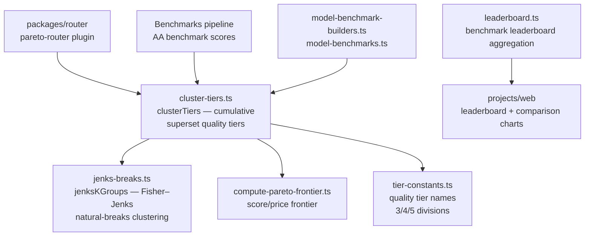

# Benchmarks Utils

Generic benchmark utility functions shared by the router's Pareto plugins and the benchmarks clustering code. Computes Pareto frontiers over model quality/price data and clusters models into quality tiers via Jenks Natural Breaks.

## Architecture

## Key Modules

| File | Purpose |
|------|---------|
| `jenks-breaks.ts` | `jenksKGroups` — Fisher–Jenks natural-breaks clustering into k groups (highest-value group first) |
| `cluster-tiers.ts` | `clusterTiers` — clusters top-N models into cumulative superset tiers by normalized score; Pareto models lead each tier, cheapest first |
| `compute-pareto-frontier.ts` | Pareto frontier computation over score/price pairs |
| `tier-constants.ts` | Shared quality tier names and division counts (3/4/5) used by both the router plugin and clustering code |
| `model-benchmark-builders.ts` / `model-benchmarks.ts` | Helpers for assembling model benchmark inputs |
| `leaderboard.ts` / `leaderboard-contracts.ts` | Benchmark leaderboard aggregation; `leaderboard-contracts.ts` holds the `searchLatencyMeanMs` latency helper (shared wire contracts live in `@openrouter-monorepo/benchmark-contracts`) |

## Commands

| Command | Description |
|---------|-------------|
| `bun test` | Run unit tests |
| `bun run typecheck` | Type-check with tsgo |
