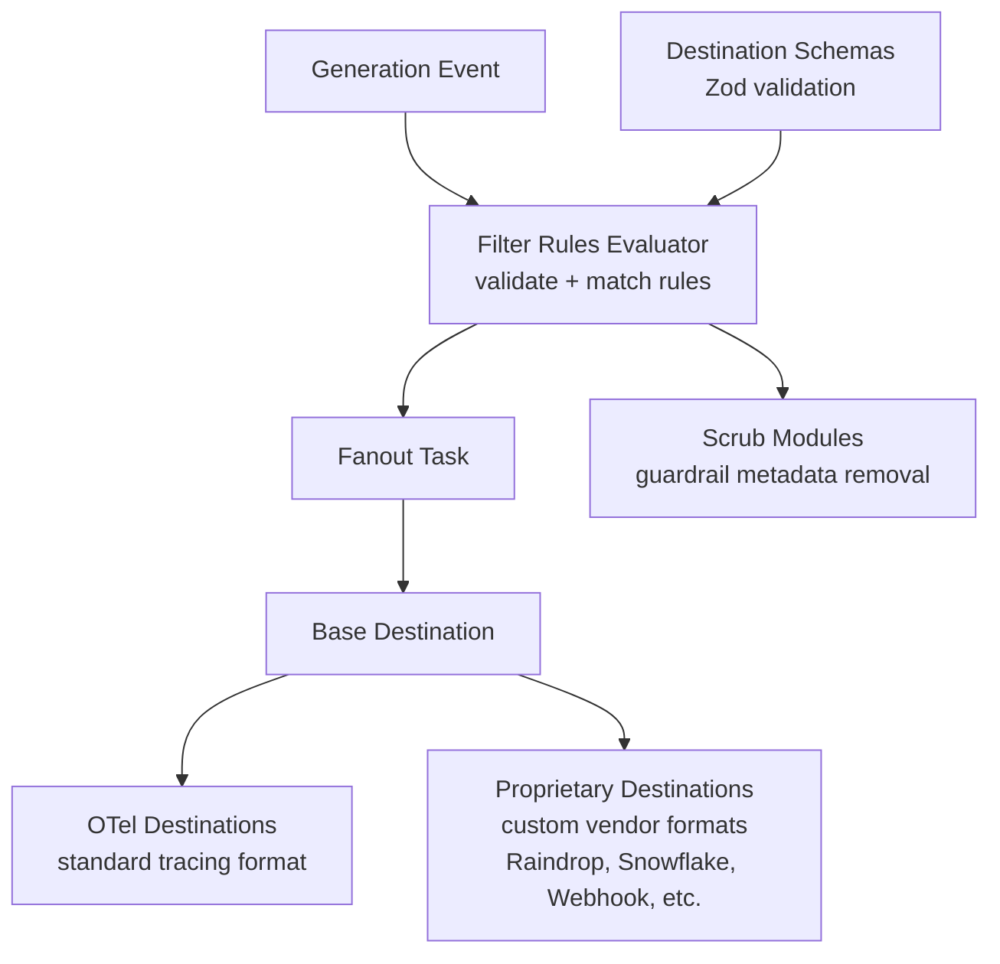

# Broadcast

LLM trace and usage data broadcasting to external storage and observability destinations. Think of it as Segment.io, but specifically designed for LLM traces. Originated from Seawatt's [Untrace](https://github.com/untrace-dev/untrace-sdk) product.

## Architecture

## Key Modules

| File | Purpose |
|------|---------|
| `filter-rules-evaluator.ts` | Evaluates filter rules against traces; rejects rules with empty values to prevent data leaks |
| `destination-schemas.ts` | Zod schemas for destination configuration validation |
| `destination-types.ts` | Type definitions for broadcast destinations |
| `destinations/base-destination.ts` | Abstract base class for all destinations |
| `destinations/base-otel-destination.ts` | OTel-compatible destination base |
| `destinations/base-proprietary-destination.ts` | Vendor-specific destination base |
| `destinations/raindrop/` | Raindrop.ai observability destination (trace forwarding with metadata) |
| `destinations/langsmith/` | LangSmith destination with exponential backoff on 429s and auto-disable on 403s |
| `fanout-task-types.ts` | Task type definitions for async fanout |

## Commands

| Command | Description |
|---------|-------------|
| `bun test` | Run unit tests |
| `tsgo --noEmit` | Type-check |
