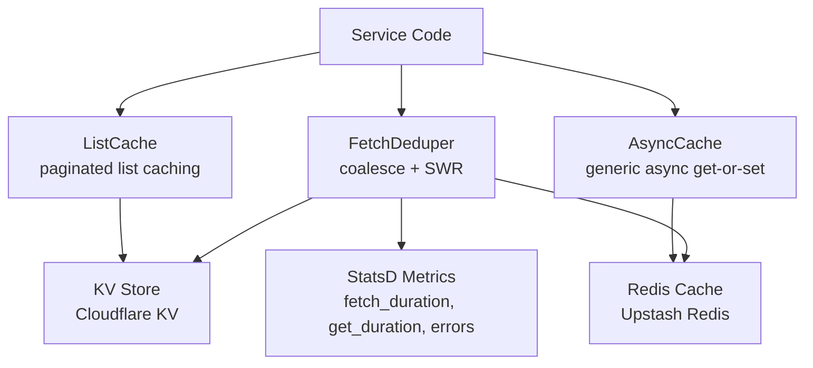

# Cache

Caching primitives for OpenRouter services. Provides deduplication, stale-while-revalidate, list caching, and Redis/KV-backed stores used across the platform to reduce upstream load and improve latency.

## Architecture

## Key Modules

| File | Purpose |
|------|---------|
| `fetch-deduper.ts` | Request deduplication with stale-while-revalidate, retry, and StatsD instrumentation |
| `list-cache.ts` | Paginated list caching (used by endpoints cache, model lists) |
| `async-cache.ts` | Generic async cache with TTL and deduplication |
| `redis-cache.ts` | Redis-backed cache via Upstash |
| `kv/index.ts` | Cloudflare KV cache helpers |
| `pending-charges.ts` | Per-pool Redis pending charges to prevent credit pool overdraw |

## Commands

| Command | Description |
|---------|-------------|
| `bun test` | Run unit tests |
| `bun run test:integration` | Run integration tests (Redis/KV) |
| `tsgo --noEmit` | Type-check |
