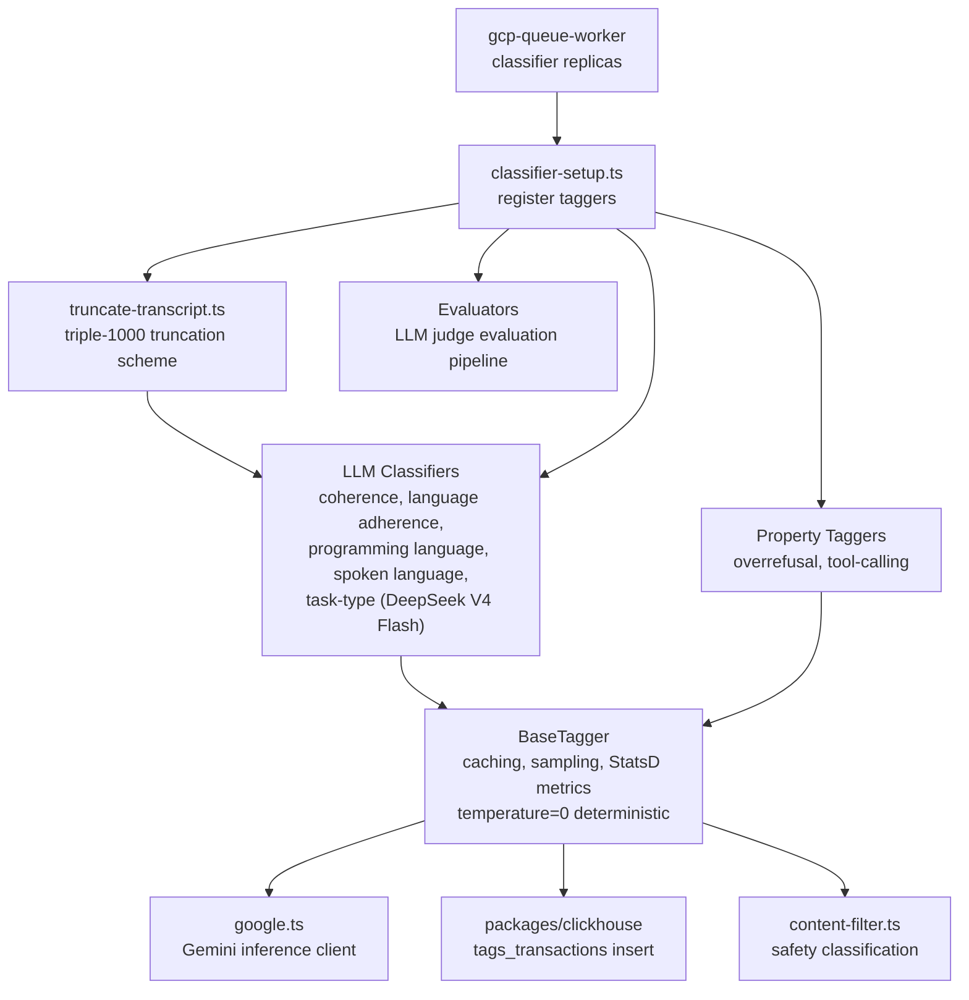

# Classifier

Model-output classification engine for OpenRouter. Runs LLM-based classifiers, deterministic property taggers, and evaluators against generation outputs to produce structured tags (language, coherence, tool-calling quality, overrefusal, etc.) used for quality analytics and content filtering.

## Architecture

## Key Modules

| Path | Purpose |
|------|---------|
| `base/base-tagger.ts` | Abstract base with caching, sample-rate gating, and `tag_duration_ms` StatsD distribution metric |
| `base/base-classifier.ts` | Extends BaseTagger with a confidence threshold for LLM-based classifiers |
| `base/base-property-tagger.ts` | Deterministic taggers (confidence always 1) for rule-based classification |
| `classifiers/` | LLM-powered classifiers (coherence judge, language adherence, programming/spoken language, task-type via DeepSeek V4 Flash). The `TaskTypeClassifier` tag list and prompt derive from the shared `task-type-taxonomy` in `packages/db` — the same source of truth that backs the customer-facing "Task type" preset, so internal tags and the gallery preset never drift |
| `property-taggers/` | Deterministic taggers (overrefusal detection, tool-calling quality) |
| `evaluators/` | LLM judge evaluation pipeline with configurable evaluation configs |
| `content-filter.ts` | Safety/content filtering classification |
| `google.ts` | Gemini inference client for LLM-based classifiers (temperature=0 for deterministic output, handles multi-output responses and markdown-wrapped JSON) |
| `truncate-transcript.ts` | Triple-1000 truncation scheme — keeps first 1000 + middle 1000 + last 1000 chars of the full request transcript for classification, replacing the previous last-message-only approach |
| `classifier-setup.ts` | Registers all taggers into the classification pipeline |

## Commands

| Command | Description |
|---------|-------------|
| `bun test` | Run unit tests |
| `bun run test:integration` | Run integration tests |
| `bun test --watch` | Run tests in watch mode |
| `bun run typecheck` | Type-check with tsgo |
