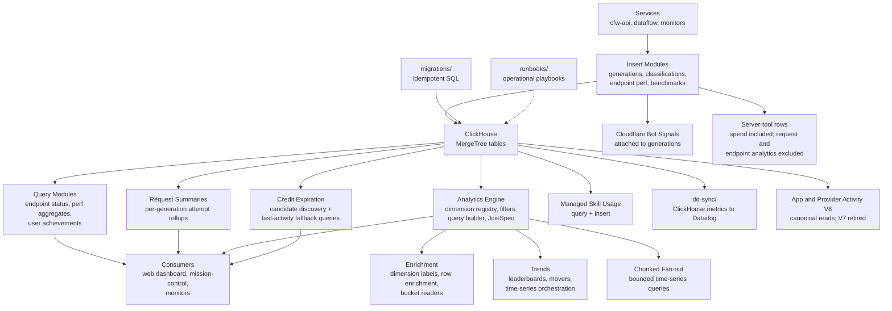

# OpenRouter ClickHouse Analytics

ClickHouse analytics package for OpenRouter. Stores and queries high-volume generation data, endpoint performance metrics, user achievements, classification signals, and gateway benchmark results.

## Architecture



## Key Tables

| Table                                  | Purpose                                                                                                                                                                                                                                                                          |
| -------------------------------------- | -------------------------------------------------------------------------------------------------------------------------------------------------------------------------------------------------------------------------------------------------------------------------------- |
| `generations`                          | Primary generation log — latency, tokens, billing, provider, Fortuna shadow-scoring fields (16 flat columns for backtesting analytics, including `is_sticky_session` for cache-hit segmentation and band-selection propensities that replay the production draw only on rows with `experiments.fortuna_routed`) |
| `endpoint_perf_*`                      | MergeTree tables and materialized views for workload-aware endpoint performance aggregation (V5 only, earlier versions retired). Readers live in `endpoint-perf/v5-*.ts`                                                                          |
| `gateway_benchmark_results`            | Per-request benchmark data from the gateway-bench-runner service (includes `routing` for strategy comparison and `num_providers_tried` for upstream fallback tracking)                                                                                                           |
| `user_achievement_aggregates_daily_v1` | Daily user achievement rollups                                                                                                                                                                                                                                                   |
| `tags_transactions`                    | Model output classification signals                                                                                                                                                                                                                                              |
| `endpoint_requests_by_generation_v1`   | Per-generation request attempt rollups (status, latency, provider)                                                                                                                                                                                                               |
| `endpoint_requests_by_entity`          | Request volume aggregated by entity (org, user, app) for per-endpoint analytics                                                                                                                                                                                                  |
| `managed_skill_usage`                  | Per-skill invocation tracking for the managed skills product                                                                                                                                                                                                                     |
| `public_api_requests`                  | Per-request telemetry for the models/datasets/analytics public API routes (cfw-public-api), with a daily rollup                                                                                                                                                                  |
| `task_spend_rankings`                  | Per-task spend aggregates for the task-spend treemap rankings feature                                                                                                                                                                                                            |

## Analytics Engine

The analytics engine supports declarative multi-table queries via a registry-based architecture:

| Module                            | Purpose                                                                                                                                                                                                                                        |
| --------------------------------- | ---------------------------------------------------------------------------------------------------------------------------------------------------------------------------------------------------------------------------------------------- |
| `analytics/dimension-registry.ts` | Dimension definitions (static and dynamic/joined) for analytics filters and groupings                                                                                                                                                          |
| `analytics/join-registry.ts`      | `JoinSpec` abstraction layer — declarative join descriptions (`JoinCardinality`, `buildClassifierJoinSpecList`) for auxiliary tables like `generation_classifications`. Supports generic LEFT JOIN via `JoinSpec` for flexible multi-table queries |
| `analytics/table-resolver.ts`     | Resolves dimension and metric requirements into physical table + join plans                                                                                                                                                                    |
| `analytics/query-builder.ts`      | Compiles resolved plans into ClickHouse SQL with correct de-duplication for one-to-many joins (including generic LEFT JOIN support)                                                                                                            |
| `analytics/metric-registry.ts`    | Metric definitions and aggregation expressions                                                                                                                                                                                                 |
| `analytics/schemas.ts`            | Zod schemas for analytics query requests                                                                                                                                                                                                       |

## Fortuna Readout

`fortuna/` holds the realized-outcome readout of Fortuna-routed traffic. One population definition (`fortuna/readout-population-sql.ts`) feeds two queries so the operational dashboard and any analysis over a longer window count the same generations:

| Module                            | Purpose                                                                                                                           |
| --------------------------------- | --------------------------------------------------------------------------------------------------------------------------------- |
| `fortuna/readout-queries.ts`      | Per (model, scoring policy, bracket policy, arm, provider) counters, quantiles and attempt rollups for one window. Runs in the cfw-internal five-minute cron and per chunk in the CLI. |
| `fortuna/user-outcome-queries.ts` | Per-user generation, completed and truncated cells over a whole window, the source of exact distinct users, user-weighted rates, concentration and user-clustered intervals. |
| `fortuna/readout-user-view.ts`    | Folds the per-user cells of one group into user-weighted rates, top-1 and top-10 user shares and the effective user count.        |
| `fortuna/readout-report.ts`       | Sums chunk counters, joins the per-user cells, flags low-volume groups, and computes routed-minus-holdout completion and completed-or-truncated intervals. |

The CLI is read-only and prints Markdown or JSON. Scope it to one model, a broad unscoped day does not fit the cluster's query memory:

```bash
bun run x scripts/fortuna-readout.ts \
  --model z-ai/glm-5.3-flash-20260826 \
  --start 2026-09-14T00:00:00Z --end 2026-09-15T00:00:00Z \
  [--chunk-hours 24] [--timeout-seconds 1500] [--format markdown|json]
```

Credentials come from the environment in one of two complete sets. `CLICKHOUSE_READONLY_USER` and `CLICKHOUSE_READONLY_PASSWORD` take precedence when both are set, on `CLICKHOUSE_ANALYTICS_URL` if it is set and on `CLICKHOUSE_URL` otherwise. Without them the script uses `CLICKHOUSE_URL`, `CLICKHOUSE_USERNAME` and `CLICKHOUSE_PASSWORD`. Only one of the two sets is needed, and a half-set pair (one read-only variable, or `CLICKHOUSE_ANALYTICS_URL` without both read-only variables) exits 2 instead of falling back. `--start` and `--end` are whole-second ISO 8601 timestamps with a timezone designator, validated as calendar dates before parsing (`2026-02-30T00:00:00Z` is rejected, not rolled into March), because the queries bound the window at second precision. The queries also read 6 minutes before `--start` (the quiet-group lookback and the attempt-scan lead) and 25 minutes after `--end` (the child-generation trail), and every instant they render must fall within the ClickHouse `DateTime` range, `1970-01-01T00:00:00Z` to `2106-02-07T06:28:15Z`, so `--start` is accepted from `1970-01-01T00:06:00Z` and `--end` up to `2106-02-07T06:03:15Z`. A bound outside that is rejected, naming the derived instant, instead of overflowing a `toDateTime` literal. Quantiles are reported per chunk only, they cannot be combined across chunks. Each routed group is compared with the holdout group stamped with the same bracket policy, so pre-stamp holdouts (`unstamped`) pair only with pre-stamp routed rows. The comparison is descriptive: arms share the eligible population, but the assignment is keyed on user, conversation or session, and model, so a user can appear in both arms. The user-clustered interval treats each user as one cluster spanning both arms for that reason. A user is the billable entity (`clerk_user_id`), the identity the sampling key is built from, so an organization is one user however many members or API keys act for it. `creator_user_id` is not used: on bearer-key traffic, nearly all of the Fortuna population, it names the API key's creator rather than the caller, so it would split one workload across its keys and merge every caller of a shared key. Generations with no Clerk user id (anonymous traffic) are counted in every generation total, generation-weighted rate, share denominator and Wald interval, but they belong to no cluster and no user cell, so the user-clustered intervals and user-weighted rates cover identified users only. The report states the anonymous count per arm next to the intervals and adds a caveat whenever it is nonzero.

The report carries two completion readings. Completion is strict, a finish reason of `stop` or `tool_calls`. Completed-or-truncated adds `length`. A pipeline that sets a small `max_tokens` finishes `length` on purpose and would otherwise read as a completion failure for its whole arm. It is not a delivered rate: a reasoning model can spend its whole token budget before any visible text and still finish `length`, and the generation row does not separate that from a capped answer (over one production day, most `length` finishes on the reasoning flash models had no completion tokens left after reasoning). Read the two together as the range in which the client-visible rate sits. `completed_count` and the strict intervals are unchanged, completed-or-truncated is an additional counter, rate and pair of intervals. Every rate comes in a generation-weighted form (the group's counts divided) and a user-weighted form (the mean of each identified user's own rate, so a user sending a million generations counts once). When the two disagree, one workload is moving the generation-weighted number. To show how much one workload can move it, each group reports the share of its generations sent by its largest identified user and by its ten largest, both over every generation of the group including anonymous ones, and an effective user count, `(sum n)^2 / sum n^2` over identified users, which is how many equal-volume users would produce the same concentration. It is a concentration measure, not a distinct count: the exact distinct count is next to it. Groups under 300 generations per day over the window, or under 300 generations observed in the window whatever its length, are flagged `is_low_volume`, marked low in the table and named in a caveat, because their rates move by whole points between days and are not readable against another group. `generations_per_day` is floored to a whole generation when the report is built, so the JSON field, the table and the flag agree. The per-day rate alone would let a few generations in a short window extrapolate to a healthy daily volume. The floors are `FORTUNA_READOUT_VOLUME_FLOOR_PER_DAY` and `FORTUNA_READOUT_MINIMUM_GENERATIONS`. Top-1 and top-10 shares divide identified-user generations from the per-user query (reported as `identified_generations`) by the chunk total, so when the two queries drift far enough apart that the users hold more generations than the total, both shares are withheld and the drift caveat says so. None of this changes the descriptive nature of the comparison, a user-weighted difference is a description of the same non-random arms.

Wall time scales with the window. The runner issues one generation query per `--chunk-hours` chunk in sequence, then one per-user query over the whole window, each bounded by `--timeout-seconds`. A 24-hour chunk scoped to one model took about 115 s on production, so a 7-day window is roughly 15 minutes of chunk queries plus the whole-window user query under normal cluster load, and up to 8 x 1500 s if every query runs to the default timeout. Under heavy concurrent load a 6-hour chunk for the same model has taken 8 to 13 minutes. Every query asks ClickHouse for progress headers every 30 s so an idle connection is never dropped mid-query, and the script raises Node's fetch header timeout and header-size limit to what `--timeout-seconds` worth of progress headers needs, so a slow query fails only through that flag. Each chunk announces itself on stderr as `fortuna readout chunk <start> to <end>` before its query runs. Run multi-day windows in the background or under `nohup` and read the report from stdout when it finishes.

## Local Development Setup

### 1. Start ClickHouse using Docker

The package includes a `docker-compose.yaml` file that sets up ClickHouse locally. To start it:

```bash
cd packages/clickhouse
bun run ch:start
```

This will start ClickHouse with the following default configurations:

- HTTP interface: Port 8123
- Native interface: Port 9000
- Default database: `default`
- Default user: `default`
- Default password: `clickhouse`

The development env will be written to `scripts/.env.development.local` file.

### 2. Environment Variables

If running clickhouse locally add the following variables to your `.env.development.local` at the repository root:

```bash
CLICKHOUSE_URL=http://localhost:8123
CLICKHOUSE_USERNAME=default
CLICKHOUSE_PASSWORD=clickhouse
```

### 3. ClickHouse Web UI (CH-UI)

For a visual interface to browse and query ClickHouse, start the CH-UI service:

```bash
bun run ch:ui
```

This starts a web UI at [http://localhost:5521](http://localhost:5521) with:

- SQL query editor
- Table browser
- Query history
- Data visualization

The UI auto-connects to your local ClickHouse instance using the default credentials.

## Troubleshooting local clickhouse

### If you can't connect to ClickHouse:

- Verify the container is running: `docker compose ps`
- Check logs: `docker compose logs clickhouse`
- Ensure ports 8123 and 9000 are not in use by other services

### To reset the database:

```bash
bun run ch:reset
```

## Migrations

Migrations are stored in the `migrations` directory. They are executed in order, and are idempotent.
We are using [clickhouse-migrations](https://github.com/VVVi/clickhouse-migrations) internally to manage migrations.

**Read the [migration guidelines](./migrations/REVIEW.md) before writing new migrations** — rules for column ordering, immutability, drop ordering, and file numbering.

To run migrations:

```bash
bun run ch:migrate
```

To create a new migration:

```bash
bun run ch:migration
```

### Production

The `Migrate Clickhouse Prod` job in `.github/workflows/release.yaml` migrates the current production service on every release. The ClickHouse Production Primary (HIPAA) service provisioned in [openrouter-infra](https://github.com/OpenRouterTeam/openrouter-infra/tree/main/terraform/clickhouse) receives the same migrations from [Migrate ClickHouse Production Primary (manual)](https://github.com/OpenRouterTeam/openrouter-web/actions/workflows/migrate-clickhouse-production-primary-manual.yaml), dispatched from `main` after each release that ships ClickHouse migrations, until the step is added to `release.yaml` as a required part of the release. The workflow defaults to the commit of the latest `release-*` tag, and an explicit SHA is accepted only when a release run for it migrated the current production service, so the primary receives exactly the migrations the current production service already has. Before it runs `clickhouse-migrations`, `scripts/ch-migrate-gcp.ts` checks that `default._migrations` exists on the primary and has rows; a service the bootstrap below has not seeded is refused with `service-not-bootstrapped`, because the runner would otherwise create the ledger and replay the corpus from the first file, fail at the first ClickPipes-dependent view, and leave ledger rows the bootstrap then refuses.

#### Bootstrapping the fresh service

The migration corpus cannot be replayed onto an empty service: migrations 221–287 create materialized views over ClickPipes CDC tables (`clickpipe_postgres_gcp_uscentral1.*`, `clickpipe_posthog.events`) and dbt tables (`analytics.stg_users`, `analytics.stg_plan_tiers`) that exist only where those pipelines are connected, and ClickHouse resolves the source at `CREATE` time. Locally, `ch:bootstrap` fakes those tables first; on the Production Primary they arrive later with the pipelines. [Bootstrap ClickHouse Production Primary (manual)](https://github.com/OpenRouterTeam/openrouter-web/actions/workflows/bootstrap-clickhouse-production-primary.yaml) runs `scripts/bootstrap-clickhouse-baseline.ts` instead, which:

1. Reads the current production service's schema (`system.tables` in `default` and `stg_trust_and_safety`, plus SQL user-defined functions) with the release's `CLICKHOUSE_*` credentials.
2. Leaves behind every object whose name appears in no migration production has applied (`*_clickpipes_error` tables ClickPipes creates next to their destination, Airbyte connection tests, hand-loaded imports), listed in the run log as `clickhouse-baseline-unmanaged`; ClickPipes recreate their own error tables where they are connected, and anything else wanted on the primary arrives as a forward migration.
3. Defers every object that reads a table outside those databases, and every object that reads a deferred or unmanaged object, and lists them in the run log; everything else is created on the primary in dependency order (tables, then views), so the primary has the same tables and the same DDL for every object it does have. The one rewrite is a view's `DEFINER = <user>` clause, which becomes `CURRENT_USER`: production records whichever user created each view, and creating a view on another user's behalf needs `SET DEFINER`, which the migrator does not have, so on the primary the definer is `migrator`, as it is for every view a later migration creates there.
4. Copies the source's `default._migrations` rows (`version`, `checksum`, `migration_name`, `applied_at`) into the primary's ledger, so the runner sees exactly what production has applied. A file merged to `main` after the last release has no row and no DDL on either service; the run log reports it as `migrations_pending_on_source` and the next Migrate ClickHouse Production Primary (manual) run applies it, as usual, only once a release has applied it to production.

The workflow is a dry run unless dispatched with `apply=true`. Before either mode prints the plan it compares the target against it: a target whose `_migrations` has rows was already bootstrapped and is refused, as is one holding any table, view or SQL function the plan would not create; an object that exists with the same DDL as the source (whitespace outside string literals, table UUIDs and the view definer aside) is skipped and counted as `objects_already_present`, so a run that failed partway (a privilege or settings difference on one object is the likely first-run failure) is resumed by dispatching again. An existing object whose DDL differs is refused by name, and the way back is to drop it (or start over: `DROP DATABASE stg_trust_and_safety SYNC`, `DROP DATABASE analytics SYNC`, and every table in `default`, which cannot itself be dropped, as the `migrator` or `default` user in the ClickHouse Cloud SQL console) and dispatch again. The deferred objects (the `user_flag_*` fraud/risk-signal views, the `model_plan_uptime_*` / `org_model_uptime_*` rollups, and the `verified_web_usage_*` views) come back as one forward migration once ClickPipes and dbt write to the primary. The same script works between two local ClickHouse instances (`CH_SOURCE_*` / `CH_TARGET_*` env vars, `bun run ch:baseline -- --dry-run`).

The workflow authenticates as the `migrator` user that openrouter-infra provisions (CREATE/ALTER/DROP/INSERT/SELECT on every database; the app `writer` user cannot run DDL and the `default` user is reserved for OpenTofu). Its password is not a GitHub secret and never a step output: the job impersonates `clickhouse-migrate@openrouter-root` through Workload Identity (main-branch runs only) and `scripts/ch-migrate-gcp.ts` / `scripts/ch-bootstrap-gcp.ts` read the latest version of the `CLICKHOUSE_PRODUCTION_PRIMARY_MIGRATOR_PASSWORD` Secret Manager secret in-process (as `scripts/db-migrate-gcp.ts` does for Postgres), so a rotation in openrouter-infra needs no change here. The only hand-set value is the `CLICKHOUSE_PRODUCTION_PRIMARY_URL` variable in the `production` GitHub environment (the `production_primary_service_url` output of openrouter-infra's `terraform/clickhouse/production` stack); the workflow fails before touching anything while it is unset. Both scripts also refuse to run unless `GITHUB_ACTIONS=true`, so a local `bun scripts/ch-migrate-gcp.ts` with Application Default Credentials stops before contacting Secret Manager; only the two workflows can reach `production_primary`.

## Commands

| Command | Description |
| --- | --- |
| `bun run test` | Run unit tests |
| `bun run test:integration` | Run ClickHouse integration tests |
| `bun run typecheck` | Type-check with tsgo |
| `bun run ch:start` | Start local ClickHouse |
| `bun run ch:migrate` | Apply ClickHouse migrations |
| `bun run ch:baseline` | Copy a service's schema and `_migrations` ledger onto an empty (or partially bootstrapped) one (`--dry-run` to only print the plan) |
| `bun run ch:reset` | Reset local ClickHouse |
| `bun run ch:ui` | Start the ClickHouse web UI |
