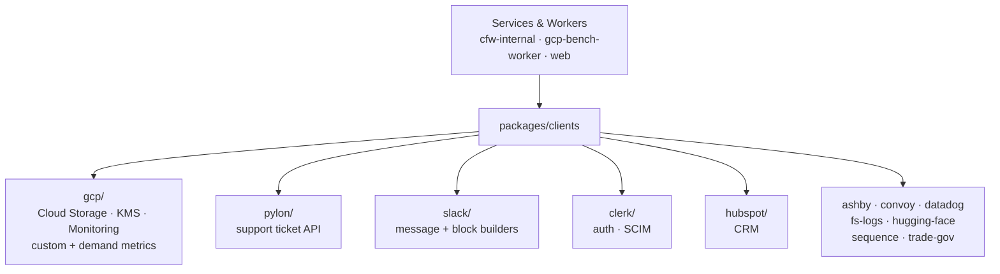

# Clients

Shared third-party API clients for the monorepo. Each subdirectory wraps one external service with typed, Result-returning helpers so services and workers don't hand-roll their own integrations.

## Architecture

## Key Modules

| Path | Purpose |
|------|---------|
| `gcp/` | Google Cloud clients: Storage, KMS, signed GCS URLs, and Cloud Monitoring (custom metric emission and demand-gauge reads used by the bench-worker autoscaler) |
| `pylon/` | Pylon support-ticket API client with Zod-validated schemas |
| `slack/` | Slack message posting and Block Kit builders (user/endpoint blocks) |
| `clerk/` | Clerk backend client for auth and SCIM directory queries |
| `hubspot/` | HubSpot CRM client and environment configuration |
| `datadog/` | Datadog API client |
| `sequence/` | Sequence billing client |
| `ashby/`, `convoy/`, `fs-logs/`, `hugging-face/`, `trade-gov/` | Smaller single-purpose clients |

## Commands

| Command | Description |
|---------|-------------|
| `bun test` | Run unit tests |
| `bun run typecheck` | Type-check |
