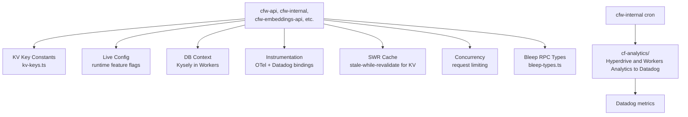

# Cloudflare

Shared Cloudflare Worker utilities and constants. Provides KV key definitions, live-config helpers, DB context for Workers, instrumentation bindings, concurrency control, and caching primitives that all `cfw-*` services depend on.

## Architecture

## Key Modules

| File                      | Purpose                                                                                                                                                                                                         |
| ------------------------- | --------------------------------------------------------------------------------------------------------------------------------------------------------------------------------------------------------------- |
| `kv-keys.ts`              | Centralized KV key constants shared across all workers — includes regional keys (`kvRegionalAllKey`)                                                                                                            |
| `live-config.ts`          | Runtime feature flag and config reader from KV                                                                                                                                                                  |
| `db-context.ts`           | Kysely DB context adapter for Cloudflare Workers                                                                                                                                                                |
| `instrumentation/`        | OpenTelemetry + Datadog integration for Workers                                                                                                                                                                 |
| `swr-cache.ts`            | Stale-while-revalidate caching over KV                                                                                                                                                                          |
| `concurrency.ts`          | Request concurrency limiting                                                                                                                                                                                    |
| `cloudflare-cache.ts`     | Cloudflare Cache API wrapper                                                                                                                                                                                    |
| `stream-patches.ts`       | Stream compatibility patches for Workers runtime                                                                                                                                                                |
| `bleep-types.ts`          | Shared request/response types for the cfw-bleep `detect` WorkerEntrypoint RPC                                                                                                                                   |
| `cf-analytics/`           | Cloudflare GraphQL Analytics sync — queries account-scoped Hyperdrive and Workers invocation datasets, transforms rows, and submits metrics to Datadog (`executeCfAnalyticsSync`, run by the cfw-internal `cf-analytics-sync` cron) |
| `timing.ts`               | Performance timing utilities                                                                                                                                                                                    |

## Commands

| Command            | Description                                 |
| ------------------ | ------------------------------------------- |
| `bun run test:cfw` | Run Cloudflare Worker-scoped tests (vitest) |
| `tsgo --noEmit`    | Type-check                                  |
