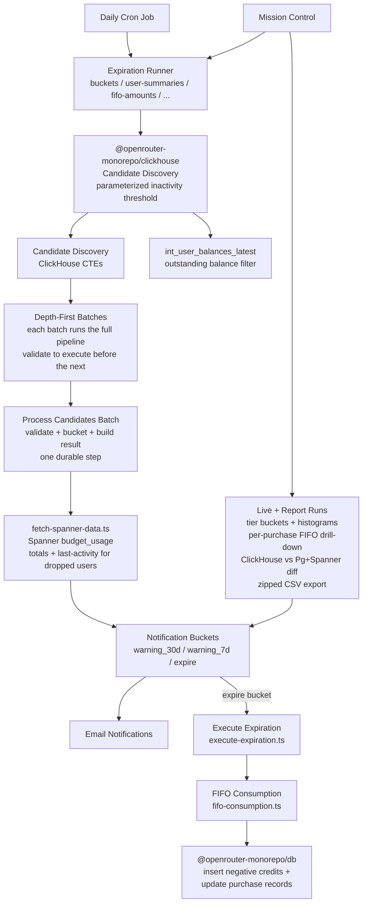

# Credit Expiration

Domain package for credit expiration logic in OpenRouter. Provides shared TypeScript types and interfaces used by both the daily cron job and Mission Control to discover, notify, and expire inactive credits.

## Architecture

## `credit_expires_at` is a floor, not a deadline

Treat `credits.credit_expires_at` as the **earliest** moment a credit may be
expired, never as the exact moment expiration must happen. Runs are daily and
manual, and the promo-credits lifecycle can push a credit's effective expiration
later so its owner receives the full 30-day and 7-day notices. Code that reads
`credit_expires_at` (queries, tiering, emails, reports) must never assume a
credit is gone the instant that timestamp passes — only that it is eligible to
be.

## Key Types

| Type                            | Purpose                                                                                        |
| ------------------------------- | ---------------------------------------------------------------------------------------------- |
| `NotificationBucket`            | Lifecycle tiers: `warning_30d`, `warning_7d`, `expire`                                         |
| `ExpirationCandidateUserRow`    | Per-user row from the candidate-discovery query (defined in `@openrouter-monorepo/clickhouse`) |
| `ExpirationResult`              | Outcome of processing a single candidate                                                       |
| `UserSummarySchema`             | Per-user expiration summary (purchased / used / amount-to-expire) returned for the top-N users |
| `CreditPurchaseBreakdownSchema` | Per-purchase FIFO expiration detail for a user's drill-down                                    |
| `FifoCreditExpiration`          | Per-credit expiration amount from FIFO computation                                             |
| `ComputeFifoArgs`               | Inputs for the FIFO consumption model                                                          |

## Key Modules

| File                            | Purpose                                                                                                                                                                                                                                                                                                                |
| ------------------------------- | ---------------------------------------------------------------------------------------------------------------------------------------------------------------------------------------------------------------------------------------------------------------------------------------------------------------------- |
| `credit-expiration-workflow.md` | Detailed `CreditExpirationWorkflow` reference — durable steps, ClickHouse/Postgres/Spanner data sourcing and filtering, dry-run vs live scope, FIFO/result semantics, persisted state, and a Mermaid workflow overview                                                                                                 |
| `amounts.ts`                    | Amount formatting (`formatAmount`) and per-user total aggregation (`sumAmountToExpire`, `sumChAmountToExpire`, `sumDiffVsPgSpanner`)                                                                                                                                                                                   |
| `buckets.ts`                    | Notification-tier bucketing — assigns each validated candidate to `warning_30d` / `warning_7d` / `expire`, filters failed expirations, and resolves the most urgent tier per user                                                                                                                                      |
| `credit-data.ts`                | Chunked fetch of per-user unexpired credits and authoritative `total_credits` (`fetchCreditsAndTotalsByUser`)                                                                                                                                                                                                          |
| `user-summaries.ts`             | Builds per-user expiration summaries with the per-purchase FIFO breakdown and top-N ranking                                                                                                                                                                                                                            |
| `tier-breakdown.ts`             | Aggregates bucketed users per tier and merges per-batch tier breakdowns                                                                                                                                                                                                                                                |
| `histograms.ts`                 | Amount-to-expire histograms (general + sub-dollar, including a $0.00–$0.01 bin) and their per-tier and cross-batch merges                                                                                                                                                                                              |
| `fifo-amounts.ts`               | Read-only FIFO expiration previews and dropped-candidate amount-to-expire totals                                                                                                                                                                                                                                       |
| `run-results.ts`                | Assembles the stored/returned workflow run result payload and batch-size constant                                                                                                                                                                                                                                      |
| `validate-candidates.ts`        | Re-checks candidates before expiration (balance, activity — with a ClickHouse last-activity fallback) and persists validation drops and bucket skips for audit                                                                                                                                                         |
| `fetch-spanner-data.ts`         | Batched Spanner `budget_usage` lookup (one call per batch; the shared helper sizes its own queries) returning per-user total usage and a last-activity timestamp — recovers usage for dropped users missing it and cross-checks ClickHouse-derived amounts                                                             |
| `workflow-state.ts`             | Serializable workflow state for the credit-expiration Cloudflare Workflow, including persisted drop-out records                                                                                                                                                                                                        |
| `schemas.ts`                    | Zod schemas for the credit-expiration request/response surface (`StartRunRequestSchema`, tier breakdown, user summaries)                                                                                                                                                                                               |
| `execute-expiration.ts`         | Executes the `expire` bucket — inserts negative credit records and updates purchase `expires_at` via `packages/db`                                                                                                                                                                                                     |
| `fifo-consumption.ts`           | FIFO consumption model — walks credits oldest→newest to compute per-credit expiration amounts                                                                                                                                                                                                                          |
| `promo-credits-tiering.ts`      | Promotional-credit lifecycle — calendar-day tiering of `credit_expires_at` into `warning_30d` / `warning_7d` / `expire`, effective expiration = max(own date, midnight of the 30-day email send day + 30 days) so every credit gets a full 30-day notice, granted only to credits without a 7-day-only warning on record (`resolveEffectiveExpiresAt`), `promo-credits:<credit_id>:<30\|7\|0>` idempotency keys; a soft-deleted owner's credits skip the warning tiers and grace window and go straight to `expire` |
| `promo-credits-fifo.ts`         | Attaches FIFO unspent amounts to tiered promo credits (all of a user's unexpired credits, Spanner usage), aggregates one notification per user and tier, projects the `expire` tier into FIFO rows                                                                                                                     |
| `types.ts`                      | Shared TypeScript types for candidates, results, runner options, and FIFO args                                                                                                                                                                                                                                         |

## Commands

| Command                               | Description        |
| ------------------------------------- | ------------------ |
| `tsgo --noEmit`                       | Type-check         |
| `bun test packages/credit-expiration` | Run all unit tests |
