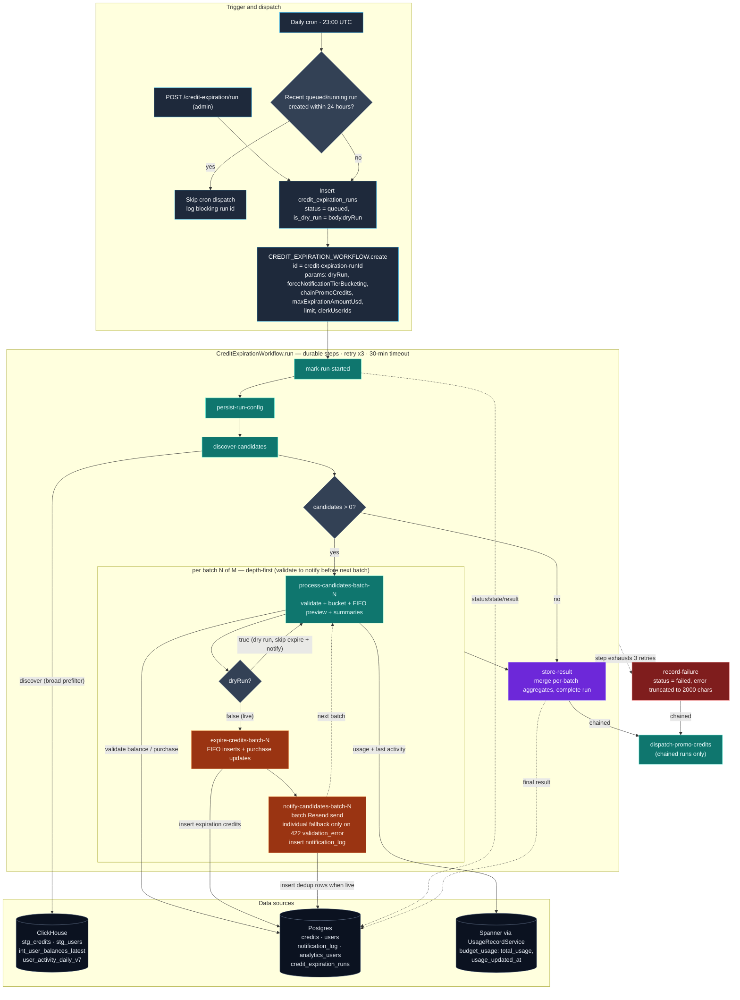

# `CreditExpirationWorkflow`

This document describes `CreditExpirationWorkflow`, the durable Cloudflare
Workflow that runs the credit-expiration pipeline. The standard HTTP surface
triggers it in **dry-run** mode by default (a read-only preview shown in
Mission Control) and can explicitly dispatch a live run with `dryRun: false`
for real expiration and email sends.

The workflow entrypoint lives in
[`services/cfw-internal/src/workflows/credit-expiration.ts`](../../services/cfw-internal/src/workflows/credit-expiration.ts).
Most discovery, filtering, bucketing, and FIFO logic lives in this package
(`@openrouter-monorepo/credit-expiration`).

## What "dry run" means

A dry run (`dryRun: true`, the HTTP route's default) skips the domain side
effects that change a user's balance or reach a customer:

- no expiration credit rows inserted;
- no `credits.credit_expired_by_id` updates;
- no emails sent through Resend.

It is **not** free of writes. A dry run still writes run status, intermediate
state, diagnostics, and the final preview to the `credit_expiration_runs` row.

Dry runs skip the notify step entirely (no `notification_log` writes, no Resend
sends, and `notificationsSent` is 0), so they do not affect the durable dedup
state used by scheduled runs. Live runs write those rows as the durable source
of truth.

A live run (`dryRun: false`) additionally runs an `expire-credits-batch-{n}`
step per batch (FIFO negative-credit inserts + purchase updates) and sends one
Resend batch per notification chunk. A batch rejected with a
`422 validation_error` for an invalid recipient falls back to individual Resend
sends; other batch failures fail the notify step as before.

## Workflow overview



Batch loops are sequential and depth-first: each batch runs
`process` → (`expire` when live) → (`notify` when live) before the next batch
starts. Within a batch, Spanner chunks and the two Postgres credit-data
queries (unexpired credits + `analytics_users.total_credits`) are issued in
parallel.

## Source map

| Concern | Implementation |
| --- | --- |
| Workflow orchestration | `services/cfw-internal/src/workflows/credit-expiration.ts` |
| Payload schema | `services/cfw-internal/src/workflows/credit-expiration-schemas.ts` |
| HTTP trigger and workflow dispatch | `services/cfw-internal/src/routes/credit-expiration/run.ts`, `start-run.ts` |
| ClickHouse candidate discovery | `packages/clickhouse/credit-expiration/queries.ts` |
| Postgres + Spanner validation | `packages/credit-expiration/validate-candidates.ts` |
| Spanner usage fetch | `packages/credit-expiration/fetch-spanner-data.ts` |
| Notification-tier bucketing | `packages/credit-expiration/buckets.ts` |
| Per-user summaries + credit fetch | `packages/credit-expiration/user-summaries.ts`, `credit-data.ts` |
| FIFO model | `packages/credit-expiration/fifo-consumption.ts` |
| Dropped-candidate FIFO preview | `packages/credit-expiration/fifo-amounts.ts` |
| Result aggregation | `packages/credit-expiration/run-results.ts`, `tier-breakdown.ts`, `histograms.ts`, `amounts.ts` |
| Live expiration execution | `packages/credit-expiration/execute-expiration.ts` |
| Notifications | `packages/credit-expiration/notify.ts` |
| Postgres credit/notification queries | `packages/db/credit-expiration/queries.ts` |
| Run-state persistence | `packages/db/credit-expiration/workflow-run-queries.ts` |
| Serializable intermediate state | `packages/credit-expiration/workflow-state.ts` |
| Constants and drop reasons | `packages/credit-expiration/constants.ts` |

## Data sources and authority

The workflow uses three sources on purpose. ClickHouse narrows the universe
cheaply, then Postgres and Spanner re-read the selected users before anything
is previewed or expired.

| Source | Tables / API | Data used | Role and assumptions |
| --- | --- | --- | --- |
| ClickHouse | `analytics.stg_credits` | Positive credits, last purchase per user, unexpired-credit existence | Broad discovery via the `candidate_users` CTE (`HAVING max(created_at) < cutoff AND countIf(credit_expired_by_id IS NULL) > 0`). PeerDB-replicated, ~37-min CDC lag is acceptable. |
| ClickHouse | `analytics.stg_users`, `analytics.stg_plan_tiers` | `is_organization`, `is_enterprise`, `plan_tier_id` and the tier's `plan` (latest CDC row via `argMax`, `_peerdb_is_deleted = 0`) | Excludes org users and enterprise users during discovery. Enterprise is `is_enterprise = true` OR a sales-managed plan tier (`pro`/`enterprise`), since legacy rows can carry an enterprise tier without the flag. |
| ClickHouse | `analytics.int_user_balances_latest` | `outstanding_balance` | `INNER JOIN ... outstanding_balance > 0`; also surfaced as `chAmountToExpire`, the ClickHouse-only amount estimate. Discovery optimization, not the balance authority. |
| ClickHouse | `user_activity_daily_v7` | Max activity day | Supplies `lastActivityDate` and keeps users whose last activity is `<= cutoff` (never-active users included via the `1970-01-01` sentinel). Fallback last-activity signal only. |
| Postgres | `credits` | All-time net balance (`SUM(amount)`), latest positive purchase, unexpired credit rows | Authoritative re-check of balance and purchase recency; direct FIFO input. |
| Postgres | `users`, `plan_tiers` | `is_enterprise`, `is_organization`, `plan_tier_id` and the tier's `plan` | Re-applies the exclusion against current state (`is_enterprise = false` and tier `plan NOT IN ('pro', 'enterprise')`). Deleted users stay eligible so their credits still expire. |
| Postgres | `notification_log` | Latest lifecycle notification for the latest purchase (`:0`/`:7`/`:30`) | Drives tier progression, and is written by the notify step as the dedup source of truth. |
| Postgres | `analytics_users` | `total_credits` | Required FIFO input; already reflects prior negative expiration records. |
| Spanner (`UsageRecordService.getBudgetDataMultiple`) | `budget_usage`-derived analytics | `total_usage`, `usage_updated_at` | All-time usage and the preferred last-activity signal. `usage_updated_at` is a settlement commit timestamp used as a generation proxy. |
| Postgres | `credit_expiration_runs` | Status, intermediate state, final result, errors | Durable coordination + Mission Control result storage. |

There is no cross-source snapshot or transaction. Each step reads its source at
the moment it runs, so a long run can observe changes made after discovery.
That's why validation is conservative and the result is a preview at execution
time, not a point-in-time snapshot.

## Trigger and dispatch

`creditExpirationRunHandler` (admin-authenticated `POST /run`) does three
things before `run()` starts:

1. `insertWorkflowRun({ isDryRun: body.dryRun, requestedBy })` — a `queued` row
   whose mode matches the requested run.
2. `CREDIT_EXPIRATION_WORKFLOW.create({ id: "credit-expiration-{runId}", params })`
   with `params = { runId, forceNotificationTierBucketing, maxExpirationAmountUsd,
   dryRun, limit, clerkUserIds }`.
3. Best-effort `setWorkflowRunInstanceId(runId, instanceId)`.

If dispatch fails the row is marked failed and the route returns 500. Failing to
persist the instance ID is logged but non-fatal — the `runId` alone is enough to
execute and store results.

The same dispatch helper is called by the `0 23 * * *` UTC cron after the
exact-model auto-enrollment task. The cron inserts a system-initiated run with
`requestedBy: null`, `dryRun: false`, `forceNotificationTierBucketing: false`,
and `chainPromoCredits: true`; the inactivity run then ends by dispatching the
promo-credits workflow as a terminal durable step (see the
`dispatch-promo-credits` step below), so the two lifecycles never expire from
one balance concurrently. It supplies no `maxExpirationAmountUsd` or `limit`,
so the schema defaults apply. Should the inactivity start itself fail, the cron
falls back to dispatching promo-credits directly so the daily cadence is
preserved. Before dispatching, the cron checks for a queued or running run
created within the last 24 hours. If one exists, it skips dispatch and logs
the blocking run's `run_id`; older stuck runs do not block the next daily
run. This guard applies only to the cron path and does not change manual
dispatch behavior.

### Payload inputs (`CreditExpirationPayloadSchema`)

| Field | Default | Meaning |
| --- | --- | --- |
| `runId` | — | `credit_expiration_runs.id` tracking this execution. |
| `dryRun` | `true` | Suppresses live email sends and credit expiration. Set to `false` for a live run. |
| `forceNotificationTierBucketing` | `false` | Infer a tier from inactivity even for never-notified or already-`:0` users (preview coverage). |
| `chainPromoCredits` | `false` | Dispatch the promo-credits expiration run as a terminal durable step once this run reaches a terminal state, so the two lifecycles never expire from one balance concurrently. Set only by the daily cron. |
| `maxExpirationAmountUsd` | unset | Caps cumulative credit expiration during a live run in USD. Temporary initial-rollout control — removed after the first live expiration run (PLA-686). |
| `limit` | unset | Caps discovered candidates (`LIMIT {limit:UInt32}`); bounded by the ClickHouse `UInt32` max so an out-of-range value fails validation, not at query time. |
| `clerkUserIds` | unset | Restricts discovery to these Clerk `user_`/`org_` IDs. When set, discovery runs unbounded so the `limit` can't hide a targeted user, then `filterCandidatesToTargets` narrows the discovered set to the targeted IDs and the `limit` is applied to the filtered set. All other eligibility predicates still apply, so an ineligible targeted user (including any `org_` ID — inactivity expiration is personal-only) yields no candidate. |

## Execution model

Every named phase runs through `step.do(name, RETRY_CONFIG, ...)` with:

- 3 retries;
- 1-minute initial delay, exponential backoff; and
- a 30-minute per-attempt timeout.

Each step is wrapped in `withRpcDbContext`, which establishes the DB context the
shared query helpers use. Large values live in `credit_expiration_runs.result`;
steps return only small counters or aggregates, because a non-streaming
Cloudflare step result is capped at 1 MiB.

## Step: `mark-run-started`

*Purpose: claim the queued run and make its progress observable, while guaranteeing
only one real run proceeds. Cloudflare can wake or retry a workflow, so this
step is the gate that rejects a missing or already-completed run instead of
re-doing terminal work.*

`markWorkflowRunStarted()` sets `status = running`, `started_at = now`,
`error = null`. Completed runs are terminal; queued/running/failed rows may be
(re)marked running to accommodate Workflow wake-ups and retries. A missing or
completed row fails the step.

## Step: `persist-run-config`

*Purpose: preserve the input settings needed to reproduce a dry run later from
Mission Control.*

Immediately after the run is marked started, this step stores the workflow
inputs `forceNotificationTierBucketing`, `maxExpirationAmountUsd`, `limit`,
and `clerkUserIds` under `result.runConfig`. The key remains
in the completed run's JSONB result so Mission Control can offer **Run live with
these settings** for a recent completed dry run.

## Precondition: usage-record binding

*Purpose: fail fast if the usage service isn't wired up. Every validation
decision depends on real Spanner usage data; running against a no-op service
would treat active users as unused and expire credits it shouldn't.*

After marking started, the workflow resolves the `SVC_USAGE_RECORD` service
binding. A `NoopUsageRecordService` is a configuration error and stops the
pipeline before discovery. This is not a separate named step.

## Step: `discover-candidates`

*Purpose: cheaply shrink the entire user base to a small candidate set before any
expensive authoritative work runs. ClickHouse absorbs the full-table scan that
would otherwise hammer Postgres. Staleness is acceptable because every candidate
is re-checked against authoritative Postgres + Spanner in the next step — this
step only needs to avoid missing plausible candidates.*

Calls `findExpirableCandidates(INACTIVITY_THRESHOLD_MONTHS, limit)`
(`INACTIVITY_THRESHOLD_MONTHS = 11`; 11 months captures the 30-day warning tier
of a 12-month lifecycle). When `clerkUserIds` is set, discovery runs unbounded
— `limit` is not passed to ClickHouse, so a targeted user can't be hidden by
the cap — and `filterCandidatesToTargets` narrows the discovered set to the
targeted IDs before the `limit` is applied to the filtered set.

The ClickHouse query (`CANDIDATE_DISCOVERY_QUERY`) keeps a user when **all** hold:

1. `candidate_users`: their newest positive `stg_credits` row is `< cutoff`
   (`today() - 11 months - 1 day`) **and** at least one credit is unexpired
   (`countIf(credit_expired_by_id IS NULL) > 0`).
2. `eligible_users`: latest CDC row is neither organization nor enterprise.
3. `int_user_balances_latest.outstanding_balance > 0`.
4. `last_activity`: last activity day is `NULL` or `<= cutoff` (never-active
   users are kept via the `1970-01-01` sentinel + `nullIf`).

The query in full (`packages/clickhouse/credit-expiration/queries.ts`):

```sql
WITH
  today() - INTERVAL {inactivityThresholdMonths:UInt32} MONTH - INTERVAL 1 DAY
    AS cutoff_date,

  /* Users whose most recent positive credit predates the cutoff (no recent
     purchase) and who still hold at least one unexpired credit. */
  candidate_users AS (
    SELECT
      clerk_user_id,
      max(created_at) AS last_purchase_date
    FROM analytics.stg_credits
    WHERE amount > 0
    GROUP BY clerk_user_id
    HAVING max(created_at) < cutoff_date
       AND countIf(credit_expired_by_id IS NULL) > 0
  ),

  /* Latest CDC row per plan tier. */
  plan_tiers AS (
    SELECT id, argMax(plan, _peerdb_version) AS plan
    FROM analytics.stg_plan_tiers
    GROUP BY id
  ),

  /* Individual (non-org, non-enterprise) users, using the latest CDC row per
     user so the flags reflect current state rather than "ever". Enterprise is
     the is_enterprise flag OR a sales-managed plan tier (pro/enterprise).
     _peerdb_is_deleted = 0 drops PeerDB tombstone rows so argMax reads the
     last live version's flags. */
  latest_users AS (
    SELECT
      clerk_user_id,
      argMax(is_organization, _peerdb_version) AS is_organization,
      argMax(is_enterprise, _peerdb_version) AS is_enterprise,
      argMax(plan_tier_id, _peerdb_version) AS plan_tier_id
    FROM analytics.stg_users
    WHERE _peerdb_is_deleted = 0
    GROUP BY clerk_user_id
  ),

  eligible_users AS (
    SELECT latest.clerk_user_id
    FROM latest_users AS latest
    LEFT JOIN plan_tiers AS tier ON tier.id = latest.plan_tier_id
    WHERE latest.is_organization = 0
      AND latest.is_enterprise = 0
      AND ifNull(tier.plan, '') NOT IN ('pro', 'enterprise')
  ),

  /* All-time last activity day per user, used downstream as a fallback
     last-generation timestamp when Spanner has no settlement timestamp. */
  last_activity AS (
    SELECT clerk_user_id, max(date) AS last_activity_date
    FROM user_activity_daily_v7
    GROUP BY clerk_user_id
  )

SELECT
  candidate.clerk_user_id AS clerk_user_id,
  toString(balance.outstanding_balance) AS ch_amount_to_expire,
  nullIf(activity.last_activity_date, toDate('1970-01-01'))
    AS last_activity_date
FROM candidate_users AS candidate

INNER JOIN eligible_users AS user
  ON user.clerk_user_id = candidate.clerk_user_id

INNER JOIN analytics.int_user_balances_latest AS balance
  ON balance.clerk_user_id = candidate.clerk_user_id
 AND balance.outstanding_balance > 0

LEFT JOIN last_activity AS activity
  ON activity.clerk_user_id = candidate.clerk_user_id

/* Keep users whose last activity is on/before the cutoff. A user who never
   generated has no user_activity_daily_v7 row; with join_use_nulls=0 the
   LEFT JOIN fills last_activity_date with the 1970-01-01 epoch sentinel,
   which is <= cutoff and maps to null above via nullIf. */
WHERE activity.last_activity_date IS NULL
   OR activity.last_activity_date <= cutoff_date
ORDER BY
  greatest(
    toDateTime(ifNull(activity.last_activity_date, toDate('1970-01-01'))),
    candidate.last_purchase_date
  ) ASC,
  candidate.clerk_user_id ASC
-- LIMIT {limit:UInt32}   -- appended only when a `limit` is supplied
```

The 1-day buffer avoids processing users exactly on the month boundary and
absorbs day-level activity precision.

Per user the query returns `clerkUserId`, `chAmountToExpire` (the ClickHouse
`outstanding_balance` estimate), and `lastActivityDate` (or `null`). It groups
by `clerk_user_id`, so downstream batching is per user, not per credit.

Results are ordered most-dormant-first by
`greatest(last_activity_date, last_purchase_date) ASC`, with
`clerk_user_id ASC` as a full tiebreaker. This total order makes a `limit`ed
discovery deterministic: a smaller `limit` returns a stable prefix of a larger
one (barring underlying ClickHouse data drift from CDC lag or the daily balance
refresh), so a limited rollout expires the most-dormant users first.

The full list is serialized under `result.candidates`
(`{ clerkUserId, chAmountToExpire, lastActivityDate }`); plain-string entries
are normalized to this shape on read. The step returns only the count:

- `0` → skip everything, run `store-result` with an empty result;
- otherwise the count sets `batchCount = ceil(count / 1000)`.

**Freshness:** discovery is a broad, possibly stale prefilter. False positives
are dropped later; a false negative isn't recovered until a later run.

## Step: `process-candidates-batch-{n}-of-{batchCount}`

*Purpose: for one batch of candidates, confirm against authoritative data who
should actually have credits expired, decide which lifecycle email each is due,
and compute how much would expire. Batches are processed depth-first (this step,
then expire, then notify, per batch) to keep the gap between validating a user
and acting on them small, which shrinks the race window against concurrent user
activity.*

A single durable step per batch handles validation, bucketing, and result
building together. It loads `result.candidates`, slices batch `n` (1,000 users),
and runs the following in memory before a single `mergeState` write.

### 1. Postgres validation (`filterPgCreditExpirationCandidates`)

*Purpose: get the authoritative, current credit and purchase state for each
candidate. ClickHouse is CDC-lagged, so this reads the primary — a purchase made
seconds ago must not be missed, or a paying user's credits could be expired.*

One aggregated row per user, read from the **primary** (`primaryOnly: true`) so
replica lag can't admit a recent purchase:

- `latest_purchases`: newest positive credit (`DISTINCT ON (clerk_user_id)`
  ordered by `created_at DESC, id DESC`).
- `credit_summaries`: `SUM(amount)` net balance and
  `BOOL_OR(amount > 0 AND credit_expired_by_id IS NULL)`.
- `candidate_users`: keeps users whose latest purchase is `< purchaseRecencyCutoff`,
  who still hold an unexpired positive credit, and who are `is_enterprise = false`,
  `is_organization = false`, and not on a `pro`/`enterprise` plan tier
  (`LEFT JOIN plan_tiers`, deleted users intentionally included).
- A `LEFT JOIN LATERAL` on `notification_log` picks the most recent lifecycle
  notification whose key is `last_credit_id || ':0' | ':7' | ':30'`.

`purchaseRecencyCutoff = subDays(subMonths(now, 11), 1)`, the same shared cutoff
`ClassifyCandidateRows` reuses.

### 2. Spanner fetch (`fetchSpannerUsageData`)

*Purpose: get authoritative lifetime usage and the last settlement time — the
signals for "is this user actually dormant" and "have they already spent these
credits". This is the source of truth the activity and usage filters depend on.*

Per user (the whole batch goes over in one `getBudgetDataMultiple` call, which
sizes its own queries from each request's estimated expression cost so every
generated query stays under Spanner's 1000-function-call limit):

- `total_usage` (`userAnalytics.total_usage`; `0` omitted); and
- `usage_updated_at` (most recent settlement commit) → `lastUsageAtByUser`.

### 3. Validation filters (`ClassifyCandidateRows`)

*Purpose: drop every candidate who shouldn't be expired — recently active,
recently purchased, or already consumed their balance — so only genuinely
dormant, unspent credits move forward. Order matters: cheaper/stronger
disqualifiers run first.*

For each Postgres row, in order:

1. **`recent_generation`** — `lastGenerationAt > now - 7 days`
   (`RECENT_ACTIVITY_THRESHOLD_MS`). `lastGenerationAt` is Spanner's
   `usage_updated_at` when present, else the ClickHouse `lastActivityDate`
   fallback.
2. **`recent_purchase`** — `last_purchase_at >= purchaseRecencyCutoff`.
3. **`usage_exceeds_purchases`** — `credit_balance <= total_usage` (missing
   Spanner usage treated as `0`).

Users with no Postgres row are implicitly dropped as **`no_eligible_credits`**.
Survivors become `ValidatedCandidate`s carrying `amount`, `purchaseDate`,
notification state, `totalUsage`, `lastGenerationAt`, and `chAmountToExpire`.

Dropped candidates are persisted (with reason + human detail) under
`validationDroppedBatch{n}`. Their combined amount-to-expire is computed by
`sumDroppedAmountToExpire` — which re-fetches Spanner usage for
`no_eligible_credits` drops that never reached the Spanner step, then runs the
same FIFO model so the figure is comparable to validated users'.

### 4. Notification-tier bucketing (`bucketCandidates` → `computeBucket`)

*Purpose: decide which lifecycle email a surviving candidate is due next. Users
get a 30-day warning, then a 7-day warning, then the expiration notice — one
tier per run with a minimum wait between tiers, so nobody is spammed and, under
ordinary progression, nobody is expired without warning (the
`forceNotificationTierBucketing` override below can bypass this).*

Progression is `null → warning_30d → warning_7d → expire`.

- **Never notified** (`lastNotifiedUniqueId === null`): `warning_30d`, unless
  `forceNotificationTierBucketing`, which infers the tier from
  `computeExpirationDate` (expire if past it, `warning_7d` within 7 days, else
  `warning_30d`).
- **Last suffix `:0`** (already at expire): `null` (skipped), or `expire` when
  forcing.
- **Last suffix `:30`/`:7`**: advances to the next tier only if
  `now - lastNotifiedAt >= minimumAge - 1h` buffer (23 days after `:30`, 7 days
  after `:7`); otherwise `null`.
- Unknown suffix → `null` (logged).

Skipped candidates go to `bucketSkippedBatch{n}`. Each bucketed candidate gets
`idempotencyKey = "{latestCreditId}:{30|7|0}"` and an `expirationDate`
anchored to the notification send time plus the tier's remaining lead time:
`warning_30d` adds 30 days, `warning_7d` adds 7 days, and `expire` adds 0 days.

### 5. FIFO preview (`computeFifoPreview`) and per-user summaries

*Purpose: compute exactly how much of each user's balance would expire, spending
oldest credits first (FIFO), and freeze that plan. Freezing it means a retried
live expiration acts on the same credit set instead of recomputing against
shifted state.*

`buildUserSummaries` fetches each validated user's unexpired credits and
`analytics_users.total_credits` (`fetchCreditsAndTotalsByUser`, chunked to 1,000
users), then builds a per-purchase FIFO breakdown via `computeFifoBreakdown`.
Summaries with no purchases or a zero amount-to-expire are filtered out; the
rest are stored under `summaryBatch{n}`.

The frozen FIFO expiration preview (`fifoPreviewBatch{n}`) is persisted here so
the live `expire` step operates on the same credit set on retry.

### Persisted state and return

One `mergeState` write sets `validationDroppedBatch{n}`, `bucketedBatch{n}`,
`bucketSkippedBatch{n}`, `summaryBatch{n}`, and `fifoPreviewBatch{n}`. The step
returns a small `BatchResultAggregate` (validated/user counts, `amountExpired`,
`amountToExpire`, `chAmountToExpire`, `diffVsPgSpanner`, histograms, tier
breakdown) plus the dropped amount and skip count.

**Retry note:** this step re-queries live user state by design — the latest
credit/usage snapshot is preferred over a frozen one.

## Step: `expire-credits-batch-{n}-of-{batchCount}` (live runs only)

*Purpose: actually expire the credits from the frozen preview, safely under
concurrent activity, and report what truly expired (which can differ from the
preview if a credit was consumed or expired in between).*

Skipped when `dryRun` is `true`.
Loads `fifoPreviewBatch{n}` and runs
`executeExpiration`, which groups the credits by user and packs whole users into
DB batches of `MIN_BATCH_RECORDS = 100` records (a batch may overshoot when the
last user's credits push it past 100, but a single user is never split across
batches). Each packed batch is expired in one transaction via `expireCreditsBatch`
(`packages/db/credit-expiration/queries.ts`), executed as a single
data-modifying CTE:

1. `eligible` — `SELECT ... FOR UPDATE` over the batch's credit ids where
   `credit_expired_by_id IS NULL`; this is both the lock and the
   double-expiration guard. Ids not returned become `skippedCreditIds`.
2. `inserted` — insert one negative `expiration` credit per eligible credit
   (the `handle_new_credit()` trigger updates `analytics_users.total_credits`),
   each temporarily stashing its **original** credit id in its own
   `credit_expired_by_id` and `RETURNING (original_id, expiration_id)`. The
   owning `clerk_user_id` is read from the locked row, not the caller's input.
3. `linked` — set each original purchase's `credit_expired_by_id` to its
   expiration record, keyed on the returned `(original_id → expiration_id)`
   pairs (not on row order).
4. A follow-up `UPDATE ... SET credit_expired_by_id = NULL` resets the temporary
   carrier on the expiration rows, in the same transaction.

Batching this way cuts one-transaction-per-user down to O(1) writes per ~100
records while still guaranteeing per-user all-or-nothing expiration.

Failure is per batch, not per credit: if `expireCreditsBatch` errors, every
credit and user in that batch is marked failed (their emails are suppressed for
this run; the idempotency guard re-processes them on retry). Later batches still
run.

Persists `expireFailedUsersBatch{n}` (users whose batch failed, excluded from
notification) and `expireActualBatch{n}` (`expiredCount`, `amountExpired`,
`amountExpiredByUser`). Returns those actual totals so the final summary reflects
what really expired, not just the preview.

## Step: `notify-candidates-batch-{n}-of-{batchCount}` (live runs only)

*Purpose: send each candidate the email their tier calls for and record that
the tier was reached so the next run never re-notifies the same tier. The
notify step is skipped entirely on dry runs.*

Loads `bucketedBatch{n}`, drops expire-tier users whose expiration failed
(`filterFailedExpirationCandidates`), and splits into deterministic
`<= RESEND_BATCH_MAX_SIZE` chunks keyed by `(runId, batchNumber, chunkIndex)` so
retries map to the same recipients.

Per chunk:

- `sendNotificationChunk` sends one Resend batch of locally rendered emails
  (per-request `Idempotency-Key`). Amounts come from `summaryBatch{n}` plus
  `expireActualBatch{n}`.
- If the batch request fails with a Resend `422 validation_error` (for example,
  because one `to` address is invalid), it retries each valid recipient through
  Resend's single-email endpoint. Each fallback request uses a deterministic,
  per-notification `Idempotency-Key`, so workflow-step retries do not resend
  an email that Resend already accepted.
- Any other batch failure, including a timeout, network error, or 5xx response,
  fails the notify step and the workflow retries the same batch with its
  original batch idempotency key.
- `recordExpirationNotifications` inserts `notification_log` rows
  (`ON CONFLICT DO NOTHING`) for every recipient whose send succeeded,
  including recipients sent by the fallback. Recipients whose individual
  fallback send fails with a Resend `422 validation_error` are omitted and
  persisted under `notificationFailedBatch{n}` for follow-up or retry; a
  transient (non-422) individual send error is re-thrown and fails the
  notify step.

Returns the count of newly-inserted log rows; the sum is the run's
`notificationsSent` (0 on dry runs, which skip this step).

## Step: `store-result`

*Purpose: fold every per-batch aggregate into the single run summary that
Mission Control reads, and mark the run complete.*

`mergeAndStoreResult` sums the per-batch aggregates (valid because ClickHouse
emits one row per user and batches are user-disjoint; fixed histogram bins merge
by index) and calls `completeWorkflowRun(runId, result, { removeStateKeys: [] })`
— the final `result` is merged into the existing JSONB, so all intermediate keys
stay readable.

Final result shape: `summary`, `tierBreakdown`, `amountHistogram`,
`amountHistogramsByTier`, `batchCount`, `runConfig`. In the `summary`:

- `expiredCount` / `amountExpired` — actual expired totals on a live run, else
  the FIFO preview totals;
- `amountToExpire` — sum of FIFO amounts across users kept after summary
  filtering;
- `amountFailedValidationToExpire` — FIFO total across dropped candidates;
- `chAmountToExpire` / `diffVsPgSpanner` — ClickHouse estimate and its delta vs
  Postgres+Spanner;
- `validatedCount` — distinct validated users; `userCount` — users kept after
  summary filtering;
- `notificationsSent` — newly-logged notification rows on live runs (0 on
  dry runs, which skip the notify step); `skipped` — bucketing skips
  (promo-credits runs: candidates FIFO dropped for a missing balance row or
  no unspent amount; discovery skips are only in `promoCreditsSkipped`);
  `errors` — always 0; individual fallback send failures that are Resend
  `422 validation_error` responses are recorded under
  `notificationFailedBatch{n}` without failing the run. Transient individual
  send errors (any non-422 failure) and other batch send failures fail the
  notify step and therefore the run after retries.

## Empty-result paths

- **No ClickHouse candidates:** `emptyRunResult(0)` — all counters zero,
  `batchCount = 0`, `candidates = []` retained.
- **Candidates found but none in a batch validate:** batches still run;
  `validatedCount`/`userCount`/amounts stay zero for that batch and
  `validationDroppedBatch{n}` records the drops. (There is no separate global
  "none validated" short-circuit — each batch is processed depth-first.)

## Failure handling

If a step exhausts its 3 retries, `runPipelineRecordingFailure` catches the
error, runs a durable `record-failure` step (`failWorkflowRun`), and rethrows so
Cloudflare marks the instance errored. The row becomes `status = failed`,
`completed_at = now`, `error =` the message truncated to 2,000 chars. Existing
intermediate JSONB is preserved for debugging. A secondary failure updating the
row is logged but the original error still propagates.

## Step: `dispatch-promo-credits` (chained runs only)

*Purpose: hand off to the promo-credits workflow as the terminal durable step of
a chained run, so the two credit lifecycles never expire from one balance
concurrently.*

Skipped unless `chainPromoCredits: true`; HTTP-triggered runs always use the
schema default of `false`, so only the `0 23 * * *` cron sets it. Reached in a
`finally` block, so it runs both after `store-result` (success) and after
`record-failure` (a step exhausted its retries). The step calls
`dispatchScheduledPromoCreditsRun`, which inserts a system-initiated
promo-credits run with `requestedBy: null` and the same `dryRun` value the
parent run used (a live inactivity run chains a live promo run). If a promo run
is already active, the dispatch returns `skipped-active-run` and the step
succeeds as a logged no-op. A dispatch that errors throws, so the inactivity
instance is marked errored once the step's retries are exhausted; the
credit-expiration run row is already terminal by then, so its stored result is
unaffected.

## Batching and size limits

| Limit | Value | Reason |
| --- | --- | --- |
| Workflow candidate batch | 1,000 users (`DEFAULT_BATCH_SIZE`) | Bounds per-step memory and JSONB write size. |
| Spanner query chunk | Sized by `MAX_ESTIMATED_BUDGET_QUERY_FUNCTIONS` (850) in `queryBudgetDataMultiple` | Keeps each query under Spanner's 1000-function-call limit. |
| Postgres credit-data chunk | 1,000 users (`MAX_USER_IDS_PER_QUERY`) | `getUnexpiredCredits` / `getUserTotalCredits`. |
| Cloudflare step return | 1 MiB | Large values persisted to Postgres; steps return counters. |
| Hyperdrive message | 125 MB | Intermediate state is read one top-level JSONB key at a time. |
| Persisted error | 2,000 chars | Bounds error storage. |

## Persisted state keys (`WorkflowRunStateKey`)

Written to `credit_expiration_runs.result` and retained after completion:

```text
candidates
validationDroppedBatch{n}
bucketedBatch{n}
bucketSkippedBatch{n}
fifoPreviewBatch{n}
expireFailedUsersBatch{n}   (live runs)
expireActualBatch{n}        (live runs)
summaryBatch{n}
notificationFailedBatch{n}  (live runs; recipients failing individual fallback with 422 validation_error after a 422 batch error)
runConfig
promoCreditsSkipped         (promo-credits runs; every skipped credit with its reason)
promoCreditsAffected        (promo-credits runs; every credit that would be notified about or expired)
```

## Key assumptions and caveats

1. **ClickHouse is a prefilter, not the authority.** False positives are dropped
   during validation; false negatives wait for a later run.
2. **Dry runs skip the notify step entirely.** They write no
   `notification_log` rows and report `notificationsSent = 0`, leaving
   scheduled-run dedup state untouched.
3. **The 7-day Spanner guard assumes bounded discovery lag.** Validation only
   rejects activity in the last week; it doesn't re-derive 11 months of
   inactivity from Spanner.
4. **`usage_updated_at` is an activity proxy** — settlement commit time, not a
   direct generation timestamp, though stored as `lastGenerationAt`.
5. **Missing Spanner usage is treated as zero,** which can overestimate
   expiration when data is merely absent.
6. **Missing `analytics_users.total_credits` drops the user from FIFO results;**
   no trustworthy breakdown can be computed without it.
7. **Not a point-in-time snapshot.** ClickHouse, Postgres, and Spanner are read
   at different times within a run.
8. **Calendar-month arithmetic is intentional** (`subMonths`/`addMonths` clamp
   month-end and leap days) rather than a fixed day count.
9. **Candidate, validated, user, and expired counts are different funnels.**
   Validation drops, bucket skips, missing FIFO inputs, and zero amounts are
   tracked separately.
10. **`expiredCount` is a credit count,** not a user count.
11. **`amountExpired` vs `amountToExpire`** answer different questions:
    actual/expire-tier vs the full validated FIFO projection.
12. **Per-batch summaries are locally sorted;** concatenating batches is not a
    global ranking.
13. **Batches are processed depth-first** (validate → expire → notify per batch)
    to shrink the window between validating a user and acting on them.

## Reading a completed run

The run endpoints return metadata plus the small final result. Diagnostics live
in individual JSONB fields, with optional DB-side array pagination
(`DEFAULT_PAGE_SIZE = 100`, `MAX_PAGE_SIZE = 1000`):

```text
GET /runs/{runId}
GET /runs/{runId}/fields
GET /runs/{runId}/fields/{key}?offset=0&limit=100
```

Useful fields:

- `validationDroppedBatch{n}` — exact drop reason and detail;
- `bucketSkippedBatch{n}` — notification-state / timing skips;
- `bucketedBatch{n}` — inputs to expiration and notification;
- `summaryBatch{n}` — per-user and per-purchase FIFO previews;
- `expireActualBatch{n}` — what actually expired (live runs).
