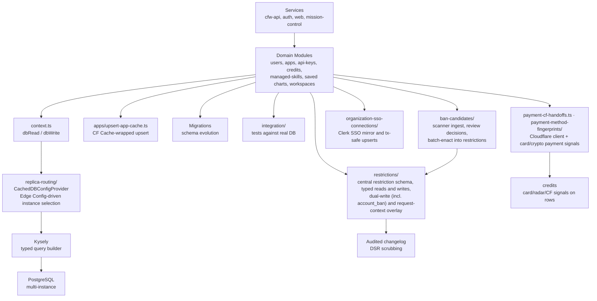

# DB

Central database access layer for OpenRouter. Provides typed Kysely query builders and domain-specific query modules for all Postgres operations across the monorepo.

## Architecture

## Key Modules

| Path | Purpose |
|------|---------|
| `context.ts` | `dbRead` / `dbWrite` entry points with instrumentation, replica routing, and `db.instance` / `db.attempts` / `db.operation.type` breakdown tags on client-side query duration metrics |
| `replica-routing/` | Dynamic DB instance routing via `CachedDBConfigProvider` — reads Edge Config through a FetchDeduper (60s TTL) to select primary/replica instances per-operation, with static fallback on error. `resolveDbConfigProvider` is the single selector that picks the KV vs static provider (folding the old `shouldRefresh` flag in), so callers no longer thread it through `DBRequestContext.create`. Trusts union of all instance CAs for replica connections |
| `kysely.ts` | Kysely instance configuration and connection pooling |
| `kysely-types.gen.d.ts` | Auto-generated TypeScript types from database schema |
| `users/` | User CRUD, Clerk upsert (capturing signup country + Cloudflare bot-score metadata + signup-CF integrity status flags), settings, deletion, DSR scrubbing (`scrub-user`). Sealed signup-CF metadata is bound with a single-use nonce, AAD, and tamper signals; `signup-seal-replay.ts` guards against seal replay |
| `restrictions/` | Central restriction schema and typed read/write queries. `targetless-ban.ts` builds account and frontier-US ban inputs for the restrictions table; enacted `ban_candidate` targets carry a restriction reference back to their source candidate |
| `api-keys/` | API key management — bulk/single workspace moves with optimistic-concurrency guards, slim batch lookups for log hydration |
| `apps/` | Application registry queries; `upsertAppWithCache` wraps the Kysely upsert in a CF Cache layer (no AppRegistrar class hierarchy) |
| `credits/` | Credit operations (chargebacks, transfers, pools, transaction-hash lookup). Credit rows persist card, crypto, Cloudflare Radar, and CF client payment signals; `chargeback-queries.ts` also records the signup-email autogen score and Stripe Early Fraud Warning signals |
| `payment-cf-handoffs.ts` | Short-lived Cloudflare client-signal handoff rows captured at auto-top-up activation / payment-method add / manual top-up, joined back onto issued credits (cleaned up by a cfw-internal cron) |
| `payment-method-fingerprints/` | Payment-method fingerprint records used for abuse/fraud correlation across payments |
| `endpoints/` | Provider endpoint queries, changelog, feature configs (instruction-role-support, multipart support), and `listActiveEndpointsForSweep` (open-weights-only filter via non-empty `hf_slug`) |
| `models/` | Model registry and metadata, including `getModelsBySlugsOrPermaslugs` for batched slug/permaslug resolution (used by activity/logs filters) |
| `guardrails/` | Guardrail definitions and assignments |
| `guardrail-false-positives/` | Guardrail false positive reporting — records and retrieves user-reported false-positive guardrail triggers. Rows carry `entity_type`; uniqueness is `(generation_id, event_type, entity_type)` with `NULLS NOT DISTINCT`, and an upsert keeps the latest `guardrail_id` |
| `guardrail-pi-allowlist/` | Per-user PI (prompt injection) guardrail allowlist — CRUD queries for whitelisted phrases that bypass the PI guardrail. Loaded via `LEFT JOIN LATERAL` in `queryUserByKeyHash` |
| `csl-screening/` | Trade.gov Consolidated Screening List (CSL) infrastructure — TSV parsing, fuzzy name matching, Redis screening cache (hydrated in bulk via `MSET` with read-time expiry checks), user screening queries, and Slack alerting for flagged users |
| `broadcast-destinations/` | Observability destination management |
| `provider-api-keys/` | BYOK provider key storage, paginated listing, and prioritized/fallback partitioning |
| `credit-expiration/` | Queries for the credit expiration pipeline — `getUnexpiredCredits()` fetches unexpired credits of all types (including negative amounts) ordered `created_at ASC` for FIFO consumption; `workflow-run-queries.ts` manages `credit_expiration_runs` lifecycle (insert, mark started, complete, fail, list, get) |
| `user-deletions/` | GDPR user deletion audit ledger queries — `initiateUserDeletion`, `settleUserDeletionTask`, `rollupUserDeletionParent` |
| `benchmark-results/` | Model quality benchmark result queries with a per-benchmark-type minimum-sample floor applied to both listing and chart queries |
| `gateway-benchmark-schedules/` | Typed Kysely queries for gateway benchmark schedules and runs |
| `routing-fortuna-score-snapshots/` | Fortuna per-endpoint audit rows (Beta parameters, capacity score, effective pricing, latency/throughput stats, discount rates) |
| `routing-tool-call-sort-snapshots/` | Autoexacto routing sort snapshots with per-signal derank audit data |
| `classifiers/` | Custom-classifier config CRUD, limits/schemas (`MAX_VALUES_PER_DIMENSION` raised to 35 for the full task-type taxonomy), the curated gallery `dimension-library`, preset definitions (`classifier-presets.ts`), and `task-type-taxonomy.ts` — the single source of truth for both the internal `TaskTypeClassifier` and the customer-facing "Task type" preset. Lives here (not `packages/classifier`) so the dimension library and presets can import it without a circular dependency |
| `interns/` | Intern metadata, credentials (junction table), and provisioning queries |
| `startups/` | Startup application queries including supporting materials |
| `mpp/` | MPP wallet address parsing (DID PKH format) |
| `auth/` | User authentication — lookup by key, cookie, or wallet address. `getUserByKey` now loads `hasActiveClassifier` and `piWhitelistPatterns` per-request |
| `workspaces/` | Workspace management with budget columns, one-time budget support, and `include_byok_in_budgets` toggle |
| `alert-policy-settings/` | Notification config CRUD — per-org settings blob, recipient resolution (org-admin/workspace-admin roles, people), and config validation (webhook URL, thresholds) |
| `alert-state/` | Alert firing state — edge-triggered fire/resolve with SQL-level dedupe (1-min re-trigger floor via `ON CONFLICT` predicates) |
| `managed-skills/` | Managed skill CRUD queries; registry-sourced skills carry registry pointer metadata (source URL/ref) |
| `managed-skill-versions/` | Versioned skill bundle metadata queries |
| `oauth/` | OAuth 2.1 client registrations and authorization codes for MCP (DCR + PKCE) |
| `scim-groups/` | SCIM group and member CRUD, group→workspace mappings for SCIM provisioning |
| `organization-members/` | Org membership queries including SCIM-managed membership status and removal handling |
| `scheduled-plan-tier-changes/` | Scheduled (effective-dated) plan tier changes |
| `user-entitlements/` | Per-user feature entitlement overrides (individual DB rows that supplement plan-level defaults) |
| `changelog/` | Shared Slack formatting for changelog notifications with compact `+added/-removed` array diffs |
| `transactions/` | Generation transaction types and row normalization helper (`hydratePublicTransaction`) |
| `test-write-path/` | `test_in` write-path smoke test — insert/read/delete round-trip queries plus `runTestInWritesWithPrimary`, which builds a throwaway pool with an overridden primary so test-in surfaces can target a specific DB (Cloud SQL cutover, PLA-535) |
| `integration/` | Integration tests (run against real Postgres) |
| `ci-paths.ts` | `DB_PATHS` — every repo path the DB integration suite covers; any code expected to be covered must have a path here so the `db-lint-and-tests` merge-queue gate runs the suite on changes to it |

## Database Access

All queries use Kysely via `dbRead` / `dbWrite` from `context.ts` — Kysely is the sole query layer. See [REVIEW.md](./REVIEW.md) for query guidelines.

## Commands

| Command | Description |
|---------|-------------|
| `bun test` | Run unit tests |
| `bun run test:integration` | Run integration tests against real Postgres |
| `bun run test:integration:coverage` | Integration tests with coverage report |
| `tsgo --noEmit` | Type-check |
