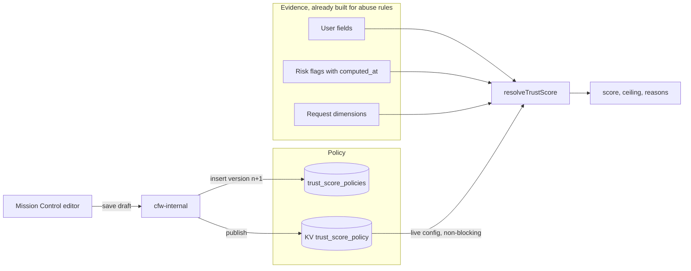

# Trust score

A trust score is an advisory 0-100 number computed per request from the same evidence the abuse-rule engine already assembles, plus a published policy. Higher means more trustworthy. The resolver itself never enforces anything. It returns a score and reasons, and restrictions stay with the abuse-rule engine. A restriction may depend on the score once the score is exposed to that engine (a `trust_score` evidence dimension a rule can compare, or a published risk flag), so that enforcement keeps the abuse-rule authority gate, shadow mode, and audit trail rather than growing a second one here. Until that plumbing exists the score is advisory.

## Key concepts

- **Policy.** One versioned document with a `base_score`, a list of `terms`, and optional per-family `family_caps`. Policies live as rows in `trust_score_policies` (Postgres, append-only history) and the live version is published to KV under `trust_score_policy`. Inference reads KV only; it never reads Postgres.
- **Term.** A rule that adds or removes points, or caps the score. A term reuses the abuse-rule filter grammar (`request_dim`, `user_field`, `risk_flag` leaves in `and`/`or` groups), so anything a targeted rule can match, a term can score. Each term declares a `family` and carries a stable `id` that becomes the reason code.
- **Effect.** `points` (`value`, optional `half_life_ms`) or `ceiling` (`max_score`). A ceiling bounds the final score and contributes no points.
- **Decay.** A points term with a `half_life_ms` loses weight as its evidence ages: `value * 0.5 ^ (age / half_life)`. Age is measured from the newest `computed_at` among the risk flags that made the term match. Evidence with no timestamp (user fields, request dimensions) does not decay.
- **Family caps.** Deductions and credits are capped separately per family, and each term in the family is scaled proportionally so the reasons still add up to the score.
- **Reasons.** Every matched term produces one reason: `term_id`, `label`, `family`, `effect`, configured `points`, `applied_points` after decay and capping, `half_life_ms`, `evidence_at`, `evidence_age_ms`. Reasons are ordered deterministically: ceilings first, then by contribution magnitude, then by term id.
- **Unscored.** A missing or invalid live policy leaves the account unscored, never at `0`. Callers (router, cfw-internal) skip the resolver when no policy is loaded, so a score of 0 is always a resolved verdict.

## When to use it

Use the resolver anywhere the abuse-rule `RuleEvaluationInput` is already built and a per-account trust signal is wanted without a database read: the router (advisory logging and metrics), cfw-internal (operator evaluation of one account), and Mission Control (score card, policy editor, preview).

Do not derive restrictions from the score inside this package or its callers. A score-dependent restriction belongs in an abuse rule that reads the score as evidence, so it inherits the rule engine's `log_only` preflight, tighten-only merge, and `rule_hit` audit.

## Architecture



The resolver is pure: `resolveTrustScore(input, policy)` reads nothing and writes nothing.

## Writing a policy

```json
{
  "base_score": 50,
  "family_caps": {
    "network": { "max_deduction": 30, "max_credit": null }
  },
  "terms": [
    {
      "id": "signup_velocity",
      "label": "Signup dimension velocity",
      "family": "network",
      "effect": { "type": "points", "value": -20, "half_life_ms": 604800000 },
      "filters": {
        "combinator": "and",
        "rules": [
          { "kind": "risk_flag", "flag": "signup_dimension_velocity", "field": "signups_1h", "operator": "gte", "value": 5, "seen_within_ms": 1209600000 }
        ]
      }
    },
    {
      "id": "card_country_mismatch",
      "label": "First top-up card country differs from signup country",
      "family": "payment",
      "effect": { "type": "points", "value": -15, "half_life_ms": null },
      "filters": {
        "combinator": "and",
        "rules": [
          { "kind": "user_field", "field": "first_topup_card_country_mismatch", "operator": "eq", "value": true }
        ]
      }
    },
    {
      "id": "fraud_percentile_high",
      "label": "Fraud score above the 95th percentile",
      "family": "behavior",
      "effect": { "type": "ceiling", "max_score": 30 },
      "filters": {
        "combinator": "and",
        "rules": [
          { "kind": "risk_flag", "flag": "fraud_score_user_day", "field": "score_percentile", "operator": "gte", "value": 95, "seen_within_ms": 172800000 }
        ]
      }
    },
    {
      "id": "funded_tenure",
      "label": "Funded for more than 90 days",
      "family": "identity",
      "effect": { "type": "points", "value": 10, "half_life_ms": null },
      "filters": {
        "combinator": "and",
        "rules": [
          { "kind": "user_field", "field": "first_funded_at_age_ms", "operator": "gte", "value": 7776000000 }
        ]
      }
    }
  ]
}
```

User-field terms can use any abuse-rule `user_field` (see `packages/db/abuse-rules/README.md`). For example, `{ "kind": "user_field", "field": "signup_to_first_funding_ms", "operator": "lt", "value": 600000 }` matches accounts first funded within 10 minutes of signup, however old the account is now. It is absent while the account is unfunded, and it counts any positive credit (including promo codes and transfers), not only paid top-ups.

Rules of thumb:

- Term ids are lowercase `[a-z0-9_]` and unique within a policy. They are the reason codes operators and logs see, so keep them stable across versions.
- Windowed risk flags require `seen_within_ms`. Evidence older than the bound does not match, so a term cannot score on a flag the producer stopped asserting.
- Half-life is for evidence that should fade rather than cliff. A 7-day half-life on a 14-day-bounded flag means a fresh burst costs the full 20 points, a week-old burst costs 10, and a two-week-old one costs 5 until the bound drops it entirely.
- Ceilings express "this evidence alone makes a high score implausible". They are the right tool for a strong single signal; use points when several weaker signals should accumulate.

## Worked examples

All examples use the policy above with `base_score` 50.

**No evidence.** No term matches. Score 50, no reasons. The absence of evidence is neutral, not a credit.

**Fresh signup burst.** `signup_dimension_velocity` has `signups_1h: 7`, computed one day ago. The term matches; decay gives `-20 * 0.5 ^ (1/7) = -18.11`. Score `round(50 - 18.11) = 32`. One reason: `signup_velocity`, points `-20`, applied `-18.11`, `evidence_age_ms` one day, `half_life_ms` seven days.

**The same burst, ten days later.** Still within the 14-day `seen_within_ms` bound. Applied points `-20 * 0.5 ^ (11/7) = -6.73`. Score 43. The reason is still present with a smaller `applied_points`, so the operator can see recovery in progress rather than an unexplained jump.

**Fifteen days later.** The flag is older than the bound and no longer matches. Score 50, no reasons. Recovery is complete because the evidence is gone, not because a timer fired.

**Payment mismatch plus tenure.** `first_topup_card_country_mismatch` is `true` and `first_funded_at_age_ms` is 120 days. Two terms match, neither decays. Score `50 - 15 + 10 = 45`. Reasons sorted by magnitude: `card_country_mismatch` (-15) then `funded_tenure` (+10).

**Missing payment data.** The account has never topped up. `first_topup_card_country_mismatch` is absent, so the mismatch term does not match. Absence is not evidence; the score is 50 unless another term matches.

**Family cap.** Suppose two more network terms each subtract 20 and all three match fresh. Uncapped, network would subtract 60; the cap is 30, so each term is scaled by `30 / 60 = 0.5` and the applied points are -10, -10, -10. The three reasons show `points: -20, applied_points: -10`, and they sum to the 30 the score actually lost.

**Ceiling.** `fraud_score_user_day.score_percentile` is 97, computed two hours ago, and no other term matches. Points total is 0, so the uncapped score is 50, but the ceiling is 30, so the final score is 30. The ceiling reason sorts first with `applied_points: 0` and `points: 30` (the cap). If the tenure credit also matched the uncapped score would be 60 and the result would still be 30.

**Stale fraud percentile.** Same flag, computed three days ago. `seen_within_ms` is 48 hours, so the term does not match and no ceiling applies. Score 50.

**Nested groups.** A term whose filters are `or` over two risk-flag leaves takes its evidence timestamp from whichever leaf actually matched, so a stale leaf that failed to match cannot make a fresh match look old. If an `or` group is satisfied by an undated branch (a user field or request dimension), the term is undated and does not decay even when a dated branch also matches, because the flag was not needed to hold the term.

**Absent flag.** A term on `verified_web_usage.web_active_days_7d` with `operator: "missing"` and a seven-day `seen_within_ms` matches accounts with no signed-in web activity in that window. Absence has no timestamp, so the term is undated and does not decay, even when an older entry exists outside the window.

## Publishing

Saving a draft inserts a new `trust_score_policies` row with the next version and publishes it to KV. The version is derived in the insert statement and guarded by a unique constraint, so two saves racing for the same number produce one row and one duplicate-key error rather than two rows. The row is committed first and KV is written afterwards, outside any database transaction. Inference picks up the new version through the ordinary non-blocking live-config refresh; the first request after a cold start may run before the refresh completes and will be unscored for that request.

Each version records the publisher's Clerk user ID (`null` for a requester-less Devin session) and an optional free-text note. Both are treated as personal data: the DSR scrub job NULLs them when that user's account is deleted, and the version and document survive.

## Portable JSON

The Mission Control editor exports and imports the draft as the versionless `TrustScorePolicyDraft` shape parsed by `parseTrustScorePolicyDraft`: an object with `base_score`, `family_caps`, and `terms`, exactly as the console save route accepts under `draft`. Export writes the current editor draft (saved or not) to `trust-score-policy.json`. Import parses the document with the same schema, reports field-level issues on failure, and on success replaces the base score, family caps, and terms in the editor without touching the base version or the note. Nothing is published until the operator saves. The persisted `version` is not part of the document and a document that carries one is rejected.

## Integration points

This package is the bottom of a stacked change. It ships the resolver, the schemas, storage, and publication. The layers above consume those exports and land in their own PRs.

- `packages/db/abuse-rules` owns the filter grammar, the matcher, and `RuleEvaluationInput`. The trust score adds no fields to that input.
- The router layer ([#43674](https://github.com/OpenRouterTeam/openrouter-web/pull/43674)) calls `resolveTrustScore` once per request beside abuse-rule evaluation, emits `openrouter.router.trust_score.*` metrics, and logs `trust_score`, `trust_score_policy_version`, and `trust_score_reasons` on the transaction attempt.
- The cfw-internal layer ([#43686](https://github.com/OpenRouterTeam/openrouter-web/pull/43686)) exposes the policy, its version history, save, and per-account evaluation (published policy or an unsaved draft) for Mission Control.
- The Mission Control layer ([#43676](https://github.com/OpenRouterTeam/openrouter-web/pull/43676)) renders the score card on the user page and the policy editor, history, and draft preview under admin utilities.
