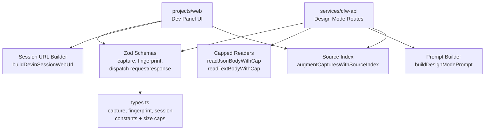

# Design Mode Shared

Shared types, Zod schemas, prompt builder, and capped streaming readers for the Design Mode feature. Imported by both `services/cfw-api` (server-side dispatch + session routes) and `projects/web` (dev panel client).

## Architecture

## Key Modules

| File | Purpose |
|------|---------|
| `types.ts` | Zod schemas and size-cap constants for captures, fingerprints, dispatch requests/responses, and session summaries |
| `build-prompt.ts` | Assembles the Devin prompt from captures and source context |
| `source-index-schema.ts` | Schema for the repo source-file index used to enrich captures |
| `augment-captures-with-source-index.ts` | Maps captured React fiber locations to repo source files |
| `read-text-body-with-cap.ts` | Reads a text body with a byte-size ceiling |
| `normalize-design-mode-session-status.ts` | Maps Devin session states to Design Mode status enum |
| `build-devin-session-url.ts` | Constructs Devin web session URLs |

## Commands

| Command | Description |
|---------|-------------|
| `bun run test` | Run unit tests |
| `bun run typecheck` | Type-check with tsgo |
