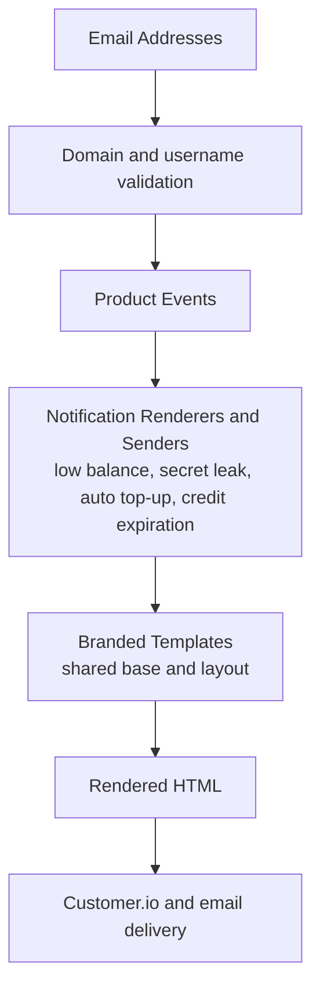

# Email

Transactional email package for OpenRouter. It owns branded HTML templates,
notification renderers, Customer.io event helpers, and the validation utilities
used to decide whether addresses can receive product mail.

## Architecture

## Key Modules

| Path | Purpose |
|------|---------|
| `notifications/` | Transactional renderers and senders for low-balance, credit-expiration, auto-top-up, and secret-leak emails. `format-usd-email-amount.ts` renders USD amounts with two decimals and dedicated sub-cent copy in v2 emails |
| `templates/` | Shared branded HTML layout and rendering primitives |
| `customer-io/` | Customer.io event payloads and delivery helpers |
| `validation/` | Free, personal, protected, and autogenerated address checks |
| `types.ts` | Shared email and renderer types |

## Commands

| Command | Description |
|---------|-------------|
| `bun test` | Run unit tests |
| `bun run typecheck` | Type-check the package |
