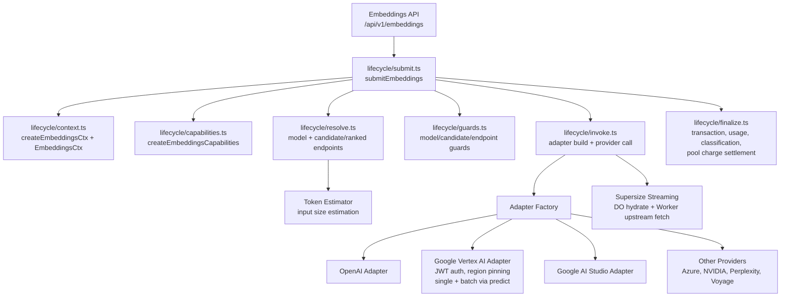

# Embeddings

Provider-agnostic embedding generation engine. Routes embedding requests to the best available provider, manages chunked input for large documents, and supports Durable Object offloading with split hydrate/upstream architecture for oversized payloads.

## Architecture

The surface is a linear lifecycle of plain functions over a per-request context — there is no Router class. The composition root (services/cfw-embeddings-api) builds a context and a capabilities object, then calls `submitEmbeddings`, which resolves the model, runs guards, resolves candidate endpoints, authorizes credit, opens a pending pool charge, ranks endpoints, attempts them through adapters, and finalizes billing/response in `finalizeSuccess`.

## Key Modules

| Path | Purpose |
|------|---------|
| `lifecycle/context.ts` | `EmbeddingsCtx` type, cross-stage value types (invocation, resolved model, credit authorization), and `createEmbeddingsCtx` (with classification-option sampling) |
| `lifecycle/capabilities.ts` | `EmbeddingsCapabilities` alias and `createEmbeddingsCapabilities`, built on the shared routing surface capabilities |
| `lifecycle/submit.ts` | `submitEmbeddings`: the linear request handler, credit authorization step, routeRequest, and error exhaustion |
| `lifecycle/resolve.ts` | Model-slug validation, model resolution, candidate endpoint resolution, endpoint ranking, and the 404 error helper |
| `lifecycle/definition.ts` | Executable feature catalog and ordered model, candidate, and endpoint guards |
| `lifecycle/guards.ts` | Content-filter, moderation, and input-token budget guard implementations |
| `lifecycle/invoke.ts` | Adapter construction, the provider call (`callProvider`), per-attempt latency/usage observation, and error logging |
| `lifecycle/finalize.ts` | `finalizeSuccess`: transaction init, response write with `cost_details`/`is_byok`, usage recording, private logging, classification, pool settlement |
| `internal.ts` | Internal embedding helpers |
| `adapters/` | Per-provider request/response transformers (OpenAI, Cohere, Google AI Studio, Google Vertex AI, Azure, NVIDIA, Perplexity). The Vertex AI adapter uses JWT auth from service account credentials, supports region pinning (`provider_region` > key region > `us-central1`), and routes single requests to `:embedContent` and batch requests to `:predict` |
| `routing/` | Endpoint selection for embedding requests (`routing/steps.ts` holds the ordered routing steps) |
| `estimator/` | Token count estimation for input sizing |
| `configs/` | Live-configurable parameters (concurrency caps, chunk sizes) |
| `helpers/` | Shared utilities |
| `utils/` | Data transformation utilities |

## Lifecycle Catalog

[`lifecycle/definition.ts`](lifecycle/definition.ts) declares all fourteen shared feature decisions and binds the implementations consumed by the lifecycle. The policy entries bind standard data-policy, BYOK, and HIPAA routing, the existing model guards, and the shared broadcast/private-logging observability owner. It owns guard composition, while orchestration, classification, response handling, and pool-charge cleanup remain ordinary calls. Endpoint rate limiting still precedes moderation and the input-token budget check. The declaration is the inventory; there is no separate support matrix or workflow interpreter.

## Commands

| Command | Description |
|---------|-------------|
| `bun test` | Run unit tests |
| `bun test --watch` | Run tests in watch mode |
| `tsgo --noEmit` | Type-check |
