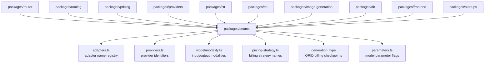

# Enums

Canonical enum definitions for the OpenRouter monorepo. Provides `as const` objects with `ValueOf` types for adapters, providers, model modalities, pricing strategies, API types, endpoint statuses, and other domain constants shared across packages.

## Architecture

## Key Files

| File | Purpose |
|------|---------|
| `adapters.ts` | Adapter name enums for chat, STT, TTS, image, and embedding adapters |
| `providers.ts` | Provider identifier constants |
| `pricing-strategy.ts` | Billing strategy names (token, duration, image, embedding) |
| `model/modality.ts` | Input/output modality flags (text, image, audio, video, file, embeddings, rerank, speech, transcription) |
| `model/groups.ts` | Model group/family classifications |
| `parameters.ts` | Model parameter support flags |
| `instruction-role-support.ts` | Instruction role mapping modes (developer, system, user-only) |
| `plugins.ts` | Plugin identifier constants |
| `endpoint-status.ts` | Endpoint lifecycle status values |
| `bans.ts` | Ban type definitions |
| `app-category.ts` | Marketplace app category taxonomy |

## Commands

| Command | Description |
|---------|-------------|
| `bun test` | Run unit tests |
| `bun run typecheck` | Type-check with tsgo |
