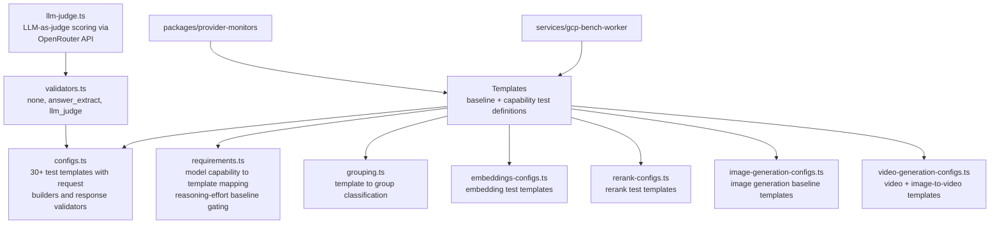

# Evals

Dataset evaluation utilities for OpenRouter. Defines test templates, validators, and baseline requirements used by `packages/provider-monitors` to gate endpoint visibility and by `services/gcp-bench-worker` to run benchmarks.

## Architecture

## Key Modules

| Path                        | Purpose                                                                                                                                                                                                                                                                   |
| --------------------------- | ------------------------------------------------------------------------------------------------------------------------------------------------------------------------------------------------------------------------------------------------------------------------- |
| `templates/configs.ts`      | 30+ test template definitions — each pairs a request builder with a response validator (vision, tool calls, reasoning, audio, video, etc.)                                                                                                                                |
| `templates/requirements.ts` | Maps model capabilities (modalities, reasoning-effort support) to required baseline templates; generates per-effort reasoning-effort templates that gate auto-unhide. Image generation baseline templates are capability-gated per endpoint (e.g. streaming, image input) |
| `templates/grouping.ts`     | Classifies templates into groups (Basic, InputImage, ReasoningEnabled, OutputAudio, etc.) for organized test reporting                                                                                                                                                    |
| `validators.ts`             | Validator registry — `None` (always pass), `AnswerExtract` (regex match), `LlmJudge` (LLM-scored)                                                                                                                                                                         |
| `llm-judge.ts`              | Sends a judge prompt to the OpenRouter API and parses a 0-1 score with retry and backoff                                                                                                                                                                                  |
| `templates/video-generation-configs.ts` | Video generation test templates, including image-to-video variants that seed a first frame from either an image URL or an inline base64 image                                                                                                                            |
| `types.ts`                  | Shared types — `DatasetRow`, `TestResult`, `TestStatus`, multimodal request unions                                                                                                                                                                                        |

## Commands

| Command             | Description          |
| ------------------- | -------------------- |
| `bun test`          | Run unit tests       |
| `bun run typecheck` | Type-check with tsgo |
