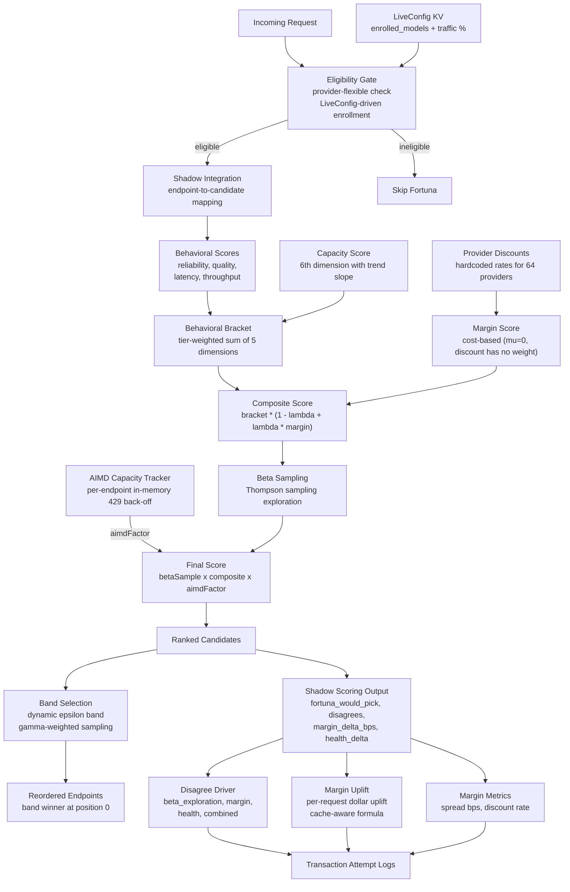

# Fortuna

Scoring engine, eligibility gate, margin metrics, band-weighted selection, and provider discount data for the Fortuna inference routing system. Contains the composite scoring formula, band-weighted sampling for traffic distribution, shadow scoring pipeline for observability, provider discount rates, request eligibility checks, per-request margin metrics, and the shadow integration bridge that maps routing endpoints to Fortuna candidates.

## Architecture

## Key Modules

| Path | Purpose |
|------|---------|
| `src/scoring.ts` | Composite scoring formula: behavioral bracket (5 dimensions + capacity), margin score, Beta sampling, tier weights, and `computePreferenceScore` for custom scoring profiles based on provider sort preference |
| `src/shadow-scoring.ts` | Shadow pipeline: scores all candidates, ranks them, computes what Fortuna would have picked vs actual, classifies disagree drivers, emits winner pricing |
| `src/provider-discounts.ts` | Hardcoded discount rates for 64 providers (flat and tiered) |
| `src/eligibility.ts` | Fortuna eligibility gate — checks provider-flexibility (no BYOK, no provider order/only/ignore, multi-provider model) and LiveConfig enrollment (per-model traffic percentage sampling via `FortunaEnrollmentConfigSchema`). Provider sort preferences are no longer a disqualifier — they are handled via custom scoring profiles instead. Enrollment status is stamped in the ClickHouse `experiments` column (`fortuna_enrolled`, `fortuna_traffic_pct`) |
| `src/metrics.ts` | Per-request margin metrics — spread in dollars and basis points, provider discount rate lookup |
| `src/shadow-integration.ts` | Shadow integration bridge — maps routing Endpoint objects to ShadowCandidate inputs for the shadow scoring pipeline |
| `src/band-selection.ts` | Band-weighted sampling — computes dynamic band of near-tied candidates (epsilon from spread fraction × rank-5 reference) and samples with gamma-weighted probabilities (`P(i) ∝ score^γ`). Distributes traffic across competitive providers to reduce 429 cascades |
| `src/fortuna-routing.ts` | Live routing module — scores eligible endpoints, applies band selection, reorders the winner to position 0 for the router. Only runs for sampled A/B traffic subset. Also exposes `countFortunaScoreableEndpoints` so callers can decide whether a sampled-out request is a valid control. Requests that are Fortuna-eligible but lose the sampling dice roll form the randomized **control cohort** — NOT Fortuna-routed, but recorded (via `isEligibleHeldOut`) so the held-out group can be reconstructed for A/B analysis |
| `src/aimd-capacity.ts` | In-memory AIMD (Additive Increase / Multiplicative Decrease) per-endpoint 429 back-off tracker with TTL expiry and FIFO eviction |

## Key Concepts

| Concept | Description |
|---------|-------------|
| Composite Score | `bracket * ((1 - lambda) + lambda * preferenceScore)` where lambda = 0.95 for proprietary, 0.5 for open-weight with non-default provider sorts, 0.25 for open-weight otherwise |
| Scoring Profiles | `computePreferenceScore` maps provider sort to the relevant behavioral dimension: `price/null → marginScore`, `latency → latencyScore`, `throughput → throughputScore`, `exacto → qualityScore`. Lets sorted requests benefit from Fortuna's capacity-aware routing while respecting user preference |
| Behavioral Bracket | Tier-weighted sum of reliability, quality, latency, throughput, and capacity scores (5 dimensions) |
| Customer Tier | Fortuna-local weight selector, not the account's subscription plan. Live routing hardcodes `Pro` for every request (OPE-4778), so only the `Pro` weights affect production ranking. Shadow scoring hardcodes `Pro` too. `Free` and `Enterprise` rows are placeholders. Enterprise users are rejected at the live-routing eligibility gate (`EnterpriseRestricted`) but still get shadow scores |
| Margin Score | `mu * discountScore + (1 - mu) * costScore` where mu (MARGIN_MU) = 0 (purely cost-based, discount has no weight). CostScore uses effective (served) pricing for open-weight models when available; proprietary models always use static list prices |
| Beta Sampling | Thompson sampling via Gamma-ratio method for exploration vs exploitation |
| Band Selection | After ranking, computes a dynamic epsilon band of near-tied providers (`epsilon = spreadFraction × (leader − rank-5 score)`, min `NOISE_FLOOR`). Samples from the band with `P(i) ∝ score^γ` (γ=3 → leader ~40%, rank2 ~32%, rank3 ~25%). Replaces deterministic argmax to reduce 429 cascades from traffic over-concentration |
| Selection Policy | Tunable parameters for band selection: `spreadFraction` (0.7), `noiseFloor` (0.01), `spreadReferenceRank` (4 = rank 5), `minK` (2), `gamma` (3) |
| Shadow Scoring | Computes hypothetical Fortuna picks without affecting production routing |
| Disagree Driver | Classification of why Fortuna disagrees with the router: `beta_exploration`, `margin`, `health`, or `combined` |
| Margin Uplift | Per-request dollar savings estimate computed as margin difference (`fortuna_margin − actual_margin`), cache-aware (splits uncached and cached prompt tokens at different prices) |
| Pick Outcome | 3-way classification of Fortuna's preferred endpoint: `not_attempted`, `attempted_succeeded`, `attempted_failed` |
| Sticky Session | Requests hitting a cached provider are flagged `is_sticky_session`; shadow scoring still runs for observability but margin uplift is nulled and `fortuna_disagrees` is set to false (switching providers would destroy prompt cache) |
| Beta Half-Life | Time-weighted Beta parameter decay (10 minutes), controls how fast historical observations fade |
| Warmup Threshold | Endpoints with < 100 requests get neutral (0.5) behavioral scores |
| Capacity Score | 6th composite dimension — disentangles 429 rate-limit pressure from reliability, with trend extrapolation (rising 429 rate amplifies penalty). Tier-weighted: Enterprise 0.3, Pro 0.2, Free 0.15. Learned ceiling is floored at the median clean RPM (sample-gated) to prevent transient low-volume 429s from dragging the ceiling below sustainable rates |
| AIMD Capacity Tracker | Per-endpoint in-memory counter: quarters on a 429 loss event (multiplicative decrease = 0.25, at most once per 2s window), recovers by +0.005 per elapsed second of successful traffic (time-paced, ~3.2 min floor-to-ceiling). Upstream Retry-After pins the factor at the floor until the deadline. Floor 0.05, ceiling 1, 10-min base TTL + 5-min jitter, slow-start (0.1) on TTL expiry, 10k FIFO eviction. Per-Worker-isolate — no shared memory |
| Capacity Ceiling Factor | Dampens an endpoint's score when recent traffic exceeds its learned capacity ceiling (`ceiling/recent`, floored at 0.05). Uses a short-window peak RPM (trailing minutes) instead of the 30-minute average so bursty providers can actually cross the ceiling threshold |
| Capacity Score vs AIMD | CapacityScore is a KV-precomputed minutes-scale signal inside the behavioral bracket; AIMD is a per-worker milliseconds-scale override multiplied into the final score outside the bracket |

## Commands

| Command | Description |
|---------|-------------|
| `bun test` | Run unit tests |
| `bun run typecheck` | Type-check with tsgo |

## Integration

Fortuna score snapshots are persisted to `packages/db` via the `routing_fortuna_score_snapshots` table, capturing per-endpoint audit data (Beta parameters, capacity score, effective pricing, latency/throughput stats, discount rates) for offline analysis. Shadow scoring results are also persisted as flat columns on ClickHouse `generations` for backtesting analytics.
