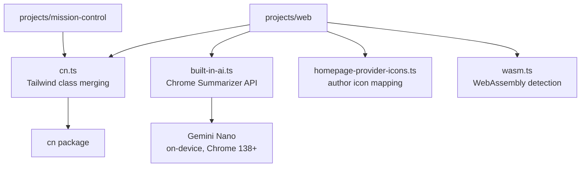

# Frontend Utils

Framework-agnostic browser utilities shared across OpenRouter's frontend projects (web, mission-control). Provides Tailwind class merging, browser capability detection, and on-device AI helpers.

## Architecture

## Key Modules

| File | Purpose |
|------|---------|
| `cn.ts` | Tailwind class merging with custom z-index class group support |
| `built-in-ai.ts` | Chrome Built-in AI Summarizer — generates headlines on-device via Gemini Nano |
| `wasm.ts` | Cached WebAssembly support detection |
| `homepage-provider-icons.ts` | Author-to-icon path mapping for homepage featured models |

## Commands

| Command | Description |
|---------|-------------|
| `bun test` | Run unit tests |
| `tsgo --noEmit` | Type-check |
