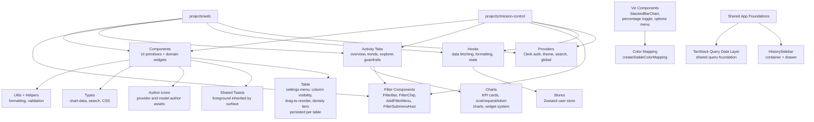

# Frontend

Shared React component library, hooks, and utilities used by `projects/web` and `projects/mission-control`. Provides reusable UI primitives, data-fetching hooks, global state stores, and common providers. The Bauhaus rebrand design system under `components/ui/` is the current design language, and the legacy components that share that directory are being replaced or deleted as surfaces migrate.

## Architecture

## Key Directories

| Path                        | Purpose                                                                                                                                                                                                                                                                                                                                                                                                                                                                                                                                                                                                                                                                                                                                                                                                                                   |
| --------------------------- | ----------------------------------------------------------------------------------------------------------------------------------------------------------------------------------------------------------------------------------------------------------------------------------------------------------------------------------------------------------------------------------------------------------------------------------------------------------------------------------------------------------------------------------------------------------------------------------------------------------------------------------------------------------------------------------------------------------------------------------------------------------------------------------------------------------------------------------------- |
| `components/activity-tabs/` | Activity dashboard tabs — Overview (KPI cards, cost/request/token charts, top rankings with percentage toggle, leaderboards), Trends (movers, time series), Explorer (dimension drilldown, chart + table, saved-charts UI), Guardrails; includes chart widget system, stable color mapping, server-side data fetchers, and deep-link support (`?transaction=X&message=N` for prompt overlay row selection)                                                                                                                                                                                                                                                                                                                                                                                                                                                 |
| `components/filters/`       | Shared filter UI — FilterBar, FilterChip (with negation support), AddFilterMenu, FilterSubmenuHost, ActivityHeaderShell (used by web activity + mission-control data explorer)                                                                                                                                                                                                                                                                                                                                                                                                                                                                                                                                                                                                                                                            |
| `components/charts/`        | Comparison charts (latency, throughput, uptime, tool-call error, structured output) and shared helpers (`hasInsufficientComparisonData`)                                                                                                                                                                                                                                                                                                                                                                                                                                                                                                                                                                                                                                                                                                  |
| `components/viz/`           | Visualization primitives (StackedBarChart, StackedBarChartSkeleton) and color mapping utilities (`createStableColorMapping`). Hover state is deferred (`useDeferredValue`) so hover-driven highlight changes don't block chart re-renders. `ChartLegendRow` renders a single legend entry (label, value, percentage, swatch) with an opt-in `onIcon` prop threaded from StackedBarChart's `onIcon` so rankings legends can show a leading icon without affecting other StackedBarChart usages                                                                                                                                                                                                                                                                                                                                  |
| `types/`                    | Shared TypeScript types (chart data point hierarchy, search, CSS)                                                                                                                                                                                                                                                                                                                                                                                                                                                                                                                                                                                                                                                                                                                                                                         |
| `components/`               | Domain-specific widgets (Chatroom, Markdown — with shiki highlighter worker recovery after worker termination — ModelNotFound, CustomOrgSwitcher, etc.)                                                                                                                                                                                                                                                                                                                                                                                                                                                                                                                                                                                                                                                                                   |
| `hooks/`                    | Custom React hooks (useModelInfo — whose `modelCount`/available-model lists count only "active" models via `isActiveModel` (has a live endpoint or is a router-group model), useApiKeys, useDateFormat, useDeviceCapabilities, etc.) plus SSR-safe primitives: `useInterval`, `useIntersectionObserver`, and `useIsomorphicLayoutEffect`                                                                                                                                                                                                                                                                                                                                                                                                                                                                                                                                                                                                                                                  |
| `providers/`                | Context providers (ClerkAuth, Theme, GlobalProvider, NavSearch)                                                                                                                                                                                                                                                                                                                                                                                                                                                                                                                                                                                                                                                                                                                                                                           |
| `stores/`                   | Zustand state stores (user store)                                                                                                                                                                                                                                                                                                                                                                                                                                                                                                                                                                                                                                                                                                                                                                                                         |
| `components/ui/`            | Rebrand design system with dedicated `.storybook-ui/` config — includes Button, Card, Dialog, Badge, Avatar, AudioPlayer, Charts, Tabs, Checkbox, `Container` (CVA-based page-width wrapper that replaces the legacy `.main-content-container` CSS class), and more. Table primitives (`Table.tsx`, `TableFilter.tsx`, `Pagination.tsx`, `TableSettingsButton.tsx`, `TableSettingsHead.tsx`) provide composable tables with filtering, pagination, settings, pinned headers, and density tiers; their styles live in a dedicated `components/ui/table.css` split out of `theme.css`. Dialog/Sheet/AlertDialog overlays no longer use `backdrop-blur` (stacked-blur freeze fix). Chart colors are read from `document.documentElement` custom properties. The Command primitive re-exports `useCommandState` from cmdk so consumers (e.g. web's VirtualizedModelList) can bridge the active item to a virtualizer for keyboard scroll-follow. Consumers import these components via aliased paths. The same directory also holds the legacy components that have not been rebranded yet                                                                                                                                                                                                                                                                                                                                                                                                                     |
| `forms/`                    | Shared form components and utilities                                                                                                                                                                                                                                                                                                                                                                                                                                                                                                                                                                                                                                                                                                                                                                                                      |
| `helpers/`                  | Frontend-specific helper functions, including `withContext` route guards. Org-required / org-admin-required 403s return a consistent `{ error: { code, message } }` envelope (e.g. `org_required`, `org_admin_required`) instead of a bare `error` string                                                                                                                                                                                                                                                                                                                                                                                                                                                                                                                                                                                 |
| `middlewares/`              | Next.js middleware utilities                                                                                                                                                                                                                                                                                                                                                                                                                                                                                                                                                                                                                                                                                                                                                                                                              |

## Commands

| Command         | Description    |
| --------------- | -------------- |
| `bun test`      | Run unit tests |
| `tsgo --noEmit` | Type-check     |
