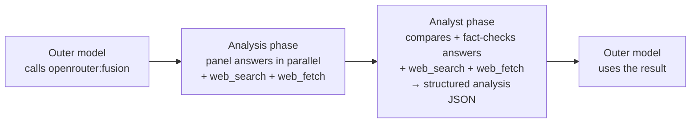

# Fusion Core

Multi-model deliberation engine behind OpenRouter's Fusion feature. A **panel**
of models answers a prompt in parallel, a **analyst** model compares and
fact-checks their answers into a structured **analysis**, and the calling model
uses that analysis however it needs — to write its response, inform a decision,
or drive a larger task.

This package owns the _pipeline_ (prompts, schemas, model resolution,
orchestration, and progress/stream handling). The request plumbing around it — auth,
tool injection, streaming back to the client — lives in the `openrouter:fusion`
server tool (`packages/router`), which is this package's only caller. The
generic inner-call SSE accumulator it drives lives in
`@openrouter-monorepo/network` (see the note under [Layout](#layout-high-level)).

## Product

Fusion is for questions where one model isn't enough: research, expert critique,
contested reasoning, or decisions that are expensive to get wrong. Running
several strong models independently and then reconciling them surfaces
consensus (higher-confidence), contradictions, and blind spots a single model
would miss. It is deliberately _not_ for routine or mechanical prompts — every
call runs several completions plus an analyst, so it trades cost and latency for a
better answer.

## Process

1. The outer (calling) model invokes the `openrouter:fusion` tool.
2. **Analysis phase** — the panel models each answer the prompt independently,
   in parallel, each with `web_search` + `web_fetch` enabled.
3. **Analyst phase** — one model reads every panel answer and actively verifies
   their claims (it also has `web_search` + `web_fetch`), then returns a
   structured analysis. It evaluates and compares; it does not merely merge.
4. The outer model receives the panel responses **and** the analysis as the
   tool result and uses them for whatever it's doing — writing a response,
   informing a downstream step, or any other purpose. Fusion itself makes **no
   separate synthesis call**.



## Architecture

- **One caller.** The `openrouter:fusion` server tool in `packages/router`
  resolves config + models and invokes `runFusion`; this package has no other
  entry point.
- **Inner calls go through the gateway.** Every panel and analyst call is a
  streaming `POST /responses` against the same OpenRouter API, so
  responses-only server tools (`openrouter:shell`, `openrouter:apply_patch`)
  work inside fusion. Streaming keeps the parent Worker at `O(final_text)` per
  call, which is what lets the panel fan out fully in parallel.
- **Bounded recursion.** Each inner call carries `x-openrouter-fusion-depth`;
  panel/analyst calls cannot re-enter fusion, so deliberation stays one level
  deep. A signed `x-openrouter-fusion-max-steps` header bounds the agentic loop,
  and inner generations are attributed to the sugar slug the request entered
  through via `x-openrouter-fusion-entry` (`models/sugar-slugs.ts`,
  `utils/recursion-guard.ts`).
- **Streaming panel checkpoints.** `runFusion` accepts an abort signal and
  streams panel text to the Durable Object store in 100KB checkpoints, so
  long panel answers don't accumulate in Worker memory.
- **Graceful analyst stage.** Any analyst or parse failure degrades to returning the
  panel responses with the analysis omitted, rather than failing the run — the
  panel bodies are the bulk of what the user already paid for. A run only hard-
  fails when _every_ panel fails.
- **Citations bubble up.** `url_citation` annotations from panel and analyst inner
  calls are captured and deduplicated by URL across the run. Because the inner
  sub-requests never reach the client, skins replay these into the API's native
  citation channel (e.g. chat-completions `message.annotations`).
- **Per-run correlation + observability.** A synthetic run-id is stamped on
  every inner call, and one warn-level `fusion:run-complete` (or
  `fusion:run-failed`) rollup carries the run aggregates.

## Interfacing

### Entry points

There are **two public ways to reach fusion**, and they are _not_ identical at
the request-shaping layer — they only converge once the panel+analyst pipeline
runs. The `FusionPlugin` (`packages/router/plugins/fusion`) is what forks them.

| Entry point                                                | Public docs                                                                          | Outer model                                                           | Tool           | Invocation         | Analyst default             |
| ---------------------------------------------------------- | ------------------------------------------------------------------------------------ | --------------------------------------------------------------------- | -------------- | ------------------ | ------------------------- |
| **Model alias** — `model: "openrouter/fusion"`             | [Fusion Router](https://openrouter.ai/docs/guides/routing/routers/fusion-router)     | The resolved fusion model (`model` / preset / `DEFAULT_FUSION_MODEL`) | Auto-injected  | **Forced**         | The resolved fusion model |
| **Server tool** — `tools: [{ type: "openrouter:fusion" }]` | [Fusion server tool](https://openrouter.ai/docs/guides/features/server-tools/fusion) | **Your** model                                                        | You declare it | Model's discretion | Your outer model          |

On the **model alias** path, invocation is forced — `FusionPlugin` injects a
analyst directive that requires the tool be called exactly once on every request,
including trivial prompts. On the **server tool** path,
invocation is left to the model's discretion. In all cases, fusion can only
execute once per request (enforced by `MAX_FUSION_INVOCATIONS_PER_REQUEST` in
`fusion-tool.ts`). Additionally unique to the **model alias**: `FusionPlugin`
defaults the outer request's `max_tool_calls` to 1 so the agent loop
transitions straight to its tool-free final response after a single fusion call
(explicit caller budgets keep their existing defaults). Configuration is shared
across both entry points: the `plugins[]` entry provides Fusion preferences,
while the server tool's `parameters` override those preferences per field on
the tool path. The model alias falls back to defaults/preset when preferences
are omitted.

The request-shaping policy these paths share is owned by this package, not the
router, so the entry points can't silently diverge:

- `models/resolve-fusion-models.ts` — all model resolution: `resolveOuterFusionModel`
  (outer synthesis model precedence) and `resolveFusionModels` (inner panel + analyst).
- `utils/request/build-fusion-tool-parameters.ts` — the single forward-list of
  _which_ plugin config crosses the plugin→tool boundary.

Plugin/tool config (public, frozen contract):

| Field             | What it is                                                                 |
| ----------------- | -------------------------------------------------------------------------- |
| `analysis_models` | The 1–8 panel models (see Glossary).                                       |
| `model`           | The analyst model. Defaults to the outer model, then `DEFAULT_FUSION_MODEL`. |
| `preset`          | A curated `<task>-<tier>` slug that expands into a panel + analyst.          |
| `max_tool_calls`  | Agentic step ceiling per panel/analyst call (1–16).                          |
| `enabled`         | Set `false` to bypass fusion for one request.                              |

### Programmatic entry point

```ts
runFusion(opts: RunFusionOpts): AsyncResult<RunFusionOutput, RunFusionError>
```

- **In** — the `prompt`, the panel roster (`analysisModels`), the `analystModel`,
  auth + `serverURL`, and the current `fusionDepth`; plus optional reasoning,
  tools, temperature, token budgets, and `onProgress` / `onDelta` callbacks for
  progressive streaming.
- **Out (ok)** — `{ analysis?, responses, failedModels, totalInnerCost }`. The
  `analysis` is omitted on a degraded analyst; `responses` are the successful
  panel answers; `totalInnerCost` is the summed inner spend folded into the
  outer generation's reported usage. Deduplicated `url_citation` annotations are
  carried alongside so skins can surface them on the native citation channel.
- **Out (err)** — a structured `RunFusionError` only when the whole panel fails.

Progress is streamed via `onProgress` as discriminated events
(`panel_started` · `panel_delta` · `panel_complete` · `panel_error` ·
`analysis_started` · `analysis_complete`).

## Glossary

Fusion's public API and internal code share one vocabulary. The single quirk
worth internalizing: **"analysis" refers to two different things**, both kept
for public-API back-compat.

| Term                               | Public field      | What it is                                                                                                                                                                                                         |
| ---------------------------------- | ----------------- | ------------------------------------------------------------------------------------------------------------------------------------------------------------------------------------------------------------------ |
| **Panel** (a.k.a. analysis models) | `analysis_models` | The 1–8 models that answer the prompt in parallel — the "analysis phase". Each gets `web_search` + `web_fetch`.                                                                                                    |
| **Analyst**                          | `model`           | The single model that compares and fact-checks the panel answers and emits the structured analysis. Also gets `web_search` + `web_fetch` — it verifies claims against primary sources, it does not just summarize. |
| **Analysis** (the output)          | `analysis`        | The analyst's structured JSON result: `consensus`, `contradictions`, `partial_coverage`, `unique_insights`, `blind_spots`.                                                                                           |
| **Outer model**                    | —                 | The calling model that invokes `openrouter:fusion` and consumes the result — using it for whatever it's doing (writing a response, informing a step, etc.). Not a fusion-internal call.                            |

> **"analysis" is overloaded.** `analysis_models` names the **panel** (the
> phase-1 _input_ roster), while `analysis` names the **analyst's output** (the
> phase-2 _result_). Same word, two roles — a historical public-API choice we
> preserve. When you see `analysis*` in the code, check which one it means.

## Layout (high level)

- `definitions/` — constants, errors, prompts, schemas, shared types
- `models/` — preset and default panel + analyst resolution, plus sugar slugs
  (`sugar-slugs.ts`): separately-listed fusion model aliases like
  `openrouter/fusion-flash` that pin a preset
- `use-cases/run-fusion/` — the pipeline orchestrator and its helpers
- `utils/` — recursion guard, request-shaping helpers, the analysis-stream
  parser, and prompt-injection guards
- `skins/` — multimodal content-part forwarding to panel calls

> **Generic inner-call streaming lives in `@openrouter-monorepo/network`, not
> here.** The SSE accumulator (`accumulateStreamedText`) and the
> `ChatCompletionError` vocabulary are shared by every
> tool that issues an inner streaming call (fusion, `openrouter:advisor`,
> `openrouter:subagent`), so they live in `network` alongside `SSEDeserializer`.
> Fusion consumes them like any other caller. Only the fusion-specific
> `FUSION_FAILURE_REASON` vocabulary stays in `definitions/errors`.

## Commands

| Command         | Description    |
| --------------- | -------------- |
| `bun test`      | Run unit tests |
| `tsgo --noEmit` | Type-check     |
