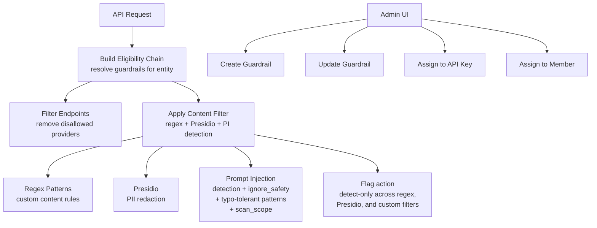

# Guardrails

Policy enforcement engine for content filtering, prompt injection detection, and endpoint access control. Manages guardrail definitions, assignments to API keys and workspace members, and runtime enforcement during request processing.

## Architecture

## Key Directories

| Path | Purpose |
|------|---------|
| `use-cases/` | Business logic for each guardrail operation (CRUD, assignment, enforcement) |
| `definitions/` | Type definitions, error types, and mock data |
| `helpers/` | Shared utilities: content filter parsing, ZDR (zero-data-retention) with an independent xAI frontier ZDR toggle |
| `integration/` | Integration tests against real database |

## Key Use Cases

| Use Case | Purpose |
|----------|---------|
| `apply-content-filter/` | Runtime content scanning (regex, Presidio, prompt injection). Supports `scan_scope` (`all_messages` or `user_only`) for regex PI to avoid false positives on system prompts |
| `detect-prompt-injection/` | ML-based prompt injection detection |
| `build-eligibility-chain/` | Resolves which guardrails apply to a given request |
| `filter-endpoints-by-guardrail/` | Removes endpoints disallowed by guardrail policies |
| `create-guardrail/`, `update-guardrail/`, `delete-guardrail/` | CRUD operations |
| `assign-api-key-guardrail/` | Assignment management |
| `list-guardrails-by-entity-paginated/` | Paginated listing for admin UI |

Per-user PI allowlist phrases ("allowlist" is the canonical term) bypass the prompt-injection guardrail and are managed from the privacy settings UI.

## Commands

| Command | Description |
|---------|-------------|
| `bun test` | Run unit tests |
| `bun test --watch` | Run tests in watch mode |
| `BUN_INTEGRATION_TEST=1 bun test ./integration` | Run integration tests |
| `tsgo --noEmit` | Type-check |
