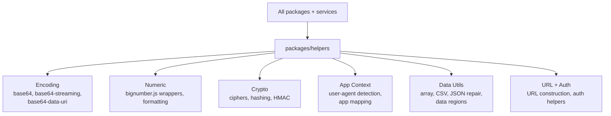

# Helpers

Isomorphic utility functions shared across the OpenRouter monorepo. Provides pure, runtime-agnostic helpers for string manipulation, encoding, cryptography, date formatting, URL handling, user-agent detection, and numeric operations.

## Architecture

## Key Modules

| Path | Purpose |
|------|---------|
| `get-app-context/` | User-agent parsing and app identification (Cursor, Copilot, Cline, Kilo Code, etc.) |
| `bn.ts` | BigNumber.js wrappers for safe decimal arithmetic |
| `base64*.ts` | Base64 encoding/decoding including streaming and data-URI variants |
| `ciphers.ts` | Encryption utilities using @noble/ciphers |
| `crypto.ts` | Hashing and HMAC helpers |
| `data-regions.ts` | Data region mapping and validation |
| `url.ts` | Service URL construction helpers |
| `merge-async-generator.ts` | Merges multiple async generators into a single stream, correctly handling source completion without dropping items |
| `safe-race.ts` | Safe replacement for `Promise.race` (required by monorepo style) |

## Commands

| Command | Description |
|---------|-------------|
| `bun test` | Run unit tests |
| `tsgo --noEmit` | Type-check |
