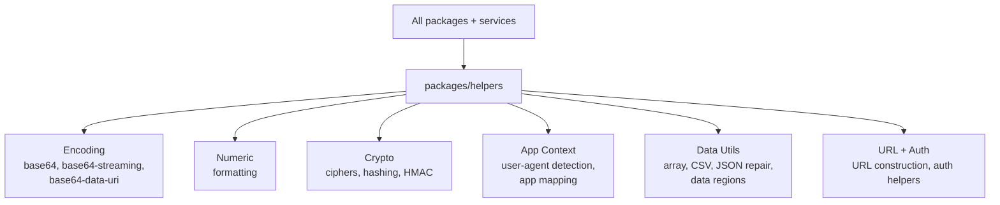

# Helpers

Isomorphic utility functions shared across the OpenRouter monorepo. Provides pure, runtime-agnostic helpers for string manipulation, encoding, cryptography, date formatting, URL handling, user-agent detection, and numeric operations.

## Architecture

```mermaid
graph TD
    Consumers["All packages + services"] --> Helpers["packages/helpers"]
    Helpers --> Encoding["Encoding\nbase64, base64-streaming,\nbase64-data-uri"]
    Helpers --> Numeric["Numeric\nformatting"]
    Helpers --> Crypto["Crypto\nciphers, hashing, HMAC"]
    Helpers --> Context["App Context\nuser-agent detection,\napp mapping"]
    Helpers --> Data["Data Utils\narray, CSV, JSON repair,\ndata regions"]
    Helpers --> URL["URL + Auth\nURL construction, auth helpers"]
```

## Key Modules

| Path | Purpose |
|------|---------|
| `get-app-context/` | User-agent parsing and app identification (Cursor, Copilot, Cline, Kilo Code, etc.) |
| `base64*.ts` | Base64 encoding/decoding including streaming and data-URI variants |
| `ciphers.ts` | `PROVIDER_ENCRYPTION_KEY` encrypt/decrypt wrappers over `@openrouter-monorepo/lib-crypto/ciphers` |
| `static-key-header.ts` | `checkStaticKeyHeader` static API key header check |
| `data-regions.ts` | Data region mapping and validation |
| `url.ts` | Service URL construction helpers |
| `merge-async-generator.ts` | Merges multiple async generators into a single stream, correctly handling source completion without dropping items |

## Commands

| Command | Description |
|---------|-------------|
| `bun test` | Run unit tests |
| `tsgo --noEmit` | Type-check |
