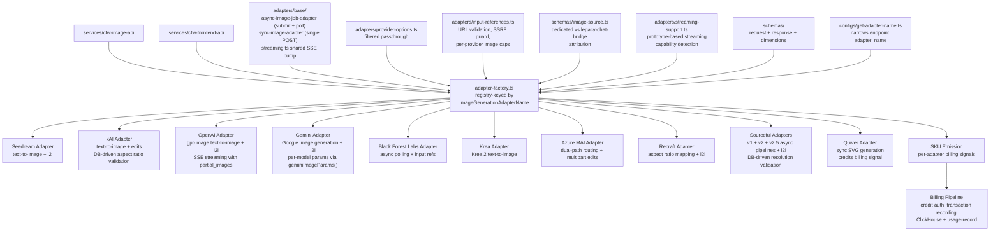

# Image Generation

Provider-agnostic image generation adapter layer. Routes image creation and editing requests to provider-specific adapters (Krea, Seedream, xAI, Quiver, etc.) via a registry-based factory, normalizes request/response formats, handles provider-specific parameter mapping, and computes usage from adapter SKU emissions. Request orchestration, credit authorization, response construction, and billing completion live in `services/cfw-image-api/src/routes/images/lifecycle/`. All endpoint capabilities (aspect ratios, resolutions, max images, input reference limits) are DB-driven via the `supported_image_parameters` JSONB column — adapters contain no hardcoded capability constants. Errors are normalized across every adapter via a shared upstream-fault classification, and `output_format` now includes `svg`.

## Architecture

## Key Modules

| Path                                       | Purpose                                                                                                                                                                                                                                                                                                               |
| ------------------------------------------ | --------------------------------------------------------------------------------------------------------------------------------------------------------------------------------------------------------------------------------------------------------------------------------------------------------------------- |
| `adapters/adapter-factory.ts`              | Registry mapping `ImageGenerationAdapterName` to adapter instances                                                                                                                                                                                                                                                    |
| `adapters/base/`                           | Abstract base adapter classes: `async-image-job-adapter.ts` (`BaseImageGenerationAdapter` — submit/poll lifecycle with a single `getUrl(upstream)` resolver) and `sync-image-adapter.ts` (`BaseSyncImageGenerationAdapter` — single-request POST)                                                                     |
| `adapters/base/streaming.ts`               | Shared streaming-adapter scaffold: a common SSE pump that decodes the upstream stream, delegates payload handling to a provider `StreamPayloadHandler`, and tracks the shared `ImageStreamState` (SKU items, first-partial latency, complete/error/cancel flags) used by the OpenAI and Quiver streaming adapters     |
| `packages/helpers/sanitize-provider-error.ts` | Shared provider-error sanitization used by every adapter — strips upstream internals from error bodies before they reach clients                                                                                                                                                                                |
| `adapters/seedream/`                       | Seedream image generation adapter                                                                                                                                                                                                                                                                                     |
| `adapters/openai/`                         | OpenAI gpt-image adapter — text-to-image and image-to-image via input references. Supports native SSE streaming (`streaming.ts`) with `partial_images` for progressive previews and `didComplete` tracking for billing accuracy; warns on model-ID remap misses and pricing-strategy mismatches                       |
| `adapters/x-ai/`                           | xAI adapter — sync POST for text-to-image and image edits; `parseSize` treats non-resolution strings as candidate aspect ratios (Gemini pattern) with secondary DB-driven validation against `supported_image_parameters.aspect_ratios`                                                                               |
| `adapters/gemini/`                         | Google Gemini image generation adapter with i2i support via inline image data; per-model params via `geminiImageParams(providerModelId)` (e.g. 2.5 Flash max 3, 3.x Pro max 14). Responses that complete without an image are classified as non-fault 4xx (not upstream 502s) and surface the model's `finish_reason` |
| `adapters/black-forest-labs/`              | Black Forest Labs (FLUX) adapter with async submit/poll                                                                                                                                                                                                                                                               |
| `adapters/sourceful/`                      | Sourceful v1 async image pipeline                                                                                                                                                                                                                                                                                     |
| `adapters/azure-mai-image/`                | Azure MAI image adapter with dual-path routing and dimension resolution                                                                                                                                                                                                                                               |
| `adapters/recraft/`                        | Recraft image adapter with aspect ratio mapping                                                                                                                                                                                                                                                                       |
| `adapters/sourceful-v2/`                   | Sourceful v2 async image pipeline                                                                                                                                                                                                                                                                                     |
| `adapters/sourceful-v2-5/`                 | Sourceful v2.5 async image pipeline with extended poll timeout; post-resolution DB validation against `supported_image_parameters.resolutions`                                                                                                                                                                        |
| `adapters/quiver/`                         | Quiver SVG generation adapter (sync POST). Returns each SVG as a raw string in `data[].svg`; bills off the `credits` field in the response. Supports SSE streaming (`streaming.ts`) built on the shared scaffold                                                                                                      |
| `adapters/provider-options.ts`             | Filtered provider option passthrough (reads `allowed_passthrough_parameters` from endpoint data)                                                                                                                                                                                                                      |
| `adapters/input-references.ts`             | Shared input-reference handler: URL validation, SSRF-guarded image fetching, multipart blob creation (max input refs gated by DB, not adapter code). Large `input_references` fetches can be offloaded to the supersize-streaming Durable Object on the request side (wired in `services/cfw-image-api`)              |
| `capabilities/validate-request.ts`         | Validates a request against the endpoint's DB-driven capability schema (`supported_image_parameters` JSONB column); sole capability gate — adapters no longer carry hardcoded constants. Incomplete capability ranges (`capabilities/range.ts`, `capabilities/from-db.ts`) are tolerated rather than rejected         |
| `adapters/streaming-support.ts`            | Prototype-based streaming capability detection — checks if adapter class implements `generateStream`                                                                                                                                                                                                                  |
| `schemas/image-source.ts`                  | Image source attribution enum (`dedicated` vs `legacy-chat-bridge`) and header resolution for analytics segmentation                                                                                                                                                                                                  |
| `usage/compute-usage.ts` | SKU-to-usage computation; worker-local lifecycle and billing utilities own authorization, transactions, and usage recording |
| `routing/steps.ts` | Ordered image endpoint-routing steps |
| `configs/get-adapter-name.ts`              | Narrows endpoint `adapter_name` to a typed `ImageGenerationAdapterName`                                                                                                                                                                                                                                               |
| `schemas/request.ts`                       | Request validation schema (includes `stream` field and provider routing preferences); tier-derived `image_size` is preserved when `aspect_ratio` is also set, and `aspect_ratio` may be sent without a resolution for providers that support it (e.g. Seedream, OpenAI)                                               |
| `schemas/response.ts`                      | Response format schema                                                                                                                                                                                                                                                                                                |
| `schemas/stream-events.ts`                 | Zod schemas for SSE streaming events (`image_generation.partial_image`, `image_generation.completed`)                                                                                                                                                                                                                 |
| `schemas/dimensions.ts`                    | Dimension/aspect-ratio resolution logic; supports 18 aspect ratios including extended ultra-tall/wide (1:4, 4:1, 1:8, 8:1)                                                                                                                                                                                            |

## Commands

| Command             | Description             |
| ------------------- | ----------------------- |
| `bun test`          | Run unit tests          |
| `bun test --watch`  | Run tests in watch mode |
| `bun run typecheck` | Type-check with tsgo    |
