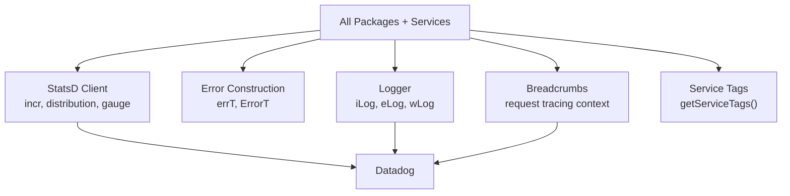

# Instrumentation

Observability primitives for the OpenRouter platform. Provides structured logging, error construction, StatsD metrics, breadcrumb tracing, and service-tag helpers used by all packages and services.

## Architecture

## Key Modules

| File | Purpose |
|------|---------|
| `logger.ts` | Structured logging (`iLog`, `eLog`, `wLog`) with snake_case fields |
| `error.ts` | `ErrorT` type and `errT()` constructor for Result-based error handling |
| `statsd.ts` | StatsD client (`getStatsd()`) for counters, distributions, gauges |
| `breadcrumbs.ts` | Request-scoped breadcrumb tracing |
| `service-tags.ts` | `getServiceTags()` — reads `SERVICE_NAME` env var for metric tagging |
| `tracing.ts` | Distributed tracing helpers |
| `process.ts` | Pure function for processing metric/log payloads (no side effects, testable in isolation) |
| `transaction-attempt-metrics.ts` | Structured metrics for routing transaction attempts (includes Fortuna fields: capacity score, AIMD capacity factor, `is_sticky_session` flag) |
| `cloudflare-metrics.ts` | CF Worker-specific metrics helpers |
| `hono.ts` | Hono middleware for request instrumentation |
| `cf-bot-log-fields.ts` | Canonical Cloudflare bot/client log-field set (`CfBotLogFields`, `NULL_CF_BOT_LOG_FIELDS`) plus the `PAYMENT_CF_FIELDS` subset used to persist client signals on payment flows |

## Commands

| Command | Description |
|---------|-------------|
| `bun test` | Run unit tests |
| `tsgo --noEmit` | Type-check |
