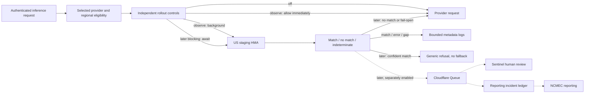

# Known-image screening: review and rollout

This is the application handoff for the first **logs-only, direct-OpenAI, Global/US image rollout**. Start with the [operator sequence](#operator-sequence) below. Keep the later Sentinel, reporting, account-action and regional work in separate review checkpoints. Deploying code and activating traffic are separate steps. Sam approves live changes.

## Where we are

The first application checkpoint (#43461–#43468) and the runtime/Live Config cleanup ([#44664](https://github.com/OpenRouterTeam/openrouter-web/pull/44664), [#44665](https://github.com/OpenRouterTeam/openrouter-web/pull/44665)) are merged. The last confirmed state is **not yet released**. Next: prepare the Worker credential and configuration, release with rates zero, then complete authenticated acceptance and bank-readiness checks before observation.

<details>
<summary>Earlier infrastructure and import snapshot — 18 September 2026 UTC</summary>

This is historical context, not a current readiness check.

| Area | State | What it proves |
| --- | --- | --- |
| US staging HMA | Infra through #131 applied. Bootstrap, migrations, runtime grants and harmless canary passed. TLS and missing/invalid-token rejection passed. | The service and importer can run. Allowed-caller match/miss and wrong-audience acceptance remain open. |
| NCMEC subscription | Sam created and enabled `NCMEC_NGO_CSAM`. His latest supplied snapshot shows 4,099,266 fetched items and 4,082,629 indexed items. Fetches succeeded, but `up_to_date=false` and `index_out_of_date=true`. | Import is progressing; backfill and index catch-up are still incomplete. This is a supplied snapshot, not a live readiness check. |
| Application foundation | Regional HMA clients, identity-token support and staging-hostname support (#44274) are on main. | Reusable code exists. This does not prove deployed Worker credentials or effective configuration. |
| First application checkpoint | PRs #43461–#43468 are merged but have not been released. The runtime/Live Config cleanup was still pending at this snapshot; it is now merged. | Code for independent observation/blocking controls plus local acceptance. Merging does not prove deployment or activation. |
| Later application work | Local branches contain Queue/Sentinel, reporting persistence/transport/scheduling/operator UI, notices, and dedicated image/embedding integrations. | Draft implementation to review and check separately. Not a completed rollout. |

The earlier observer/callback chain (#36215, #32751, #36217–#36219, #39567–#39568), old tour #39123 and EU draft #42470 describe an older design. Preserve them as reference. The merged checkpoint is recorded below. Video is deferred entirely. Coop's optional media-review deployment is not required for the agreed logs → block → Queue/Sentinel → NCMEC path.

</details>

<details>
<summary>Merged PR walkthrough and architecture</summary>

## First checkpoint: what each PR does

| Order | PR | Core change, in pseudocode | Review focus |
| --- | --- | --- | --- |
| 1 | [#43461 — Screening outcomes](https://github.com/OpenRouterTeam/openrouter-web/pull/43461) | `bounded images → HMA → match / no_match / indeterminate` | If another image fails, retain any confident match. Keep attribution precise and bodies bounded. |
| 2 | [#43462 — Rollout policy](https://github.com/OpenRouterTeam/openrouter-web/pull/43462) | `eligible selected provider + stable request cohort → off / observe / block / fail_closed` | Observation runs in the background. Every ramp defaults to zero. Provider expansion and Europe remain inactive. |
| 3 | [#43463 — Detection contract](https://github.com/OpenRouterTeam/openrouter-web/pull/43463) | `confirmed match → validated metadata event` | Defines the later Queue contract. This PR creates no queue or consumer and enables no delivery. |
| 4 | [#43464 — Router preflight](https://github.com/OpenRouterTeam/openrouter-web/pull/43464) | `selected provider → screen → allow or terminal refusal → provider dispatch` | Chat, Responses and Messages share the preflight. A block stops the whole request and provider fallback. |
| 5 | [#43465 — Worker identity](https://github.com/OpenRouterTeam/openrouter-web/pull/43465) | `regional credential + exact audience → Google ID token → HMA` | Reuses the existing identity provider. No cross-region credential fallback. |
| 6 | [#43466 — Worker wiring](https://github.com/OpenRouterTeam/openrouter-web/pull/43466) | `live config rates → lazy screening handler` | Off means no feature work. Logging-only does not need a Queue binding. Includes isolated local test setup. |
| 7 | [#43467 — Mission Control controls](https://github.com/OpenRouterTeam/openrouter-web/pull/43467) | `known_csam config → independently set observation / blocking / failClosed rates` | Review operator defaults and names. Dedicated image/embedding and Sentinel controls stay zero until their layers land. |
| 8 | [#43468 — Local acceptance and this guide](https://github.com/OpenRouterTeam/openrouter-web/pull/43468) | `harmless fixtures → actual Router / authenticated local Worker → result + dispatch assertions` | Off, observe, block, fail-open/fail-closed, partial scans and resized/re-encoded fixtures. No real bank or provider is used. |

Each layer was reviewed against its immediate parent. The eight PRs formed one review checkpoint and are now merged. Blocking code is merged with its rate defaulting to zero. It is a separate operational launch after observation. The shared future-facing metadata schema stays in its existing layer to avoid redefining it in the later consumer.



</details>

## Behavior to approve

- Initial scope: image inputs on the shared chat/Responses/Messages router, selected direct OpenAI provider, Global or US processing. An OpenAI model hosted on another provider does not qualify. Fallback **into** direct OpenAI is screened. An out-of-scope attempt does not mark the request screened. Dedicated image-generation and embedding APIs have later, independently gated integrations.
- Current image coverage: bounded inline images and their request-owned Durable Object payloads. Arbitrary remote image URLs are coverage gaps. The Worker and HMA do not fetch those URLs for this feature. Count that gap during observation before deciding on further coverage work.
- Batch submission is excluded by the router's preflight catalog. The first checkpoint does not screen batch image inputs. Broader-provider activation does not add that integration.
- Observation: positive matches, errors and incomplete scans all pass through. Log deliberate account/user/request/generation identifiers and operational outcomes. No match alert, queue, report or account action is required.
- Blocking later: any confident qualifying match refuses the whole request with generic prohibited-content wording. This also applies to requests that contain another unscannable image. Provider fallback is prohibited. Errors/gaps without a match still pass through initially.
- Fail closed later: separate manual ramp. The implementation treats errors and coverage gaps as indeterminate. Final coverage-gap policy remains an explicit decision before that stage.
- The existing HIPAA and unresolved-HIPAA-status exclusion is retained in the draft. Check that scope before observation. Sentinel's later account protections are a different concern.
- Broader providers and Europe are implemented behind zero/absent controls. EU request content must never fall back to US HMA. EU screening does not opt into the US detection queue. Additional providers share the regional behavior rates, so provider expansion can also expand an active blocking cohort.

## Activation gates and control availability

After the control cleanup is released, Live Config rates alone select screening. The old `KNOWN_CSAM_HMA_SCAN_ENABLED` environment variable is removed. Zero observation and blocking rates in both regions prevent scanner loading and credential reads. Credentials and bank readiness are prerequisites for a useful scan, not off switches. Invalid credentials after activation produce screening failures; fail closed can refuse those requests.

`known_csam` has top-level rates shared by Global/US and an optional nested `europe` object. There are no `global` or `us` objects. The defaults do not overwrite saved Live Config values. Keep Europe omitted or zero for the initial rollout. `scanTimeoutMs` is an integer from 1 to 30,000 (default 5,000). `reportingIpCaptureEnabled` defaults to false; even when enabled, the IP reader runs only for a US/Global match selected for later detection delivery.

| Live Config key | Availability in this checkpoint |
| --- | --- |
| `known_csam` | Shared Router screening. Use this for shadow observation, then match blocking. |
| `known_csam_sentinel_delivery_rate` | Producer code exists; Queue binding and consumer belong to a later stage. Keep zero. A missing binding causes delivery errors, not safe deactivation. |
| `known_csam_image` | Reserved for the later image-API integration. No runtime consumer in these eight PRs; keep zero. |
| `known_csam_embeddings` | Reserved for the later embeddings integration. No runtime consumer in these eight PRs; keep zero. |

## How the rates overlap

Each request gets one stable sampling value. Blocking takes precedence over observation. A request in the blocking group does not also run a background observation scan.

| Observation rate | Blocking rate | Selected behavior, with fail closed at zero |
| --- | --- | --- |
| 1% | 0% | 1% observe; 99% off. |
| 100% | 1% | 1% block matches; 99% observe. |
| 1% | 1% | 1% block matches; 99% off. No observation-only group. |
| 0% | 1% | 1% block matches; 99% off. Blocking does not require observation to be enabled. |

These percentages describe the intended share of eligible requests, not exact counts in a small sample. The observation-only share is `max(observationRate - blockingRate, 0)`. Keep observation above blocking only when you want an observation-only group. Equal or lower observation rates are valid; the schema should not reject a blocking-only rollout.

Fail closed takes effect only within the blocking group. Its effective share is `min(failClosedRate, blockingRate)`, rather than a percentage of that group. Keep `failClosedRate=0` for the first blocking release. There is no schema constraint that requires `failClosedRate <= blockingRate`; the selection order caps its effect.

## Operator sequence

### 1. Check the merged code and keep traffic off

1. The eight checkpoint PRs and cleanup #44664/#44665 are merged; their release is not yet confirmed. Include both in the first release. Resolve validation failures first. No remaining Coop infra PR is required for this checkpoint.
1. Hold the first release until the caller configuration below is prepared. The removed scan-enable, timeout and IP-capture environment variables are not required and no longer control this code.
1. In Mission Control → admin utilities → live config, check `known_csam` (**Known-image screening rollout**). Keep all rates zero. Keep `known_csam_sentinel_delivery_rate`, `known_csam_image` and `known_csam_embeddings` inactive too. Omit Europe or keep its rates zero.

```json
{"observationRate":0,"blockingRate":0,"failClosedRate":0,"additionalProvidersRate":0,"scanTimeoutMs":5000,"reportingIpCaptureEnabled":false}
```

### 2. Prepare the caller configuration

The NCMEC username/password belongs only to the curator's Secret Manager credential. It is **not** a Worker credential. Terraform creates the caller service account but does not provision its credential into Cloudflare.

| Worker setting | Initial value or requirement |
| --- | --- |
| `KNOWN_CSAM_HMA_BASE_URL` | `https://hma-us-central1.trust-staging.openrouter.ai` |
| `KNOWN_CSAM_HMA_OIDC_AUDIENCE` | The same exact origin, with no trailing path or slash. |
| `KNOWN_CSAM_HMA_GOOGLE_APPLICATION_CREDENTIALS_JSON` | Credential for `us-central1-cfw-api@openrouter-trust-staging.iam.gserviceaccount.com`, provisioned through the existing Worker secret/deploy path. The current token helper expects service-account JSON with its signing key. Local `gcloud auth login` and Spacelift WIF JSON are not substitutes. Use the key-creation steps below and agree rotation ownership with the infra owner. |
| `KNOWN_CSAM_HMA_BANKS` | `OPENROUTER_TEST` only in isolated harmless acceptance. Use `NCMEC_NGO_CSAM` for real observation only after bank acceptance. Never point real traffic at the canary bank. |

1. Open the [caller service account’s Keys page](https://console.cloud.google.com/iam-admin/serviceaccounts/details/109996604662331222264/keys?project=openrouter-trust-staging). The account is `us-central1-cfw-api@openrouter-trust-staging.iam.gserviceaccount.com`.
1. Check that you have `iam.serviceAccountKeys.create`. Signing in with `gcloud auth login` does not grant it. If missing, ask a platform admin for a suitable PAM entitlement or temporary **Service Account Key Admin** (`roles/iam.serviceAccountKeyAdmin`), preferably scoped to this service account. A PAM request can be made in the Console or CLI; it does not need to be local. Use an existing, verified entitlement rather than guessing a grant command.
1. Once the grant is active, choose **Keys → Add key → Create new key → JSON**. Keep the downloaded file private. The entire JSON file, including its signing key, is the value for `KNOWN_CSAM_HMA_GOOGLE_APPLICATION_CREDENTIALS_JSON`.
1. Save that JSON and the other three settings in Infisical `prod` → `/services/cfw-api`. Infisical access is separate from GCP PAM. For the public Worker, use `NCMEC_NGO_CSAM` with rates zero; use `OPENROUTER_TEST` only in the isolated acceptance deployment.
1. Remove the temporary local key file after securely saving it. Record the key ID and rotation owner without recording the private key. Expiry of the temporary IAM grant does not expire the service-account key.

<details>
<summary>Permission check from 18 September 2026</summary>

The authenticated user could list keys and read the service account, but did not have `iam.serviceAccountKeys.create`. The project’s `secret-adder` and `secret-editor` PAM entitlements grant Secret Manager access, not service-account key creation. No suitable entitlement was found among the project entitlements inspected or at the parent folder. Organization entitlements could not be listed with this identity, so an administrator may know of an existing option there.

</details>

Set timeout and IP capture in `known_csam`, not Infisical. Keep optional Coop handoff switches absent/false; they are unrelated to this launch.

After approval, release the merged stack and cleanup together with rates zero. Check the effective deployed configuration: saving an Infisical value alone does not update the running Worker.

Do not place keys or tokens in this document, PR descriptions, shell history or logs. Credential creation/secret writes and deployments need Sam's explicit approval.

### 3. Prove the path with harmless fixtures

1. Complete allowed-caller ingress acceptance: exact harmless-canary match, unrelated-image miss, and wrong-audience rejection. Use the [infra NCMEC runbook](https://github.com/OpenRouterTeam/openrouter-infra/blob/main/terraform/trust-staging/NCMEC.md#finish-authenticated-ingress-acceptance). This proves ingress authorization, not the deployed Worker path.
1. Run the [local acceptance guide](../../../tests/manual/2026-09-14-known-image-rollout/README.md). It uses local HMA, isolated local Postgres, seeded auth and a fake provider. It proves application behavior without real user traffic.
1. After approval, use an isolated, authenticated Worker deployment for the staging-ingress smoke test. Configure `OPENROUTER_TEST` and observation rate 1. Keep blocking, fail-closed and delivery rates zero. Use harmless images and a fake upstream. Check Google caller authentication, a match log, a nonmatch and unchanged provider dispatch. Keep public production screening off. Before the test, check that outbound paths are the intended staging HMA and fake upstream.
1. Record deployment revision, exact non-secret configuration and observed results. A production request with every rate zero only proves bypass behavior. It cannot prove the HMA call, token exchange or logging.

### 4. Accept the real bank, then ramp observation

1. Check import progress and serving-index freshness using metadata endpoints in the infra runbook. Require real compatible hashes in the intended bank, a successful completed backfill and a serving index that reflects it. Successful fetches with zero items are insufficient. Check the supplied NCMEC list's algorithms actually cover the PDQ client. Do not assume all NCMEC lists contain PDQ.
1. Assign import/freshness and capacity ownership. Check the matching configuration with the supplied bank/tooling before blocking. The draft PDQ distance threshold is `<=31`. Local resized-image tests do not establish production accuracy or approve that threshold.
1. With approval, deploy the real-bank caller configuration and the control cleanup with behavior rates still zero. Check effective configuration. There is no new Terraform apply or Spacelift variable to flip for an application rate.
1. With separate approval, start a small observation cohort, for example the proposed 1% configuration below. Watch match/error/gap logs and HMA capacity. Requests must continue to the provider regardless of screening outcome. Record the chosen rate and owner before increasing it.

```json
{"observationRate":0.01,"blockingRate":0,"failClosedRate":0,"additionalProvidersRate":0,"scanTimeoutMs":5000,"reportingIpCaptureEnabled":false}
```

Observation does not await the HMA result, but local extraction and scheduling still add overhead. HMA performs PDQ hashing. Inspect the existing `openrouter.known_csam.observation`, image-outcome, failure, and latency metrics alongside the logs. Successful nonmatches and no-image outcomes do not emit `knownCsamScreeningOutcome`; matches, indeterminate results, and disabled results do. Extraction/setup failures have separate diagnostics. An absence of warnings does not prove screening ran.

### 5. Choose the blocking budget, then ramp

1. Record the rollout owner, bank/threshold acceptance, and intended exclusions before enabling blocking. Include HIPAA and unresolved-posture traffic explicitly.
1. Measure added request latency, matcher timeouts/errors, and HMA capacity during staging checks and shadow observation. Include multi-image requests and token-cache misses.
1. Choose and record `known_csam.scanTimeoutMs` from those measurements before blocking. Save it in Mission Control with `blockingRate=0`, then allow Live Config to refresh and check effective behavior. No Worker redeploy is required for this setting. The 5-second default is not an approved synchronous latency budget.
1. After approval, start a small blocking cohort. Keep `failClosedRate=0`, other providers off, and Sentinel delivery zero.
1. Check a harmless match refuses the whole request with no provider fallback. Check nonmatches pass, and errors/gaps without a match still pass.
1. Increase blocking in reviewed steps toward 100% of eligible requests. Record the rate and observed results at each step; pause or roll back if they fail the agreed budget.

Images are checked with at most `maxConcurrentLookups` (default 4) hydrated at once and in flight to HMA, so peak memory is bounded by that many byte-budgeted images rather than the whole request. Blocking can wait on multiple HMA lookups, payload retrieval, and token acquisition. The matcher deadline does not bound the entire inference request. Measure added request latency separately; do not assume one network round trip.

A rate below 1 means partial blocking coverage. At 1, the initial provider, input, regional, batch, and HIPAA exclusions still apply. An earlier out-of-scope provider may receive an image before fallback into OpenAI. Later provider expansion can cover those attempts through the existing hook; this launch does not require a pre-routing rewrite.

Keep fail closed off until refusal on errors and unsupported inputs is intentional. No new HIPAA skip log, cache, or sampling control is required for this rollout.

### Rollback

Rollback: set observation/blocking/fail-closed rates to zero at the top level and in `europe` if configured. There is no separate environment kill switch after the cleanup. Live Config refreshes asynchronously: cached isolates can temporarily retain their previous rate, and cold isolates start with zero defaults. Check effective behavior after the change. Do not uninstall HMA or delete bank state to stop observation.

## Later review checkpoints

| Checkpoint | Existing draft work | Remaining acceptance or implementation |
| --- | --- | --- |
| Block matches | First eight PRs include terminal refusal and separate ramp. | Approved bank/configuration, observation confidence and deliberate activation. Continue fail-open on errors/gaps. |
| Queue → Sentinel | Receipt persistence, metadata consumer, full account/org ban handling and local Queue acceptance. | Refresh against current Sentinel enforcement protections. Prove deduplication, protected-account manual handling and full bans. Add delivery-failure alert in `#alerts-platform-low-signal` with that stage. |
| NCMEC reporting | Incident/report ledger, frozen artifacts, submit/finish receipts, scheduling, retention, recovery API and Mission Control views. | Check authoritative schema/sandbox and full signed-in browser flow. Group by authenticated account/org. Preserve supplied end-user ID, API-key creator and authenticated member separately. One year runs from the request. Report submission does not restart it. |
| Automatic actions | Reuse Sentinel investigations and durable enforcement blocks. The shared enforcement dependency [#43326](https://github.com/OpenRouterTeam/openrouter-web/pull/43326) remains open. | Implement personal-account-only activation, freemail **and** cumulative billed inference usage below configurable $2,500, protection/uncertainty checks and explicit org TODO. After investigation/checks pass, act independently of reporting. |
| Monthly notices | Persistence, Customer.io transport and operator recovery drafts. | Schedule/activate after reporting, check delivery recovery and existing recipient rule: all active org admins, fallback eligible org creator. Include applicable API-key creator/member/supplied end-user identifiers. |
| Provider/surface/EU expansion | Provider/EU policy controls plus later image and embedding integrations. | Separate activation and regional acceptance. Clarify whether content-free EU incident metadata can enter US Sentinel/reporting. Video remains deferred. |
| Additional image coverage | Remote URL images and batch submission are outside the initial scanner path. | Assess coverage gaps during observation. Safe remote-image hydration and batch integration need separate work before claiming complete image-input coverage. |

Preserve the local tail branches during the first checkpoint refresh. Publish later chunks with their own file ownership, tests and reviewer questions. Older local tests do not establish readiness on the refreshed main revision.

<details>
<summary>Historical validation — merged checkpoint</summary>

## Historical validation

These results describe the tested revisions below, not a fresh deployment check.

Each layer passed independent typechecking and its scoped tests on the pinned main revision. Layers changed during review passed `bun run verify` again. The local HMA suite passed 28 cases, including resized/re-encoded fixtures, observation during a matcher outage, and fail-closed on a remote-only gap. The authenticated Worker suite passed all four stages: 14 authenticated image requests plus four unauthenticated rejections, with 64 assertions. PR descriptions record the tested revisions, commands and review resolutions.

The generated-guard check passed again after the review fixes. The earlier checkpoint at `ace2b9b54a6a56b7207acf612ee131a3c58fa4dc` also passed a local Worker bundle dry run: 53.87 KiB larger uncompressed and 15.99 KiB larger gzipped than pinned main. That size measurement predates the small review fixes; no Worker upload or cloud startup measurement occurred.

If old build artifacts cause unrelated type errors after a rebase, run `bun run typecheck:clean` and repeat the check. A cold baseline build and the refreshed layers passed here.

Local acceptance uses harmless fixtures only. It does not establish a real bank, cloud credentials, deployed log contents, production capacity or a completed rollout. Keep those checks in the operator sequence above.

</details>
