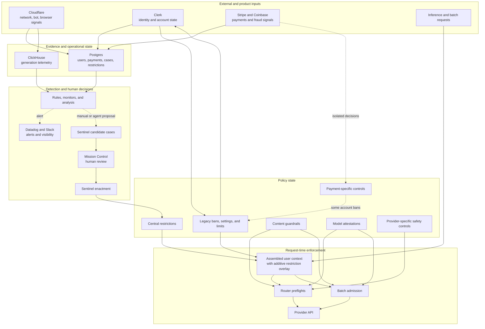
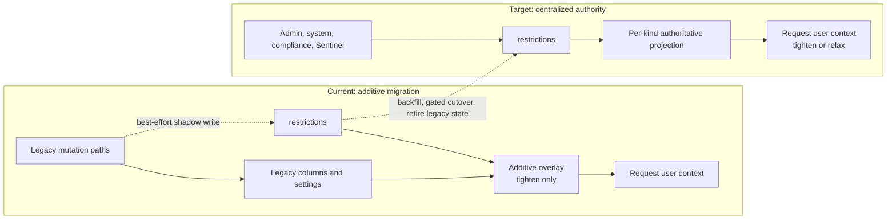
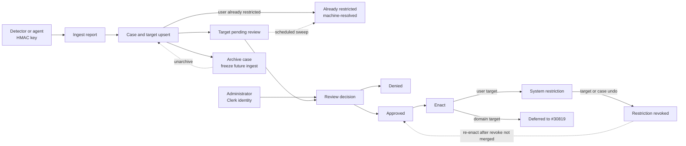

# Sentinel and Trust & Safety system spec

> **Status:** Living current-state reference.
>
> **Last audited:** 2026-07-23 12:00 UTC.
>
> This file describes what is true now. It does not preserve the history of
> each rescan. See [MEMORY.md](./MEMORY.md) for the refresh protocol, prior
> states, status transitions, and detailed changelog.

## Purpose

This document gives a human or agent a quick, broad view of how OpenRouter
collects abuse signals, reviews suspected abuse, and enforces safety policy. It
focuses on implementation boundaries and the architectural decisions that
explain how the pieces interact.

Use this file to orient before changing the system. Use
[MEMORY.md](./MEMORY.md) for PR-level history, superseded approaches, and the
automation checkpoint.

Unless stated otherwise, "current" means present in the audited `main`
revision. A merged implementation may still depend on deployment state,
configuration, or a release gate.

## Current state

- The `restrictions` table is the intended source of truth, but it is not yet
  authoritative. Request-time reads only add centralized restrictions to
  legacy state. They cannot relax legacy state.
- Sentinel supports the main user-target flow end to end: ingest a proposal,
  review it, approve it, and enact it as a `restrictions` row.
- Mission Control provides an authenticated review queue and a dedicated case
  workspace for Sentinel.
- Mission Control also exposes a unified operator Ban Users page. It either
  writes admin-sourced restrictions directly through the dual-write layer,
  recording the acting administrator, or opens a Sentinel case for review.
- Sentinel accepts domain targets as candidates and stores them for review.
  Domain enactment is deferred to #30819. The retired `domain_block` proposal
  kind is rejected at ingest.
- A Sentinel restriction is attributed to the caller-supplied acting identity,
  trusted as-sent behind the internal HMAC boundary; when omitted it falls
  back to `system`. Ingest-key (agent) callers must supply the identity. The
  durable restriction audit record therefore identifies the administrator or
  agent identity the caller claimed.
- Signup, generation, and payment flows now record many useful abuse signals.
  Most signals are still used for investigation or isolated controls rather
  than automatically creating Sentinel cases.
- The model attestation gate can block sync inference and batch admission, but
  no model currently declares a required attestation. The gate is therefore
  inactive in practice.
- Several enforcement decisions remain outside Sentinel. Hardcoded signup
  domain lists use legacy mutation paths that shadow-write `restrictions`,
  while provider-specific blocklists can bypass the table entirely.

## System boundaries

The system crosses these important internal and external boundaries:

- **Cloudflare** supplies request, network, bot, and browser-integrity signals.
  OpenRouter records selected values at signup, onboarding, generation, and
  payment time.
- **Clerk** is the identity provider and still participates in account and
  domain bans. Mission Control uses Clerk identity to authenticate human
  administrators.
- **Stripe and Coinbase** supply payment events and fraud signals. Some payment
  handlers enforce narrow controls directly; others only persist evidence.
- **Postgres** stores users, restrictions, Sentinel cases, payment signals, and
  audit history. It is the durable operational store.
- **ClickHouse** stores generation telemetry and supports offline or scheduled
  anomaly analysis. It is not the restriction source of truth.
- **Mission Control** is the human review and administration surface.
- **Datadog and Slack** carry alerts and operational visibility. An alert does
  not itself create a Sentinel case or restriction.
- **Router and batch admission code** consume the assembled user context and
  enforce bans, moderation, rate limits, and attestations before provider work.
- **Provider APIs** may apply their own safety policy. OpenRouter also has a few
  provider-specific identity and blocklist mechanisms.

## System landscape



The main discontinuities are intentional in this diagram:

- detection does not generally create Sentinel cases automatically;
- some payment and provider-specific controls bypass Sentinel;
- centralized restrictions do not replace legacy state yet; and
- guardrails and attestations remain separate policy systems.

## Important design decisions

### Centralize state before changing authority

`restrictions` was introduced as a data-centralization layer, not as a new
policy engine. The migration first added shadow writes and an additive read
overlay. Authoritative reads and removal of legacy writes are separate rollout
steps. This limits migration risk but temporarily permits drift.

### Keep detection, review, and enactment separate

Sentinel models a proposal, a human decision, and enforcement as distinct
stages. Approval does not itself mean a live restriction exists. This separation
supports review and retry, but it also means every transition needs explicit
audit and observability.

### Use different trust boundaries for machines and humans

Detection agents call signed internal endpoints with shared HMAC keys. Mission
Control uses a Clerk session and an internal-administrator check. The
enactment bridge crosses back into the machine boundary: the `restrictions`
row carries a `last_edited_clerk_user_id` actor, and the Sentinel enactment
path records the caller-supplied acting identity there, trusted as-sent
behind the HMAC boundary, falling back to `system` when omitted ([#29956]).
Requests verified by the ingest signing key are treated as agent requests:
they must claim an acting identity and are subject to the agent enactment
gates.

### Collect most new signals without blocking the user flow

Signup seals, browser signals, payment telemetry, and many fraud fields are
recorded fail-open or as isolated side effects. This protects signup and payment
availability while the team calibrates the signals. It also means collection
should not be mistaken for enforcement.

### Reuse existing request enforcement

Centralized restrictions are projected onto the legacy-shaped user context.
Existing router and batch checks enforce that projection. This avoided a second
parallel enforcement stack, but the legacy shape constrains the cutover.

### Keep different policy domains distinct

Entity restrictions, content guardrails, provider safety identity, payment
controls, and model attestations solve different problems. They may share auth
or routing infrastructure, but they are not interchangeable sources of policy.

## How we got here

The system grew in layers rather than from one Trust & Safety architecture:

1. **Enforcement started in product-specific state.** Account bans, author and
   provider settings, rate limits, payment controls, guardrails, and adapter
   blocklists were implemented independently where each need appeared.
1. **Restrictions centralized the common entity-policy state.** Shadow writes
   and an additive request overlay made centralized rows useful without making
   a high-risk source-of-truth cutover in one step.
1. **Signal collection became cross-surface.** Signup, onboarding, generation,
   and payment flows began recording joinable network, browser, identity, card,
   and Radar signals. Detection logic did not advance at the same pace.
1. **Sentinel added a human decision layer.** Machine callers can propose
   targets, administrators can review cases in Mission Control, and approved
   user targets can become centralized restrictions.
1. **A mass-enact incident exposed the next boundary.** Correct data flow and a
   review UI were not enough. Bulk enforcement also needs reversal,
   attribution, notification, and lifecycle observability.

The result is a working but transitional architecture: signal collection is
ahead of detection, Sentinel is ahead of its safety controls, and centralized
restriction storage is ahead of the authoritative cutover.

## Restrictions and request-time enforcement

### Data model

The `restrictions` table stores twelve kinds of entity restriction:

- `account_ban`
- `inference_block`
- `provider_ban`
- `model_ban`
- `author_ban`
- `frontier_us_models`
- `rate_limit`
- `forced_moderation`
- `provider_rate_limit`
- `model_rate_limit`
- `author_rate_limit`
- `spend_cap`

`inference_block` is account-wide, targetless, permanent, and takes `{}` params.
Each row includes an entity, target, source, optional expiry, revocation state,
and kind-specific parameters. Sources are `admin`, `system`, and `compliance`.
An append-only changelog records mutations.

Only one unrevoked row may occupy an entity, kind, and target slot. An expired
row still occupies that slot until it is revoked.

Relevant code:

- `packages/db/restrictions/`
- `packages/db/restrictions/AGENTS.md`
- `packages/db/restrictions/REVIEW.md`

### Current read behavior

`overlayActiveRestrictions` applies active rows to the legacy-shaped user
context used by inference and batch checks. The overlay only tightens state:

- a centralized ban can add a ban;
- a centralized forced-moderation row can require moderation;
- a centralized rate limit can lower a legacy limit; and
- the absence or revocation of a centralized row cannot remove legacy state.

This means legacy columns and settings remain authoritative wherever they are
more restrictive. The audited `main` revision has no
`applyRestrictionReadPolicy` or equivalent authoritative read cutover.

### Current write behavior

Legacy mutation paths shadow-write centralized restrictions through
`dualWriteRestrictions`. The legacy write remains authoritative. Centralized
write failures are logged and swallowed so the legacy operation can complete.

This design avoids breaking existing operations during migration, but it can
create drift. The open backfill and cutover train is intended to remove that
condition.

### Current and target authority

The current design centralizes data without replacing legacy authority. The
target design makes the centralized projection authoritative for each migrated
kind.



The target side is direction, not current behavior. Rollout remains per kind so
one restriction family can move without changing every enforcement path at
once.

### Enforcement consumers

The overlaid user context feeds existing enforcement code, including:

- the router banned preflight;
- moderation preflights;
- provider, model, and author bans;
- request rate limits; and
- batch admission checks.

Mission Control can opt into the same active-restriction overlay for user and
organization views. It also has a full restriction-history view.

## Sentinel

### Lifecycle overview

Sentinel separates machine proposals, human decisions, and live enforcement.
Case archive is orthogonal to target status: it freezes future ingest without
denying, approving, or revoking existing targets.



### Ingest

Sentinel exposes an internal HMAC-authenticated ingest endpoint at:

```text
/api/v1/internal/sentinel/ban-candidates/ingest
```

An ingest report creates or updates:

- one `ban_candidate_suggestions` case for a source, rule, and target type;
- one or more `ban_candidate_targets`; and
- evidence and proposed restriction data for each target.

The current limits are:

- at most 10,000 targets per report and per accumulated suggestion;
- at most 5,000 distinct users for a user-target report;
- at least three evidence keys shared by every target;
- at most 50 evidence keys per target; and
- at most 32 KiB of serialized evidence per target.

Ingest is idempotent for the suggestion and target conflict keys. Repeated
detections update evidence and occurrence timestamps.

When a target's user already carries an active restriction that satisfies the
proposal, ingest records the target as `already_restricted` and links it to that
restriction instead of queuing it for review; the ingest response counts these
separately ([#30642], [#30645]). Because a later revoke can falsify that
condition, ingest may re-open an `already_restricted` target, but it never
overwrites a human `approved` or `denied` decision.

An archived case is frozen at ingest. New detections for it do not add targets
or refresh the case until it is unarchived.

The merged CLI and agent skill can submit, inspect, approve, and enact cases:

- `.agents/skills/sentinel-ban-candidates/SKILL.md`
- `scripts/sentinel/ban-candidates.ts`

### Review

The review endpoint records `approved` or `denied` on a pending target.
Either shared signing key authorizes it.

The HMAC proves possession of a shared key, not a human identity. A supplied
`reviewerId` is trusted as-sent as the acting reviewer; a review-key caller
that omits it falls back to `ACTING_SYSTEM`, while an ingest-key (agent)
caller must supply it. Mission Control's server actions forward the Clerk
administrator as `reviewerId`.

Mission Control adds a stronger boundary for its user interface:

- console reads require a Clerk session and `is_internal_admin`;
- review and enact server actions require an administrator; and
- each case has a dedicated workspace with filtering, sorting, selection,
  enrichment, account metrics, and target details.

The claimed identity is threaded into the durable restriction actor.

### Enactment

The enact endpoint accepts approved target IDs and creates `system` restrictions.
The `last_edited_clerk_user_id` actor is the caller-supplied acting identity
(Mission Control forwards the reviewing administrator), and `ACTING_SYSTEM`
when omitted; agent-mode requests must supply it. Requests verified by the
ingest signing key, or carrying `agentEnactment: true`, are agent-gated:
`account_ban` and non-allowlisted kinds are refused, only PAYG user targets
may be enacted, and lookups fail closed. Ingest-key review approvals are
gated the same way, while ingest-key undo may reverse any enacted
restriction, including another actor's, provided the caller claims an
acting identity.
Per-target failures are isolated and processed with bounded concurrency.

Enactment handles three important cases:

- a new slot creates and links a restriction;
- an existing active slot is linked and reported as `already_active`; and
- an expired but unrevoked slot is revoked and replaced in one transaction.

Enacting an `account_ban` user target also applies a global account ban that
sets the legacy `users.banned` flag and bans the user in Clerk; undo lifts it
again once no other active `account_ban` restriction remains.

Once a candidate target has a `restriction_id`, it reports `already_active`
without checking whether that exact restriction was later revoked. An enacted
target can be undone — Mission Control calls an administrator-gated internal
`undo` endpoint that revokes the linked restriction — but undo does not clear
the `restriction_id`, so the target stays linked to its revoked restriction
and re-enact-after-revoke is still not merged.

Targets whose users are already restricted no longer sit in the queue. Ingest
resolves them to `already_restricted` up front, and a scheduled `cfw-internal`
sweep moves any pending target whose user has since become restricted to the
same status in batches ([#30645], [#30647]). `already_restricted` is a
machine-assigned status: it is terminal to human review but reversible by a
later ingest if the restriction is revoked.

### Domain targets

Domain targets use the domain in `targetValue` and are stored as candidates for
review. They are accepted for supported restriction kinds except
`frontier_us_models`; the retired legacy `domain_block` proposal kind is
rejected at ingest. Domain enactment is deferred to #30819.

### Operational safety

A 2026-07-21 false-positive mass enactment established three required controls:
case-scoped undo, loud batch-enact notification, and lifecycle observability.
Case-scoped undo is merged ([#30502]) — Mission Control revokes the linked
restrictions of selected enacted targets from the case workspace. The batch
notification ([#30118]) and lifecycle observability dashboard ([#30069]) are
also merged. The full incident context is in [MEMORY.md](./MEMORY.md).

## Signals and detection

### Collected signals

Signup and onboarding collect:

- country, ASN, corporate-proxy, bot, JA3, JA4, and salted IP signals;
- sealed-signup metadata integrity, replay, age, and mismatch state;
- live onboarding Cloudflare signals; and
- an autogenerated-email score.

Generation records include ASN and ASN organization, alongside other request
telemetry used for investigation.

Payment flows collect:

- Cloudflare signals on triggers and credits;
- short-lived handoff records between browser actions and Stripe webhooks;
- card fingerprint, country, funding type, and Radar risk on settled card
  top-ups; and
- Early Fraud Warning fields on credits.

These fields are useful for correlation, but similar names do not always mean
the same thing. In particular:

- `payment_method_fingerprints` stores Cloudflare context associated with a
  payment method;
- `credits.card_fingerprint` stores Stripe's card fingerprint; and
- the open [#28670] registry is the proposed queryable card-to-user index.

### Current consumers

The main automated or semi-automated controls are:

- a spend-velocity cron that emits alerts and metrics but does not disable a
  key;
- a Fable request-volume monitor with a manual ban handoff;
- a manual top-up limiter of one per minute and five per hour, where the
  hourly cap is a soft cap (observed but not blocked) for paid subscription
  plans (pro/business/enterprise) while the per-minute cap stays hard for all;
- Stripe fraud handling that bans in Clerk and Postgres;
- hardcoded signup email-domain author bans; and
- batch-line moderation, including chunked and bounded-concurrent preflights.

The proposed auto-top-up limiter and fast-loading-account autobuy hold remain
open.

No merged general detector converts high-risk correlated signals into a
Sentinel case. The normal path is still signal, investigation or alert, manual
candidate submission, review, and enactment.

### Historical signal caveats

Do not treat all signup fingerprint columns as one consistent historical
dataset:

- older `signup_js_detection` values were captured at the wrong lifecycle
  point;
- the live value moved to `onboarding_cf_js_detection`;
- rows created before the sealed-metadata migration have `NULL`, which differs
  from an explicit `absent` result; and
- signup and onboarding fields represent different moments in the account
  lifecycle.

## Other safety controls

### Provider-specific identity and blocklists

The Meta adapter contains a deploy-time safety-identifier blocklist. Its default
set is empty.

OpenAI and Azure requests derive an upstream identity that includes a
client-supplied `user` or `safety_identifier` when present. This limits the
blast radius of a provider policy block to one end user instead of an entire
OpenRouter organization.

Signup email-domain lists can add frontier-author bans.
These lists require a code change and deploy. They bypass Sentinel review, but
the resulting author-ban mutations shadow-write centralized restrictions.

### Guardrails

Platform and workspace guardrails provide content filtering, including block,
redact, and detect-only flag actions. They are a separate policy system from
entity restrictions.

### Model attestations

The attestation subsystem includes:

- `models.required_attestation_types`;
- a code-owned attestation definition registry;
- `entity_attestations` storage;
- auth-context hydration;
- a self-attest frontend API; and
- fail-closed checks for sync inference and batch admission.

The only defined type is currently `age_18plus`.

No model in the audited `main` revision configures a required attestation, so
the merged checks do not block production traffic in practice. Enforcement now
spans sync inference, the non-text modalities, and batch admission; the
user-facing interstitial ([#28823]) remains open.

## Where the system is going

The current work points toward these outcomes:

1. **Make restrictions authoritative.** Backfill legacy state, roll out
   per-kind authoritative reads, align batch, stop legacy writes, and eventually
   remove the old columns and settings. The active train is [#29065], [#29067],
   [#29069], [#29070], [#29078], and [#29202].
1. **Turn calibrated detections into proposals.** Build reliable correlation
   and thresholds, then have detectors create Sentinel cases instead of ending
   at a dashboard or alert. [#28670] and [#29142] are inputs to this direction,
   not the completed bridge.
1. **Make enactment reversible, attributable, and loud.** Add exact case undo,
   immediate batch notification, and lifecycle metrics. Durable human
   attribution landed in [#29956], case-scoped undo landed in [#30502], the
   batch notification landed in [#30118], and the lifecycle metrics and funnel
   landed in [#30069].
1. **Make domains a first-class policy target.** Give domain restrictions
   explicit storage, enactment, revocation, existing-user fanout, and signup
   behavior. [#29778] is the current proposal.
1. **Converge operator and machine entry points.** Direct administration,
   Sentinel, hardcoded lists, payment controls, and the proposed Sherlock API
   need clear rules for when review is required and which audit trail is
   canonical. [#29237] merged a unified operator ban page that dual-writes
   restrictions or opens a Sentinel case; [#29238] proposes a per-user and
   per-organization restrictions panel and remains open.
1. **Finish attestation rollout.** Add the user-facing confirmation flow,
   configure real model requirements, and define rollout and grandfathering.
   [#28823] covers the open code.

Secondary, exploratory, and closed PRs are tracked in
[MEMORY.md](./MEMORY.md).

## Unresolved gaps and decisions

### 1. The source-of-truth migration is incomplete

Legacy state and centralized rows can diverge. Centralized rows can tighten but
cannot relax a request. Complete the backfill, read cutover, batch alignment,
write cutover, and legacy cleanup before describing `restrictions` as the sole
source of truth.

### 2. Detection and enforcement are weakly connected

Signal collection has advanced faster than decision logic. There is no merged,
general path from a high-confidence detector to a Sentinel proposal.

### 3. Sentinel enactment is not fully safe

The current system has merged case undo ([#30502]), batch-enact notifications
([#30118]), and the lifecycle funnel ([#30069]). The 2026-07-21 incident showed
that review tooling alone is not a sufficient bulk-enact safeguard. Mission
Control authenticates an administrator and [#29956] threads that administrator
into the enacted restriction's actor when the admin service token is present,
but re-enactment of a target whose restriction was revoked is still not
merged.

### 4. Domain enforcement is a separate system

Sentinel currently stores domain proposals as candidates but skips their
enactment with `domain_enactment_not_implemented`. Domain enactment is deferred
to #30819. Domain-policy enforcement, including revocation, fanout, signup, and
protected-domain semantics, lives in the `domain_restrictions` workflow rather
than the generic `restrictions` table.

### 5. Enforcement does not share one lifecycle

Hardcoded email-domain lists, provider-specific blocklists, isolated payment
controls, and the proposed Sherlock API do not share one review and audit
lifecycle. Some shadow-write restrictions; others bypass them. The unified
operator Ban Users page now routes manual bans through the restrictions
dual-write layer or into a Sentinel case, which narrows this gap for direct
administration, but the other entry points still lack a canonical path.

### 6. Attestation enforcement is present but operationally inert

No model declares a requirement and the frontend interstitial is open. A
rollout plan is still required.

## Refresh rules

The detailed automation contract is in [MEMORY.md](./MEMORY.md). At minimum:

1. Read [MEMORY.md](./MEMORY.md) before scanning.
1. Update this file only with facts that are currently true.
1. Verify PR state on GitHub and behavior in the latest `main` code.
1. Move status transitions and superseded facts into `MEMORY.md`.
1. Keep this document oriented around components, interfaces, and decisions.
1. Keep diagrams free of PR status. Change them only when a component,
   boundary, lifecycle, or target architecture changes.

<!-- Link definitions for pull-request references. -->
[#28670]: https://github.com/OpenRouterTeam/openrouter-web/pull/28670
[#28823]: https://github.com/OpenRouterTeam/openrouter-web/pull/28823
[#29065]: https://github.com/OpenRouterTeam/openrouter-web/pull/29065
[#29067]: https://github.com/OpenRouterTeam/openrouter-web/pull/29067
[#29069]: https://github.com/OpenRouterTeam/openrouter-web/pull/29069
[#29070]: https://github.com/OpenRouterTeam/openrouter-web/pull/29070
[#29078]: https://github.com/OpenRouterTeam/openrouter-web/pull/29078
[#29142]: https://github.com/OpenRouterTeam/openrouter-web/pull/29142
[#29202]: https://github.com/OpenRouterTeam/openrouter-web/pull/29202
[#29237]: https://github.com/OpenRouterTeam/openrouter-web/pull/29237
[#29238]: https://github.com/OpenRouterTeam/openrouter-web/pull/29238
[#29778]: https://github.com/OpenRouterTeam/openrouter-web/pull/29778
[#29956]: https://github.com/OpenRouterTeam/openrouter-web/pull/29956
[#30069]: https://github.com/OpenRouterTeam/openrouter-web/pull/30069
[#30118]: https://github.com/OpenRouterTeam/openrouter-web/pull/30118
[#30502]: https://github.com/OpenRouterTeam/openrouter-web/pull/30502
[#30642]: https://github.com/OpenRouterTeam/openrouter-web/pull/30642
[#30645]: https://github.com/OpenRouterTeam/openrouter-web/pull/30645
[#30647]: https://github.com/OpenRouterTeam/openrouter-web/pull/30647
