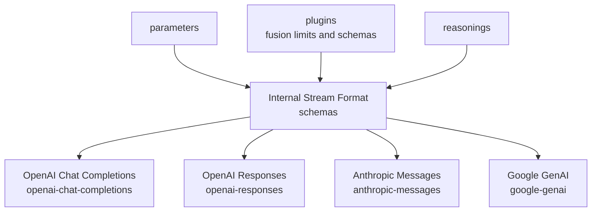

# LLM Interfaces

Shared type definitions, Zod schemas, and data structures for LLM API formats. Defines the canonical internal stream format and request/response schemas for each supported API skin (OpenAI Chat Completions, OpenAI Responses, Anthropic Messages, Google GenAI).

## Architecture

## Key Directories

| Directory | Purpose |
|-----------|---------|
| `schemas/` | Internal stream format, shared schema definitions, and citation/annotation schemas |
| `internal-stream/` | Internal stream event types and chunk definitions |
| `openai-chat-completions/` | OpenAI Chat Completions request/response/stream schemas |
| `openai-responses/` | OpenAI Responses API schemas |
| `anthropic-messages/` | Anthropic Messages API schemas (including cache control) |
| `google-genai/` | Google Generative AI schemas |
| `parameters/` | Shared parameter definitions (temperature, top_p, etc.) |
| `plugins/` | Plugin-specific schemas (e.g., fusion limits) |
| `reasonings/` | Reasoning/thinking token schemas |
| `image-detail-levels.ts` | Single source of truth for the `image_url.detail` enum (`auto`/`low`/`high`/`original`) shared by the Chat Completions and Responses skin schemas. `original` is an OpenRouter extension that maps to the highest provider fidelity (e.g. Gemini per-part `MEDIA_RESOLUTION_ULTRA_HIGH`) |

## Commands

| Command | Description |
|---------|-------------|
| `bun test` | Run unit tests |
