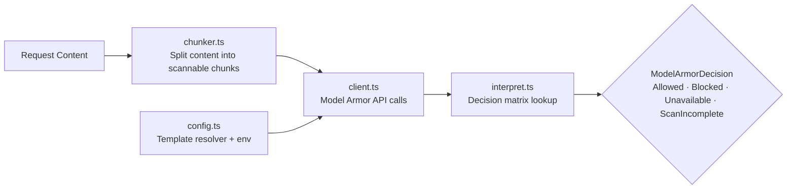

# Model Armor

Google Cloud Model Armor prompt-injection guardrail client. Sends content chunks to Google's Model Armor API, interprets scan results via a decision matrix, and maps confidence levels to block/allow/incomplete decisions.

## Architecture

## Key Modules

| File | Purpose |
|------|---------|
| `chunker.ts` | Splits request content into chunks suitable for scanning |
| `client.ts` | HTTP client for the Model Armor API |
| `interpret.ts` | Declarative decision matrix mapping `(InvocationResult, FilterMatchState)` → `ModelArmorDecision` |
| `confidence-level.ts` | Confidence level enum and comparisons |
| `config.ts` | Configuration and template resolution |
| `schemas.ts` | Zod schemas for API request/response validation |

## Commands

| Command | Description |
|---------|-------------|
| `bun test` | Run all unit tests |
