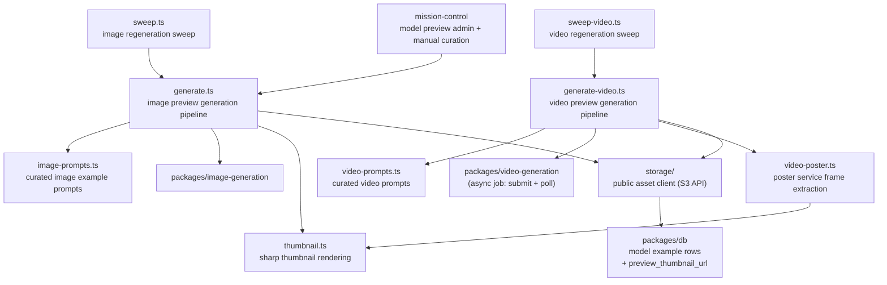

# Model Examples

Curated model preview examples for the marketplace. Generates image/video previews for models via the generation pipeline, stores public assets (with thumbnails) in R2/S3, and supports manually curated examples that are preserved across regeneration sweeps.

## Architecture

## Key Modules

| File | Purpose |
|------|---------|
| `generate.ts` | Image preview generation pipeline: runs curated prompts through the generation stack and persists results |
| `generate-video.ts` | Video preview generation pipeline: submits async Video API jobs, polls to completion, uploads the clip plus a poster-frame thumbnail |
| `image-prompts.ts` | Curated image prompt set used to produce representative image examples |
| `prompts.ts` | Curated TTS/STT prompts and prompt-id helpers (image prompts live in `image-prompts.ts`) |
| `video-prompts.ts` | Curated video prompt set (same registry pattern as `image-prompts.ts`) |
| `sweep.ts` | Background sweep that regenerates image previews across live image models |
| `sweep-video.ts` | Background sweep that regenerates video previews (one cheapest-knobs run per live video model) |
| `thumbnail.ts` | Thumbnail rendering via `sharp`; thumbnail URLs propagate to model preview surfaces |
| `video-poster.ts` | Poster-frame extraction from generated videos via the internal poster service |
| `storage/` | Public asset storage client (S3-compatible API) for example media; `storage/env.ts` centralizes the image-preview env configuration (consolidated out of mission-control's app env) |

## Commands

| Command | Description |
|---------|-------------|
| `bun test` | Run unit tests |
| `bun run typecheck` | Type-check with tsgo |
