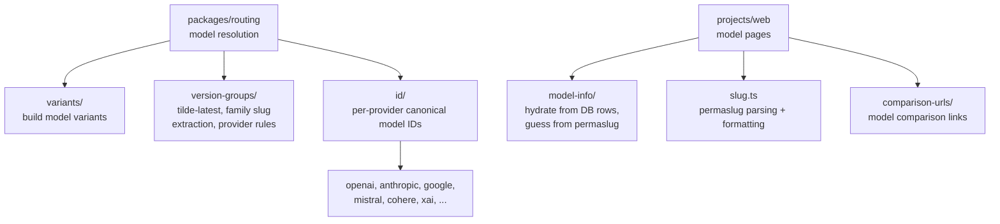

# Models

Static model metadata, slug utilities, and variant resolution for OpenRouter. Provides canonical model IDs per provider, version-group resolution (tilde-latest / family slugs), and model-info hydration from database rows.

## Architecture

## Key Modules

| Directory | Purpose |
|-----------|---------|
| `id/` | Per-provider model ID registries (OpenAI, Anthropic, Google, Mistral, Cohere, etc.) |
| `model-info/` | Hydrates model metadata from database rows; guesses model info from permaslugs; `parseModelReasoningConfig` extracts a normalized `reasoning_config` from raw DB `features` (shared by buddy-api model responses) |
| `variants/` | Builds model variant lists (e.g., extended, nitro, floor) |
| `version-groups/` | Tilde-latest resolution, family slug extraction, provider-specific version rules |
| `config/` | Model and endpoint configuration schemas (instruction-role-support, chat template config) |
| `comparison-urls/` | Generates model comparison page URLs |
| `helpers/` | Utility functions (raw model slug extraction) |
| `slug.ts` | Permaslug parsing, formatting, and validation |

## Commands

| Command | Description |
|---------|-------------|
| `bun run test` | Run unit tests |
| `bun run typecheck` | Type-check with tsgo |
