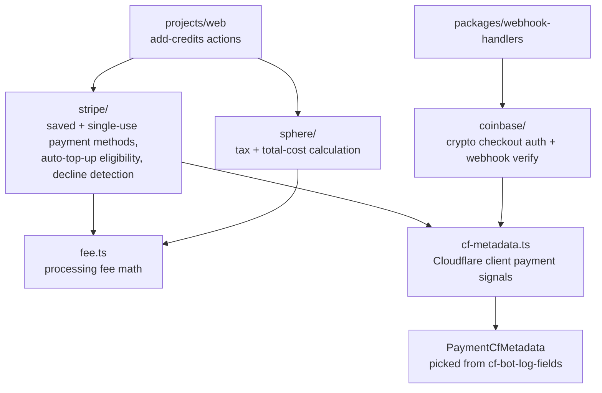

# Payments

Shared payments client for OpenRouter. Wraps Stripe (card) and Coinbase Commerce (crypto) credit purchases, computes tax and fees, and normalizes the payment signals that downstream billing and abuse tooling persist on credit rows.

## Architecture

## Key Modules

| Path | Purpose |
|------|---------|
| `stripe/` | Card purchase helpers — add credits with saved or single-use payment methods, auto-top-up payment-method eligibility, card-decline classification, refunds (admin/fraud/self-serve), and previewed total cost |
| `coinbase/` | Coinbase Commerce crypto payments — checkout auth and webhook signature verification |
| `sphere/` | Tax calculation (`calculate-sphere-tax`) and total-cost-with-tax-and-fees helpers |
| `cf-metadata.ts` | Selects the payment-relevant Cloudflare client signals (`PaymentCfMetadata`) from `instrumentation` `cf-bot-log-fields`, used to persist card/crypto payment signals on credits |
| `fee.ts` | Processing-fee math shared across payment paths |
| `schemas.ts` | Zod schemas for payment inputs and signals |

## Commands

| Command | Description |
|---------|-------------|
| `bun run test` | Run unit tests |
| `bun run typecheck` | Type-check with tsgo |
