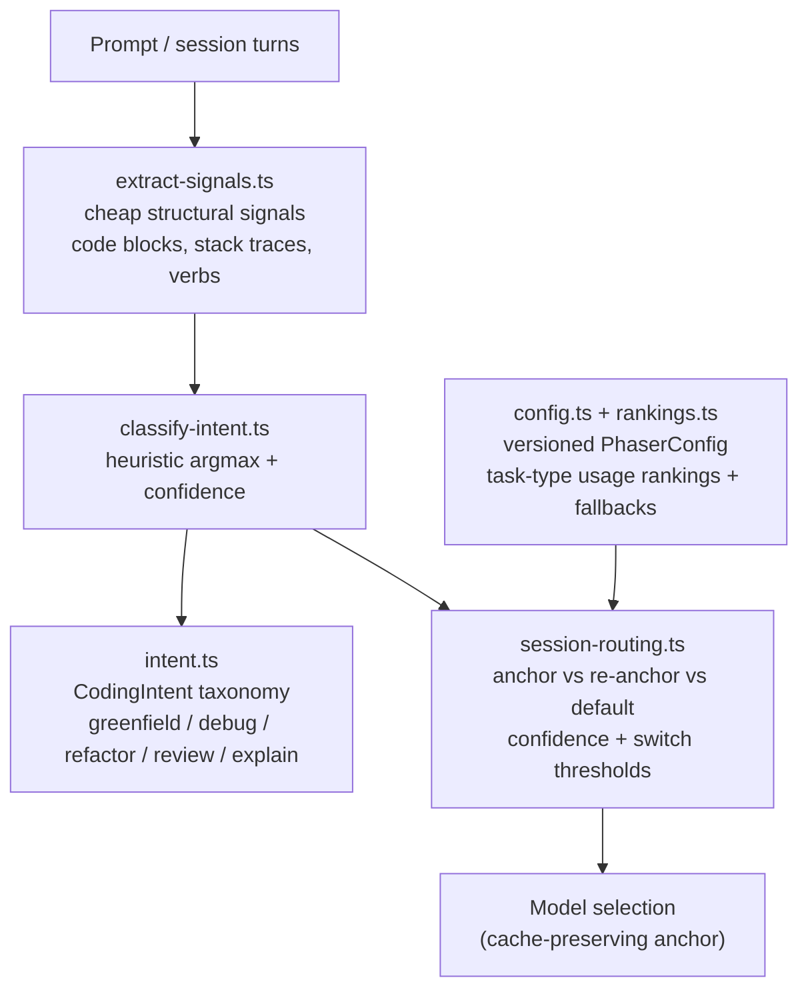

# Phaser

Coding-intent router — the coding-shaped shadow of Fusion. Phaser deterministically
classifies a request's coding intent in-memory (no model call, no network) and picks a
session-anchored model from task-type usage rankings. It only *classifies and selects*;
the routing and escalation that consume its decision live outside this package so the
existing Fusion pipeline is never touched.

## Architecture

## Overview

- **Intent taxonomy** (`intent.ts`): five coding intents — greenfield, debug, refactor,
  review, explain — each mapping to its own downstream pipeline.
- **Signals** (`extract-signals.ts`): pure string inspection extracting cheap features
  (fenced code blocks, stack traces, diff markers, error text, test artifacts, question
  phrasing, imperative verb buckets).
- **Classifier** (`classify-intent.ts`): scores each intent from the signals, takes the
  argmax, and reports a normalized confidence (winner minus runner-up). Fully
  deterministic and safe to run inline in a Worker isolate.
- **Session routing** (`session-routing.ts`): anchors a session on its first user
  message, only re-anchoring on a high-confidence task change so the session (and its
  prompt cache) stays on one model in the common case. Anchor classifier inputs are
  preprocessed and cache keys normalized to keep anchoring stable across near-identical
  turns.
- **Config** (`config.ts`, `rankings.ts`): append-only, versioned `PhaserConfig`
  snapshots (ranking window/pool/top-N/timeout budgets, text and vision fallbacks,
  confidence thresholds, classifier slot/timeout budgets). Pinned versions never
  change; the promoted default is advanced via `PHASER_CURRENT_CONFIG_VERSION`.

## Commands

| Command | Description |
|---------|-------------|
| `bun test` | Run unit tests (serialized) |
| `tsgo --noEmit` | Type-check |
