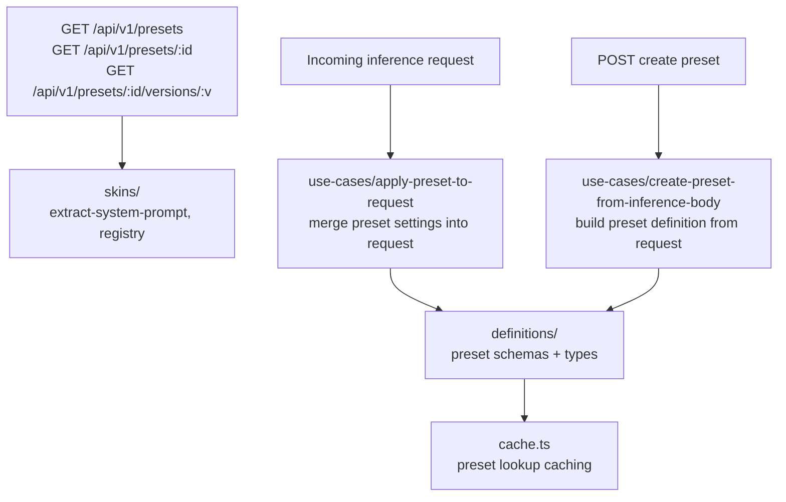

# Presets Module

A Preset is a **reusable template of request settings**. Its purpose is to allow a user to define a complete set of behaviors once and then easily apply them to any number of API calls. This is useful for creating and switching between distinct "modes" (e.g., a "creative mode" for writing or a "code-gen mode" for programming) without changing application code.

A preset can define:
-   A specific model or a fallback list of models
-   Model parameters (like temperature, top_p, etc.)
-   Advanced routing preferences
-   A default system prompt
-   A service tier (`default`, `flex`, or `priority`), with request values taking precedence when applied

## How to Use a Preset

A preset can be applied in three distinct ways in an API request.

### 1. As a Standalone Model

This method is used when the preset itself defines which model(s) to use. This is the simplest way to call a fully pre-configured behavior.

-   **Syntax:** `"model": "@preset/preset-name"`
-   **Example:** A preset named `"creative-writer"` might be configured to use `claude-3-haiku` with a specific temperature and system prompt. A user can simply call this one preset to get that exact setup.

### 2. As a Modifier on a Model (Shortcut)

This method applies a preset's parameters to a specific model named in the same string. This is useful for reusing a single configuration across many different models.

-   **Syntax:** `"model": "model-name@preset/preset-name"`
-   **Example:** A user could have a preset named `"json-mode"` and apply it to different models dynamically:
    -   `"model": "gpt-4-turbo@preset/json-mode"`
    -   `"model": "gemini-1.5-pro@preset/json-mode"`

### 3. As a Separate Parameter (Verbose)

This method explicitly separates the preset from the model choice. This is the most flexible option, especially when providing a list of fallback models in the request itself.

-   **Syntax:**
    ```json
    {
      "models": ["gpt-4-turbo", "claude-3-opus"],
      "preset": "@preset/json-mode"
    }
    ```
-   **Behavior:** This applies the settings from `"json-mode"` to the request, which will be attempted on `gpt-4-turbo` first, then `claude-3-opus`.

---

**A Note on Naming:** Currently, all presets are referenced using the `@preset/` prefix. In the future, this will be updated to support user-scoped names (e.g., `@username/preset-name`) once a username system is implemented.

## Architecture



## Key Modules

| Path | Purpose |
|------|---------|
| `definitions/` | Preset Zod schemas and TypeScript types |
| `use-cases/apply-preset-to-request/` | Merges a preset's settings (model, parameters, system prompt, routing) into an inference request |
| `use-cases/create-preset-from-inference-body/` | Builds a preset definition from a raw inference request body |
| `skins/` | Skin-specific helpers (system prompt extraction, skin registry) |
| `cache.ts` | Preset lookup caching layer |
| `utils/` | Shared utilities |

## Commands

| Command | Description |
|---------|-------------|
| `bun test` | Run unit tests |
| `tsgo --noEmit` | Type-check |
