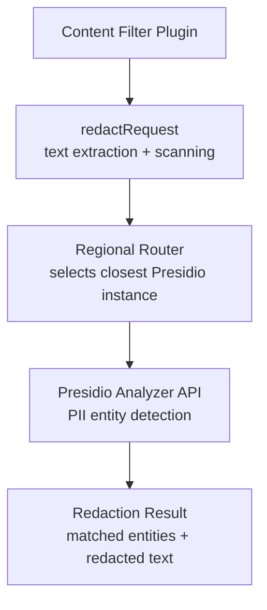

# Presidio

PII redaction integration for OpenRouter's content filtering pipeline. Wraps Microsoft Presidio's analyzer service to detect and redact personally identifiable information from LLM request text before it reaches upstream providers.

## Architecture

## Key Modules

| File | Purpose |
|------|---------|
| `redaction.ts` | Core redaction logic: sends text segments to Presidio, collects entity matches, applies redaction |
| `regional.ts` | Routes requests to the geographically closest Presidio analyzer instance |
| `config.ts` | Presidio service configuration (endpoints, thresholds, entity types) |
| `env.ts` | Environment variable bindings for Presidio service URLs |

## Integration

Presidio is invoked by the `content-filter` plugin in `packages/router` as part of the preflight pipeline. It runs alongside regex content filters and prompt injection detection. The plugin uses a per-entity circuit breaker to isolate Presidio fetch failures from blocking the entire request pipeline.

## Commands

| Command | Description |
|---------|-------------|
| `bun test` | Run unit tests |
| `tsgo --noEmit` | Type-check |
