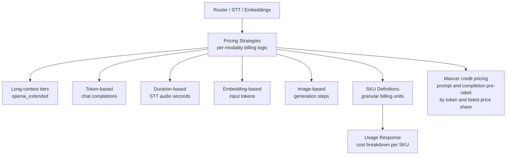

# Pricing

Billing strategy engine for OpenRouter. Implements per-modality pricing strategies that calculate costs from provider-reported usage, manage SKU definitions, and produce the usage/cost breakdowns returned in API responses.

## Architecture

## Key Concepts

- **Pricing Strategy**: Modality-specific billing logic (e.g., `MistralSTTPricingStrategy` for duration-based STT billing, `MicrosoftSTTPricingStrategy` for audio-hours billing, `MinimaxPricingStrategy` for long-context tiered pricing)
- **SKU (Stock Keeping Unit)**: Granular billing unit (e.g., `mistral_stt:audio_seconds`, `prompt_tokens`, `image_steps`)
- **Time-based (peak) pricing**: Strategies can charge different rates inside daily UTC peak windows (`peak-windows.ts` parses HHMM boundary SKU pairs into windows). DeepSeek uses this for peak/off-peak billing, and public pricing is rendered time-aware
- **Long-context tiered pricing**: Strategies like Minimax, Xiaomi, BytePlus, ... charge different per-token rates above a context-length threshold, using shared helpers in `long-context-helpers/`
- **Display multiplier**: Converts internal units to user-facing units (e.g., per-second internally, displayed per-minute)
- **Minimum billed units**: Floor for billing (e.g., 1-second minimum for Mistral STT)
- **Non-BYOK overage fee**: subscription plan tiers define a free monthly allowance (`nonByokThreshold`) and a `nonByokFeeFraction` on usage above it. The fee is **partially graduated** — only the slice of a request's charged cost that lands above the threshold is surcharged (`get-non-byok-overage-fee.ts`)
- **Fee waiver**: any active fee waiver exempts a user from non-BYOK overage fees
- **Quiver pricing**: bills per-output in credits; each generation reports credits consumed and the `cents_per_credit` SKU price converts credits to cost
- **Plugin-only accounting**: Billing path for requests where all cost comes from plugins (e.g., file-parser Mistral OCR pages, web search, web fetch) rather than provider inference
- **Zero pricing detection**: Endpoints with zero effective pricing are treated as missing data in scoring and blocked from auto-unhide; strategies can declare explicit-zero SKUs that are genuinely free rather than missing
- **Per-model image pricing**: Image pricing entries are computed per-endpoint from the pricing strategy, supporting per-model capability differences (e.g., different resolution tiers across endpoints for the same adapter)
- **Conditional pricing overrides**: Strategies with conditional rates (peak windows, long-context tiers) expose them via `pricing.overrides` in the public APIs so clients can see when non-base rates apply
- **Extended-token pricing**: the `openai-extended` strategy charges a higher per-token rate beyond a context threshold (OpenAI-priced long-context models)
- **Multilingual STT SKUs**: the Deepgram STT strategy bills a distinct SKU for multilingual transcription
- **Omni-model pricing**: `gemini-omni` prices a single slug that serves both chat and video output (chat requests are mapped to the video adapter for one-slug Omni models)
- **Unpriced service tiers**: the Gemini and OpenAI Responses strategies treat the known provisioned/standard/scale service tiers as expected-unpriced and no longer emit a missing-price warning for them

## Commands

| Command         | Description    |
| --------------- | -------------- |
| `bun test`      | Run unit tests |
| `tsgo --noEmit` | Type-check     |
