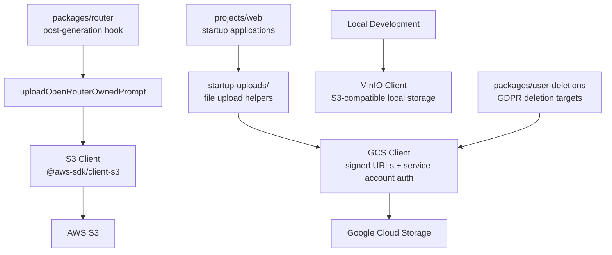

# Prompt Storage

Prompt and completion storage for OpenRouter. Uploads request/response pairs to object storage for analytics, debugging, and compliance. Supports multiple backends (S3, GCS, MinIO) and generates signed URLs for secure retrieval. Also handles startup application file uploads and the GCS list/delete primitives used by GDPR/DSR deletions.

## Architecture

## Key Modules

| Directory | Purpose |
|-----------|---------|
| `s3/` | S3 client for uploading prompts and completions |
| `gcs/` | GCS client with service-account auth, signed URL generation for startup uploads, and paged list/delete for GDPR deletion |
| `minio/` | MinIO client for local development (S3-compatible) |
| `startup-uploads/` | Helpers for startup application file uploads |
| `env.ts` | Environment variable configuration for storage backends |

## Commands

| Command | Description |
|---------|-------------|
| `bun run test` | Run unit tests |
| `bun run typecheck` | Type-check with tsgo |
