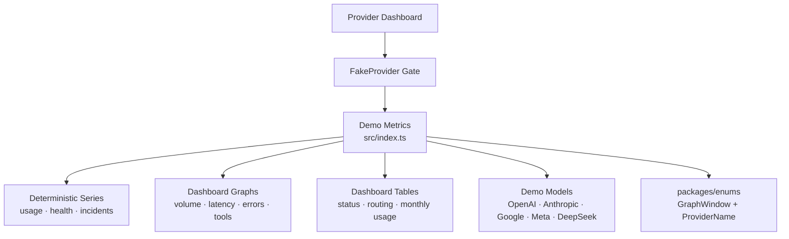

# Provider Dashboard Demo

Synthetic, deterministic metrics for the FakeProvider dashboard in Mission Control. The package provides realistic model, endpoint, benchmark, routing, health, and usage series without contacting production data sources.

## Architecture

## Commands

| Command | Description |
| --- | --- |
| `bun test` | Run unit tests |
| `bun run typecheck` | Type-check |
