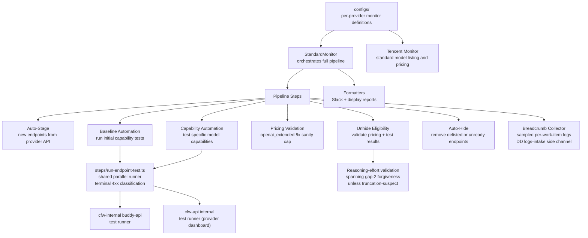

# Provider Monitors

Automated monitoring and lifecycle management for provider endpoints. Detects new endpoints from provider APIs, stages them, runs baseline capability tests, and manages visibility (hide/unhide) based on test results and pricing validation.

## Architecture

## Key Directories

| Path | Purpose |
|------|---------|
| `configs/` | Per-provider monitor configurations (120+ providers, including DigitalOcean) |
| `classes/` | Base monitor class, diff reports, auto-approval logic, capability test mapping |
| `steps/` | Pipeline steps: staging (incl. free-variant staging via `is_free` flag and `free-endpoint-pricing` helpers), baseline testing, capability testing, hide/unhide, pricing, breadcrumb collection, and shared `run-endpoint-test.ts` parallel runner |
| `formatters/` | Slack and display formatters for monitor reports |

## Key Concepts

| Concept | Description |
|---------|-------------|
| Baseline Automation | Runs initial tests on newly staged endpoints via the shared `runEndpointTest` utility with parallel execution (better for 110s HTTP budget); terminal 4xx responses fail immediately |
| Capability Automation | Tests specific model capabilities (e.g., tool calling, vision) via the shared `runEndpointTest` utility; configurable `requiredPasses` (3 for capability, 1 for baseline) |
| Auto-Unhide Eligibility | Validates that endpoints have non-zero pricing and passing tests before making them visible. Models declaring reasoning-effort support are validated across 6 effort levels during baseline-unhide, with per-effort baseline templates gated for human review. Reasoning-effort audits distinguish an *inconclusive* result (the effort signal was not observable) from an *unhonored* one (the provider ignored the requested effort), so ambiguous runs don't count as failures |
| Auto-Hide | Removes endpoints that are delisted by the provider or fail readiness checks |
| SKU Auto-Approval | Automatically approves pricing SKU changes within defined thresholds (including cache-read and cache-write pricing SKUs, and auto-approves cache-pricing removal) |
| Terminal 4xx Classification | Deterministic 4xx responses (400/422) from endpoint tests are classified as terminal failures rather than retriable, preventing infinite retry loops; shared via `TERMINAL_ERROR_STATUSES` in `run-endpoint-test.ts` |
| Capacity TPM | `capacity_tpm` field from provider models API, propagated through staging and update payloads for throughput-aware routing |
| Free Variant Staging | When `is_free: true` is set upstream, auto-stages a `:free` variant with zero pricing synthesized from the provider's pricing strategy |
| Testable Sampling Params | Providers declare which sampling parameters (temperature, top_p, etc.) they support per-model; capability tests now include these in baseline templates rather than excluding them |
| Quantization Suffix Normalization | Auto-staging ignores quantization suffixes (e.g., `-fp16`, `-q4`, `-nvfp4`) when matching upstream models by `hf_slug`, preventing duplicate staging |
| Error Cooldown Curve | Exponential backoff for chronically-erroring endpoints: `1h → 2h → 4h → ... → 168h` (7-day cap), cutting daily retests of dead providers from ~28 to ~4 at steady state; manual re-test resets immediately |
| Parallelized Capability Build | Capability work-item construction runs in parallel with bounded per-test-call timeouts, improving throughput for large provider catalogs |
| Aggregated Parse Errors | Parse errors during monitor init are aggregated into a single log line rather than one per failure, keeping worker output under the CF 256KB cap |
| DD Logs-Intake Side Channel | Run-end breadcrumbs are delivered via Datadog logs-intake HTTP API rather than `console.log`, bypassing the CF 256KB worker output cap |
| Per-Work-Item Log Sampling | Verbose per-entity logs are sampled so tail breadcrumbs survive the CF 256KB cap; sampling rate adapts to work-item count |
| Baseline Unhide Provider Gate | Auto-unhide blocks when the provider has no required unhidden endpoint, preventing premature visibility |
| Demand-Ranked Capability Tests | Capability test demand is ranked from daily usage rollups with a bounded timeout, ensuring high-traffic models get tested first |
| Unified Provider-Params Read | Provider parameter reads are unified across all providers and fail closed (reject unknown params), preventing silent misconfigurations |

## Commands

| Command | Description |
|---------|-------------|
| `bun test` | Run unit tests |
| `tsgo --noEmit` | Type-check |
