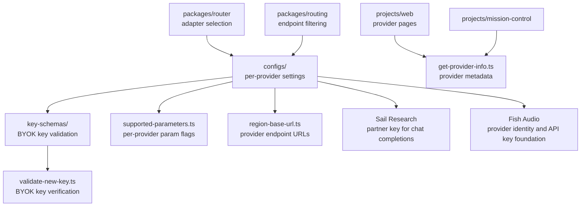

# Providers

Provider configuration registry for OpenRouter. Contains per-provider configs (API key schemas, adapter class mappings, supported parameters, region URLs, icons), BYOK key validation schemas, and provider metadata used by the router, routing, and frontend packages.

## Architecture

## Key Modules

| Path | Purpose |
|------|---------|
| `configs/supported-parameters.ts` | Per-provider parameter support flags |
| `configs/region-base-url.ts` | Provider API base URLs by region |
| `configs/provider-url.ts` | Provider website/dashboard URLs |
| `configs/prompt-caching-ratio.ts` | Provider-specific prompt caching cost ratios |
| `configs/icons.ts` | Provider icon asset mappings |
| `configs/api-key.ts` | API key format configs per provider |
| `key-schemas/` | Zod schemas for BYOK key validation (Azure with `*.azure.com` endpoint URL validation and Foundry resource name regex, Bedrock, Cloudflare, Google) |
| `get-provider-info.ts` | Public provider metadata aggregator; resolves a provider from a router adapter name or an `ImageGenerationAdapterName` |
| `slug.ts` | Provider slug parsing and formatting |

## Commands

| Command | Description |
|---------|-------------|
| `bun test` | Run unit tests |
| `bun test --watch` | Run tests in watch mode |
| `bun run typecheck` | Type-check with tsgo |
