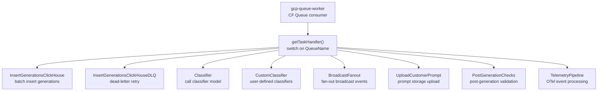

# Queues

Queue name registry and task handler dispatch for the `gcp-queue-worker`. Each queue name maps to a handler function that processes batched string payloads via Cloudflare Queue consumers.

Queue message schemas are CloudEvents v1 envelopes. See [`AGENTS.md`](./AGENTS.md) for the required shape and [`REVIEW.md`](./REVIEW.md) for the review checklist.

## Architecture

## Key Files

| Path | Purpose |
|------|---------|
| `index.ts` | `QueueName` enum and `RawQueueName` enum definitions |
| `tasks/index.ts` | `getTaskHandler()` dispatch — exhaustive switch mapping each `QueueName` to its handler |
| `tasks/insert-generations-clickhouse.ts` | Batch-inserts generation records into ClickHouse; on insert failure logs the offending row (via `insert-generations-clickhouse-utils.ts`) before routing to the DLQ |
| `tasks/insert-generations-clickhouse-utils.ts` | Helpers to isolate and serialize the bad row from a failed ClickHouse batch insert for diagnostic logging |
| `tasks/insert-generations-clickhouse-dlq.ts` | Dead-letter retry handler for failed ClickHouse generation inserts |
| `tasks/broadcast-fanout.ts` | Fans out broadcast events with sampling |
| `tasks/classify.ts` | Runs classifier model inference |
| `tasks/custom-classifier-worker.ts` | Processes user-defined classifier tasks |
| `tasks/post-generation-checks.ts` | Post-generation validation checks |
| `tasks/upload-customer-prompt.ts` | Uploads customer prompts to storage |
| `env.ts` | Environment bindings for queue workers |

## Commands

| Command | Description |
|---------|-------------|
| `bun test` | Run unit tests |
| `tsgo --noEmit` | Type-check |
