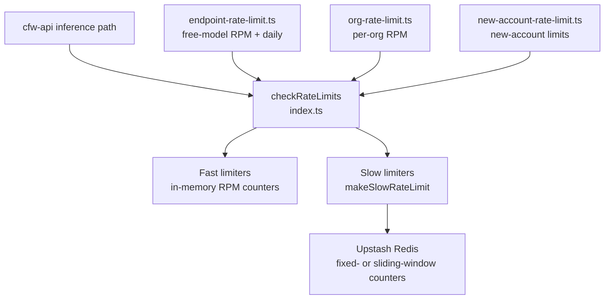

# Rate Limit

Shared rate-limiting types and utilities for OpenRouter. Wraps Upstash Redis (slow, distributed limits) and in-memory fast counters, and computes the per-user free-model, endpoint, org, and new-account limits enforced during inference.

## Architecture



## Key Modules

| File | Purpose |
|------|---------|
| `index.ts` | `checkRateLimits` runner plus `makeSlowRateLimit` (Upstash; `fixed-window` by default, `sliding-window` opt-in) and the fast/slow limiter types; 429 responses carry `X-RateLimit-*` headers |
| `restriction-rate-limit.ts` | Scoped model/provider/author RPM restrictions: a per-colo Cloudflare limiter, plus an opt-in globally-consistent sliding-window Redis limiter |
| `restriction-observability.ts` | Latency histogram, fail-open counter, and log line for globally enforced restriction checks |
| `endpoint-rate-limit.ts` | Free-model RPM and daily limits; the daily limit is enforced from the Spanner `requests_free_daily` counter (`checkFreeModelDailyLimit`) |
| `org-rate-limit.ts` | Per-organization RPM limit resolution |
| `new-account-rate-limit.ts` | Stricter limits applied to new accounts |
| `constants.ts` | Scoped-restriction sliding-window constants and free-tier parallel-request factor |

## Commands

| Command | Description |
|---------|-------------|
| `bun run test` | Run unit tests |
| `bun run test:integration` | Run `integration/` against a real Redis — needs the local emulator (see below) |
| `bun run typecheck` | Type-check with tsgo |

The integration suite exercises the real Upstash Lua (the unit tests mock
`limit`), so it needs a Redis speaking the Upstash REST protocol on
`localhost:8079`. Start the emulator from the repo root first:

```bash
docker compose -f dev/docker-compose.upstash-redis.yaml up -d
```

`integration/vitest.setup.ts` pins the suite to that emulator, so it never
touches a shared Upstash instance even when `UPSTASH_REDIS_REST_URL` is set in
the environment.
