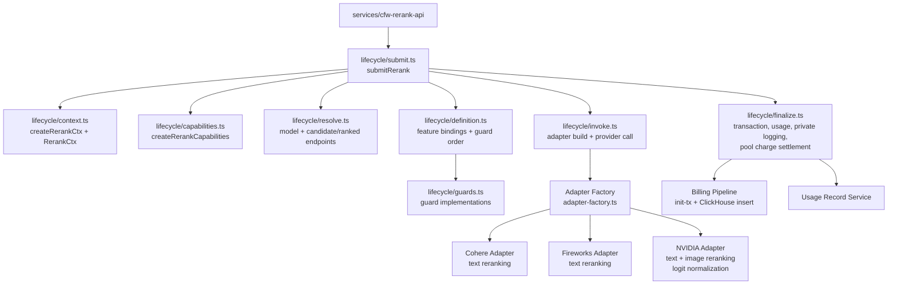

# Rerank

Provider-agnostic rerank engine for OpenRouter. Receives rerank requests, resolves model and endpoint routing, transforms requests into provider-native formats via adapter-based dispatch, and records usage through the shared billing pipeline.

## Architecture

The surface is a linear lifecycle of plain functions over a per-request context — there is no Router class. The composition root (services/cfw-rerank-api) builds a context and a capabilities object, then calls `submitRerank`, which resolves the model, runs guards, resolves candidate endpoints, authorizes credit, opens a pending pool charge, ranks endpoints, attempts them through adapters, and finalizes billing/response in `finalizeSuccess`.

## Feature Catalog

[`lifecycle/definition.ts`](lifecycle/definition.ts) is the executable catalog: plain objects name each feature's status, real binding, and rationale. A shared [`SurfaceLifecycleFeatures`](../routing/lifecycle/feature-declaration.ts) type requires all fourteen decisions; `satisfies` checks completeness, and rerank's ordinary function types check its bindings.

Every obligation must be explicitly declared. A feature is either `implemented` (it has a bound guard, policy, or owner) or `notImplemented` (a documented gap with a tracking issue). The shared type still accepts `delegated` as a legacy spelling, not as a distinct status. A gap is not an exemption or a runtime switch, and its presence does not imply implementation is planned. Only `fallback` additionally permits `notApplicable`. Rerank declares all fourteen features as `implemented`, including the shared data-policy, BYOK, and HIPAA routing policies plus model access and private logging.

The declaration also owns guard order. `submit.ts` consumes the bindings but keeps resolution, authorization, fallback, and charge cleanup as ordinary calls. An implemented feature means its policy is wired, not that it runs unconditionally — for example, moderation still follows endpoint and regional policy. The declaration itself is the inventory, rather than a separately maintained support matrix or a workflow interpreter.

Broadcast and private logging are implemented through the same existing observability owner. Finalization calls that owner once to schedule both outputs, preserving their independent enablement decisions and shared text-only payload construction. Declaring either feature does not enable it for every request or guarantee delivery.

## Key Modules

| Path | Purpose |
|------|---------|
| `lifecycle/context.ts` | `RerankCtx` type, cross-stage value types (invocation, resolved model, credit authorization), and `createRerankCtx` |
| `lifecycle/capabilities.ts` | `RerankCapabilities` alias and `createRerankCapabilities`, built on the shared routing surface capabilities |
| `lifecycle/submit.ts` | `submitRerank`: the linear request handler, credit authorization step, routeRequest, and error exhaustion |
| `lifecycle/resolve.ts` | Model-slug validation, model resolution, candidate endpoint resolution, endpoint ranking, and the 404 error helper |
| `lifecycle/definition.ts` | Feature catalog with executable bindings and ordered model, candidate, and endpoint guards |
| `lifecycle/guards.ts` | Rerank guard implementations for media balance, content filtering, estimated budget, and moderation |
| `lifecycle/invoke.ts` | Adapter construction, the provider call (`callProvider`), per-attempt timing observation, and error logging |
| `lifecycle/finalize.ts` | `finalizeSuccess`: transaction init, priced response write, usage recording, private logging, pool settlement |
| `adapters/adapter-factory.ts` | Registry mapping `RerankAdapterName` to adapter constructors |
| `adapters/base.ts` | Abstract `BaseRerankAdapter` with shared submit/response flow and DO offloading support |
| `adapters/cohere/` | Cohere rerank adapter (text-only) |
| `adapters/fireworks/` | Fireworks rerank adapter (text-only) |
| `adapters/nvidia/` | NVIDIA-direct adapter — supports text + image inputs, sigmoid logit normalization, client-side `top_n` |
| `adapters/text-only-documents.ts` | Helper to coerce mixed document inputs to text for text-only adapters |
| `configs/get-adapter-name.ts` | Narrows endpoint `adapter_name` to typed `RerankAdapterName` |
| `helpers/init-tx.ts` | Transaction initialization and ClickHouse format conversion |
| `routing/steps.ts` | Rerank-specific routing step configuration |

## Commands

| Command | Description |
|---------|-------------|
| `bun test` | Run unit tests |
| `bun test --watch` | Run tests in watch mode |
| `tsgo --noEmit` | Type-check |
