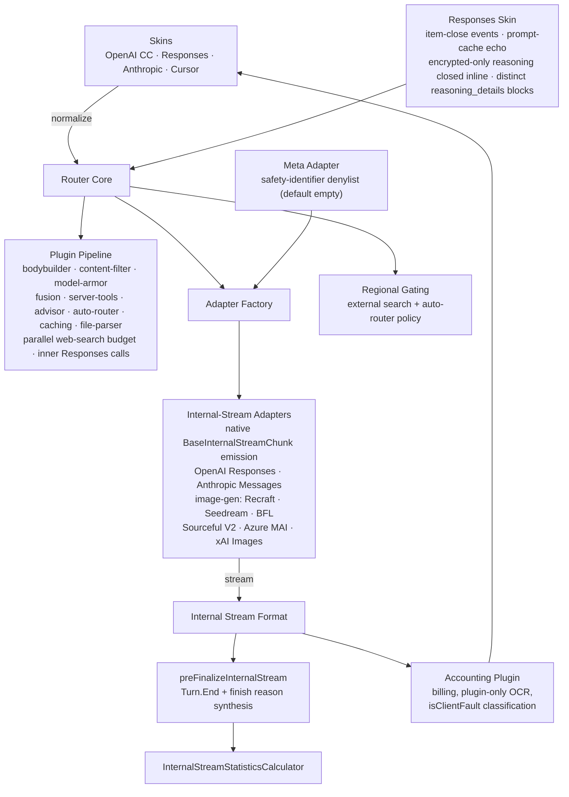

# Router

Core request-routing engine for OpenRouter. Receives normalized API requests, selects provider endpoints, transforms requests into provider-native formats, streams responses back through a unified internal format, and applies plugins for caching, content filtering, guardrails, and more.

## Architecture

## Key Modules

| Directory     | Purpose                                                                                                                                                                                                                                                                                                                                                                                                                                                                                                                                                                                                                                                                                                                                                                                                                                                                                                                                                                                                                                                                                                                                                                                                                                                                                                                                                                                                                                                                                                                                                                                                                                                                                                                                                                                                                                                                                                                                                                                                                                                                                                                                                                                                                                                                                                                                                                                                                                                                                                                                                                                                                                                                                                                                                      |
| ------------- | ------------------------------------------------------------------------------------------------------------------------------------------------------------------------------------------------------------------------------------------------------------------------------------------------------------------------------------------------------------------------------------------------------------------------------------------------------------------------------------------------------------------------------------------------------------------------------------------------------------------------------------------------------------------------------------------------------------------------------------------------------------------------------------------------------------------------------------------------------------------------------------------------------------------------------------------------------------------------------------------------------------------------------------------------------------------------------------------------------------------------------------------------------------------------------------------------------------------------------------------------------------------------------------------------------------------------------------------------------------------------------------------------------------------------------------------------------------------------------------------------------------------------------------------------------------------------------------------------------------------------------------------------------------------------------------------------------------------------------------------------------------------------------------------------------------------------------------------------------------------------------------------------------------------------------------------------------------------------------------------------------------------------------------------------------------------------------------------------------------------------------------------------------------------------------------------------------------------------------------------------------------------------------------------------------------------------------------------------------------------------------------------------------------------------------------------------------------------------------------------------------------------------------------------------------------------------------------------------------------------------------------------------------------------------------------------------------------------------------------------------------------ |
| `skins/`      | API surface translators (OpenAI Chat Completions, Responses, Anthropic Messages, Cursor IDE). The Cursor skin normalizes Cursor-style `input`/flat-tools into Chat Completions format at `/api/v1/cursor`                                                                                                                                                                                                                                                                                                                                                                                                                                                                                                                                                                                                                                                                                                                                                                                                                                                                                                                                                                                                                                                                                                                                                                                                                                                                                                                                                                                                                                                                                                                                                                                                                                                                                                                                                                                                                                                                                                                                                                                                                                                                                                                                                                                                                                                                                                                                                                                                                                                                                                                                                    |
| `adapters/`   | Per-provider request/response transformers (80+ providers) — most now use `OpenAICompatibleInternalStreamAdapter` for native internal-stream emission. The Inflection adapter triggers fallback when an internal-stream completion comes back empty. Dedicated internal-stream adapters for OpenAI Responses (`InternalStreamOpenAIResponsesAdapter`), Anthropic Messages (`InternalStreamAnthropicMessageAdapter`), Google Vertex Anthropic, Amazon Bedrock Invoke Anthropic, Azure Anthropic, Azure OpenAI Responses, xAI Responses, Stealth Responses (with encrypted reasoning passthrough), Claude on AWS. Responses adapters echo the remapped `reasoning.effort` when the upstream reports none (`utils/merge-upstream-reasoning-effort.ts`). Image-gen adapters (Recraft, Seedream, Black Forest Labs, Sourceful v1/v2/v2.5, Azure MAI-Image, xAI Images) fully cut over to internal-stream with async polling and `GenerationImage` event emission. Internal-stream adapters for the Google Interactions API (`internal-stream-google-interactions/`, with AI Studio and Vertex variants) translate ChatMessages into Interactions turns and stream native Interactions SSE. Sakana AI adapter extends `InternalStreamOpenAIResponsesAdapter` with orchestration token folding for Fugu models. Tenstorrent and Sail Research adapters for direct provider integration. OpenAI-wire serializers forward `prediction` (predicted outputs) upstream, and OpenAI chat requests support explicit prompt caching via `prompt_cache_key`. The Meta adapter accepts audio input parts and is exempt from the upstream idle-kill timeout. The GMICloud adapter keeps `reasoning_effort` on requests so Hy3 reasons. The Mistral adapter maps reasoning requests for Magistral models to prompt-mode reasoning. The Anthropic Messages adapter surfaces the TTL cache-write breakdown (`usage.cache_creation`) on Messages API responses. The Fireworks adapter forwards `prompt_cache_key` for cache affinity, and OpenAI Responses requests clamp `max_output_tokens` to the model's supported range. Perplexity search controls are forwarded upstream. Cohere v2 adapter is cut over to internal-stream (native `BaseInternalStreamChunk` emission), parsing `thinking` reasoning content and populating the reasoning token cache. The Anthropic Messages internal-stream adapter emits `GenerationRefusal` events for refusals that arrive before any output content. Provider-specific adapters include Darkbloom and Cerebras (via `EncodedImageOpenAIAdapter`, which base64-encodes both data-URI and remote `image_url` inputs), NexAGI (session affinity via `X-Session-Id`), NVIDIA reasoning_effort, Gemini incremental tool-call streaming, Gemini prompt-cache writes that classify upstream cache-write failures with the upstream status code (`google-gemini/prompt-cache.ts`), Gemini 3+ per-part `mediaResolution` mapped from `image_url.detail` (`get-media-resolution.ts`: low/high/original → `MEDIA_RESOLUTION_LOW`/`HIGH`/`ULTRA_HIGH`, gated to Gemini 3+ permaslugs and run alongside the legacy request-scoped `media_resolution` passthrough), Gemini `temperature`/`top_p` gated on the model's `supported_parameters` across all Gemini request paths, and shared utilities. Cross-provider fallback is skipped when a request carries encrypted reasoning incompatible with the next endpoint, and the provider error code is parsed structurally (not string-matched) to classify encrypted-reasoning failures |
| `plugins/`    | Composable middleware (fusion with prompt caching on inner calls via `cache_control` + `prompt_cache_key` and three-tier model resolution (plugin prefs → tool params → default) supporting variant-suffixed slugs and private endpoint bypass, server-tools with named advisor profiles + cross-request memory + bash/shell sandbox execution + `server_tool_use` usage tracking for all SDK-intercepted invocations + workspace-scoped disabled-tool gate (403 when a requested tool is in the workspace `disabled_server_tools` list) + `image_generation` rerouted to the dedicated image API over the SDK + `openrouter:files` tool results surfaced as output items in Responses streaming, web-search defaulting to Exa optimized highlights with Parallel Turbo V1 as a selectable engine, Codex namespace-tool flattening for CLI clients, server-tool model alias normalization, auto-router, model-armor, caching, content-filter, context-compression with image-output guard, file-parser, web-fetch, accounting, shadow-prompts, etc.)                                                                                                                                                                                                                                                                                                                                                                                                                                                                                                                                                                                                                                                                                                                                                                                                                                                                                                                                                                                                                                                                                                                                                                                                                                                                                                                                                                                                                                                                                                                                                                                                                                                                                                                                                                                                                                               |
| `platform/`   | Platform-level interfaces and abstractions                                                                                                                                                                                                                                                                                                                                                                                                                                                                                                                                                                                                                                                                                                                                                                                                                                                                                                                                                                                                                                                                                                                                                                                                                                                                                                                                                                                                                                                                                                                                                                                                                                                                                                                                                                                                                                                                                                                                                                                                                                                                                                                                                                                                                                                                                                                                                                                                                                                                                                                                                                                                                                                                                                                   |
| `helpers/`    | Shared utilities (error formatting, token counting, client-fault classification, per-model thinking configuration, auto `:free`-to-paid routing error messages, tilde-latest alias resolution, eager_input_streaming injection, special-field extraction, `resolveRouterPermaslug` three-tier resolution for analytics attribution, `generation-lineage.ts` linking child generations (fusion/server-tool inner calls) to their root generation, `submitGenerationBilling` shared helper for unified billing submission via `timedWaitUntil`, etc.). The router core tracks a per-request generation submit count and logs + emits a `duplicate_generation_submit` metric when the same generation is submitted more than once (backed by a Datadog monitor), with a dry-run detection mode that logs would-be duplicate submits (including usage) before enforcement. Request helpers use `prompt_cache_key` as a sticky-session fallback when no `user` field is present, and reject transcription-only models on chat-completions routes                                                                                                                                                                                                                                                                                                                                                                                                                                                                                                                                                                                                                                                                                                                                                                                                                                                                                                                                                                                                                                                                                                                                                                                                                                                                                                                                                                                                                                                                                                                                                                                                                                                                                                                                                                                                                               |
| `auth/`       | Authentication and key validation                                                                                                                                                                                                                                                                                                                                                                                                                                                                                                                                                                                                                                                                                                                                                                                                                                                                                                                                                                                                                                                                                                                                                                                                                                                                                                                                                                                                                                                                                                                                                                                                                                                                                                                                                                                                                                                                                                                                                                                                                                                                                                                                                                                                                                                                                                                                                                                                                                                                                                                                                                                                                                                                                                                            |
| `edge/`       | Edge runtime compatibility layer                                                                                                                                                                                                                                                                                                                                                                                                                                                                                                                                                                                                                                                                                                                                                                                                                                                                                                                                                                                                                                                                                                                                                                                                                                                                                                                                                                                                                                                                                                                                                                                                                                                                                                                                                                                                                                                                                                                                                                                                                                                                                                                                                                                                                                                                                                                                                                                                                                                                                                                                                                                                                                                                                                                             |
| `cache/`      | Response caching logic                                                                                                                                                                                                                                                                                                                                                                                                                                                                                                                                                                                                                                                                                                                                                                                                                                                                                                                                                                                                                                                                                                                                                                                                                                                                                                                                                                                                                                                                                                                                                                                                                                                                                                                                                                                                                                                                                                                                                                                                                                                                                                                                                                                                                                                                                                                                                                                                                                                                                                                                                                                                                                                                                                                                       |
| `statistics/` | Request/response metrics collection. The structured-output stream calculator skips JSON parsing on non-structured-output streams                                                                                                                                                                                                                                                                                                                                                                                                                                                                                                                                                                                                                                                                                                                                                                                                                                                                                                                                                                                                                                                                                                                                                                                                                                                                                                                                                                                                                                                                                                                                                                                                                                                                                                                                                                                                                                                                                                                                                                                                                                                                                                                                                                                                                                                                                                                                                                                                                                                                                                                                                                                                                             |

Reasoning handling in the OpenAI Responses skin keeps distinct reasoning blocks separate in chat-completions `reasoning_details` (`group-encrypted-reasoning-blocks.ts` + `reasoning-details-merger.ts`) and closes encrypted-only reasoning items inline as they stream. The Meta adapter's default safety-identifier blocklist is now empty. OpenAI-family endpoints derive a default reasoning return mechanism (`utils/get-default-reasoning-return-mechanism.ts`, used by the Cerebras adapter) when the caller doesn't specify one, and the Google Gemini adapter echoes upstream reasoning as thought parts for Gemma models. Anthropic-specific usage carriers are hidden from OpenAI chat-completions responses (`from-internal-stream/to-chat-wire-usage.ts`).

Stream errors surface the raw upstream provider error text to clients across all skins (`skins/shared/error-to-internal-chunk.ts`), except 500 and 429 responses which are masked with a generic/branded message (`skins/shared/apply-error-masking.ts` + `adapters/base/internal-error-mapping.ts`). Client-cancelled mid-stream attempts are recorded as 499 rather than a null status.

## Commands

| Command                               | Description                        |
| ------------------------------------- | ---------------------------------- |
| `bun run test`                        | Run unit tests (vitest)            |
| `bun run test:cfw`                    | Run Cloudflare Worker-scoped tests |
| `bun run test:clickhouse-integration` | Run ClickHouse integration tests   |
| `bun run test:watch`                  | Run tests in watch mode            |
| `bun run typecheck`                   | Type-check with tsgo               |
