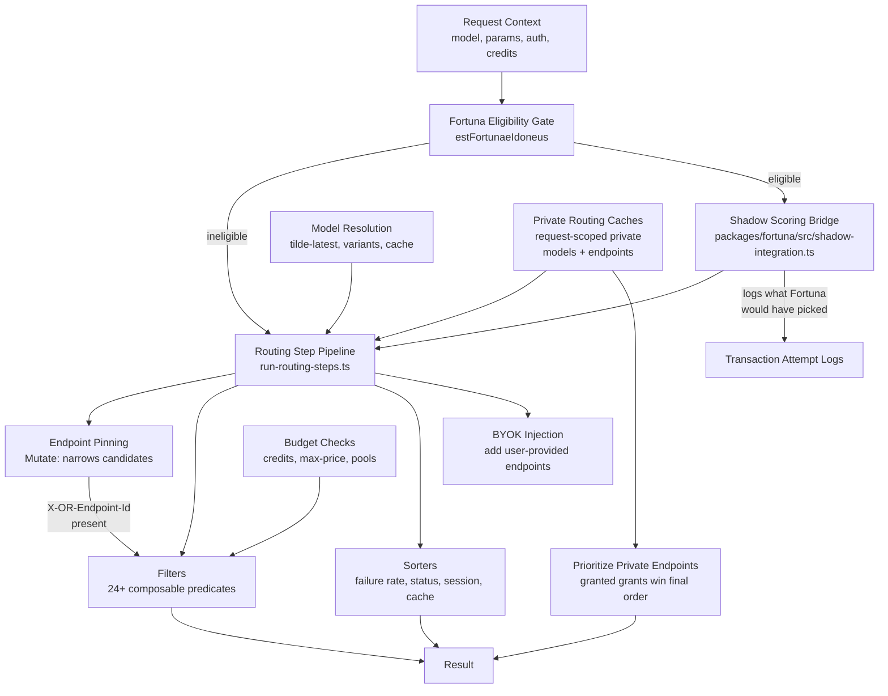

# Routing

Endpoint selection and filtering pipeline for OpenRouter. Given a model and request context, evaluates all available endpoints through a composable chain of filter and sort steps to produce a ranked list of viable provider endpoints. Also hosts the Fortuna eligibility gate and shadow scoring bridge that determine whether a request can enter Fortuna's routing surface.

## Architecture

## Key Directories

| Path                                        | Purpose                                                                                                                                                                                                                                                                                                                                                                                                                                                                                                                                                                                                                                                                                    |
| ------------------------------------------- | ------------------------------------------------------------------------------------------------------------------------------------------------------------------------------------------------------------------------------------------------------------------------------------------------------------------------------------------------------------------------------------------------------------------------------------------------------------------------------------------------------------------------------------------------------------------------------------------------------------------------------------------------------------------------------------------ |
| `filters/`                                  | 24+ endpoint filter predicates (context length, data region, guardrails, parameters, etc.). `by-regional-surcharge` treats Bedrock endpoints in a US region (both `us.*` geographic profiles and unprefixed in-region foundation IDs) as surcharge endpoints                                                                                                                                                                                                                                                                                                                                                                                                                               |
| `endpoints/`                                | Endpoint augmentation (BYOK injection, failure rate sorting, session priority, in-memory global cache). `prioritize-service-tier-endpoints.ts` floats the requested tier's endpoints to the front; persisted tier rows are strictly opt-in per request (`filters/by-tier-endpoint-rows.ts`)                                                                                                                                                                                                                                                                                    |
| `models/`                                   | Model variant construction, tilde-latest resolution, public hydration, caching                                                                                                                                                                                                                                                                                                                                                                                                                                                                                                                                                                                                             |
| `budget/`                                   | Credit sufficiency checks and budget enforcement                                                                                                                                                                                                                                                                                                                                                                                                                                                                                                                                                                                                                                           |
| `cache/`                                    | Routing result caching                                                                                                                                                                                                                                                                                                                                                                                                                                                                                                                                                                                                                                                                     |
| `helpers/`                                  | Client-fault classification (`is-client-fault`), parameter parse failures logged as summaries (and duplicate endpoint-loop error logs skipped), Fortuna eligibility gate, shadow scoring bridge, private resource grants (shared matching for fallback filtering and endpoint prioritization), `validate-model-slug` (alias + cache resolution with optional private-cache fallback), pool pending charge adjustment (`adjustPoolPendingChargeToActual`), negative-balance-with-autobuy tracking (`track-negative-balance-with-autobuy.ts` ticks `openrouter.autobuy.negative_balance` when a user is in the red despite auto top-up), metrics, outcome classification, tx-attempt logging |
| `private-routing-caches.ts`                 | Builds request-scoped `ListCache` instances for a user's granted private models/endpoints (`buildPrivateRoutingCaches`). Threaded into explicit permaslug resolution only; `openrouter/auto` and `openrouter/free` stay on the long-lived public caches                                                                                                                                                                                                                                                                                                                                                                                                                                    |
| `endpoints/prioritize-private-endpoints.ts` | Routing step that floats a user's granted private endpoints to the front, except those whose provider is listed in `provider.order` (they keep their manual-order rank). A ranking router's model order still wins unless the caller explicitly disables model partitioning. Runs twice — once pre-fallback and again after public heuristics — so private grants win final ordering                                                                                                                                                                                                                                                                                                                                                                                                                                                                                                          |

## Fortuna Integration

The eligibility gate (`estFortunaeIdoneus` in `packages/fortuna/src/eligibility.ts`) checks whether a request can enter Fortuna routing. A request is eligible when it is provider-flexible (no BYOK, no provider sort/order/only/ignore, multi-provider model), the user is not enterprise-restricted, and the model is enrolled via LiveConfig enrollment config.

The shadow scoring bridge (via `computeShadowScoringFields` in `packages/fortuna/src/shadow-integration.ts`) maps endpoints to `ShadowCandidate` inputs (including `rateLimitedCount` for capacity-weighted Beta scoring and optional `aimdCapacityFactors` for per-endpoint 429 back-off) to log what Fortuna would have picked without affecting production routing. Shadow scoring results are persisted as flat columns on ClickHouse `generations` for backtesting. Comparison is against the router's first-pick endpoint (not the final fallback landing) and includes `fortuna_pick_outcome` (`not_attempted` | `attempted_succeeded` | `attempted_failed`) to classify whether Fortuna's preferred endpoint was tried and what happened.

The Fortuna routing step (`helpers/apply-fortuna-routing.ts`) is a proper routing step that reorders endpoints by Fortuna composite score when a request is enrolled. It writes scored candidates and enrollment metadata to `fortunaRoutingResult` for downstream persistence. AIMD capacity factors from the per-Worker `AimdCapacityTracker` are passed through to influence final scores. The effective sort is resolved _before_ the sampling gate so a sampled-out request can still be stamped with its resolved sort.

Requests that are Fortuna-eligible but lose the per-model sampling dice roll (and pass every other gate) form the randomized **held-out control cohort**: they are not Fortuna-routed but are flagged via `fortunaRoutingResult.isEligibleHeldOut = true` so the control group can be reconstructed for A/B analysis. Requests that fail any other gate are not valid controls and are left unflagged.

The bridge also computes per-request **margin uplift** via `computeMarginUplift()` — a cache-aware dollar estimate of savings if Fortuna's pick had been used. When `nativeTokensCached > 0`, uncached prompt tokens use `promptPrice` and cached tokens use `cacheReadPrice`; otherwise all tokens use `promptPrice`. The bridge uses effective (served) pricing when both effective prices are available, falling back to list-price-based revenue when either is absent.

## Filter Pipeline

Filters are composable generator functions that yield diagnostic steps. Each filter either passes endpoints through or removes those that don't meet criteria:

- **Capability filters**: context length, image/audio/video support, tool compatibility, quantization
- **Policy filters**: data region, guardrails, allowed/ignored providers, disabled status
- **Economic filters**: credits, max price, credit pool constraints, BYOK-only endpoint blocklist. `by-tier-endpoint-rows` excludes persisted tier rows the request did not opt into (via `service_tier`, `:nitro`/`:floor`, or a tier slug in `provider.order`/`only`); `by-flex-service-tier` restricts the pool to flex tier rows when `service_tier: "flex"` is requested, so a flex-capacity shed surfaces to the caller instead of silently falling back to a pricier default-tier endpoint (priority keeps prefer-then-fallback semantics since default is cheaper)
- **Feature filters**: cache control, native web search, distillable text, fallback, multipart support (DB `features.supports_multipart` as source of truth for all providers including Azure), stream function-call arguments (prefers Vertex Gemini when `stream_function_call_arguments` is requested). When tool-support filtering would empty the endpoint pool, routing falls back to the unfiltered pool instead of returning a 404
- **Internal filters**: endpoint-ID pinning (`by-endpoint-id`) — allows internal entities (benchmarking org) to pin requests to a specific endpoint UUID via the `X-OR-Endpoint-Id` header, which ingress records on the user context via `applyInternalEndpointPin`. Runs as an early step and yields `Mutate`, narrowing the candidate set to the pinned endpoint while later hard gates still evaluate it

## Commands

| Command            | Description             |
| ------------------ | ----------------------- |
| `bun test`         | Run unit tests          |
| `bun test --watch` | Run tests in watch mode |
| `tsgo --noEmit`    | Type-check              |
